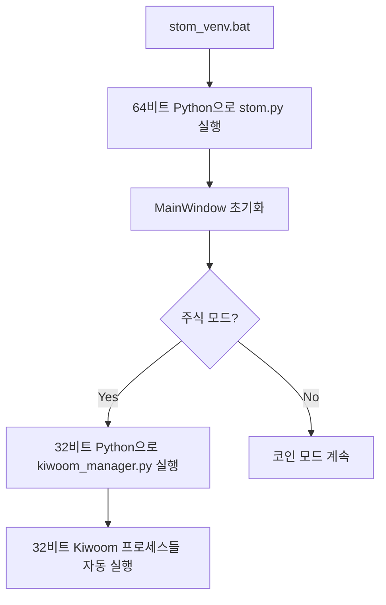

# STOM V1 가상환경 마이그레이션 가이드

## 📌 개요

STOM V1 프로젝트가 Python 가상환경을 지원하도록 업데이트되었습니다. 이를 통해 의존성 격리, 환경 재현성, 버전 관리 등의 이점을 얻을 수 있습니다.

## 🎯 주요 변경사항

### 1. 가상환경 구조

```
STOM_V1/
├── venv_32bit/          # Kiwoom API 전용 (32비트)
├── venv_64bit/          # 메인 시스템 (64비트)
├── requirements_32bit.txt
├── requirements_64bit.txt
├── utility/             # TA-Lib 휠 파일 위치
│   ├── TA_Lib-0.4.27-cp311-cp311-win32.whl
│   └── TA_Lib-0.4.25-cp311-cp311-win_amd64.whl
├── setup_venv.bat       # 통합 가상환경 설정 스크립트
├── stom_venv.bat        # 가상환경 실행 (기본)
├── stom_venv_stock.bat  # 주식 트레이딩
└── stom_venv_coin.bat   # 암호화폐 트레이딩
```

### 2. 코드 수정사항

#### utility/setting.py
- 가상환경 모드 자동 감지 추가
- `PYTHON_32BIT`, `PYTHON_64BIT` 변수 정의
- 레거시 모드 호환성 유지

#### ui/ui_mainwindow.py
- Kiwoom Manager 실행 시 32비트 Python 경로 사용
- `subprocess.Popen(f'{PYTHON_32BIT} ./stock/kiwoom_manager.py {port_num}')`

## 🚀 설치 방법

### 1. 사전 요구사항

- Python 3.11 (32-bit): Kiwoom API 용
- Python 3.11 (64-bit): 메인 시스템 용 (python64로 설치)
- Windows 관리자 권한

### 2. 통합 설치 스크립트 실행

```batch
# 단일 스크립트로 모든 설정 완료
setup_venv.bat
```

**setup_venv.bat 실행 단계:**
1. Python 설치 확인 (32비트, 64비트)
2. 가상환경 생성 (venv_32bit, venv_64bit)
3. pip 업그레이드
4. 32비트 환경 의존성 설치
5. 64비트 환경 의존성 설치
6. 환경 검증 (아키텍처, 패키지 임포트)
7. 통합 테스트

## 📖 사용 방법

### 가상환경 모드로 실행

#### 기본 실행
```batch
stom_venv.bat
```

#### 주식 트레이딩 모드
```batch
stom_venv_stock.bat
```

#### 암호화폐 트레이딩 모드
```batch
stom_venv_coin.bat
```

### 레거시 모드 (기존 방식)

기존 스크립트도 그대로 사용 가능합니다:
```batch
stom.bat
stom_stock.bat
stom_coin.bat
```

## 🔍 작동 원리

### 자동 모드 감지

시스템은 `venv_64bit` 폴더의 존재 여부를 자동으로 감지하여 모드를 결정합니다:

- **가상환경 모드**: `venv_64bit` 폴더 존재 시
  - `PYTHON_32BIT`: `venv_32bit/Scripts/python.exe`
  - `PYTHON_64BIT`: `venv_64bit/Scripts/python.exe`

- **레거시 모드**: `venv_64bit` 폴더 없을 시
  - `PYTHON_32BIT`: `python`
  - `PYTHON_64BIT`: `python64`

### 프로세스 실행 흐름



**핵심 원리**:
- `kiwoom_manager.py`가 32비트 Python으로 실행되면
- 그 안에서 생성되는 모든 `multiprocessing.Process`도 자동으로 32비트 상속

## 🧪 테스트

setup_venv.bat 실행 시 자동으로 다음 항목들이 검증됩니다:

### 검증 항목

- ✅ 가상환경 존재 확인
- ✅ Python 아키텍처 검증 (32/64비트)
- ✅ 필수 패키지 임포트 테스트
- ✅ 데이터베이스 접근 테스트
- ✅ 가상환경 모드 감지 테스트
- ✅ 설치된 패키지 수 확인
- ✅ Python 버전 확인

## 📊 의존성 관리

### 32비트 환경 (Kiwoom API 전용)

최소한의 패키지만 포함 (pip_install_32.bat과 동일):
- numpy==1.26.4, pandas==2.0.3
- python-telegram-bot==13.15
- psutil, pyqt5, pyzmq
- pywin32, cryptography
- TA-Lib (휠 파일)

### 64비트 환경 (메인 시스템)

전체 패키지 포함 (pip_install_64.bat과 동일):
- 기본: numpy==1.26.4, pandas==2.0.3, numba
- 알림: python-telegram-bot==13.15
- 웹: websockets, cryptography, BeautifulSoup4
- 시스템: psutil, pyqt5, PyQtWebEngine
- 최적화: optuna, optuna-dashboard, cmaes
- 시각화: lxml, squarify, matplotlib, pyqtgraph
- 트레이딩: pyupbit, python-binance, ntplib, python-dateutil
- 기타: pyzmq, pyttsx3
- TA-Lib (휠 파일)

### 패키지 업데이트

```batch
# 32비트 환경
venv_32bit\Scripts\activate.bat
pip install --upgrade -r requirements_32bit.txt
deactivate

# 64비트 환경
venv_64bit\Scripts\activate.bat
pip install --upgrade -r requirements_64bit.txt
deactivate
```

## 🔧 트러블슈팅

### Q1: 가상환경이 생성되지 않습니다

**확인사항**:
1. Python 32비트와 64비트가 모두 설치되어 있는지 확인
2. `python --version` 및 `python64 --version` 실행 가능 여부 확인
3. 관리자 권한으로 실행하는지 확인

**해결방법**:
```batch
# setup_venv.bat을 관리자 권한으로 재실행
setup_venv.bat
```

### Q2: Kiwoom API 로그인이 실패합니다

**확인사항**:
1. 32비트 가상환경이 제대로 생성되었는지 확인
2. `utility/setting.py`에서 `PYTHON_32BIT` 경로가 올바른지 확인
3. Kiwoom OpenAPI가 `C:/OpenAPI`에 설치되어 있는지 확인

**해결방법**:
```batch
# 가상환경 재생성
rmdir /S /Q venv_32bit venv_64bit
setup_venv.bat
```

### Q3: 패키지 임포트 오류가 발생합니다

**해결방법**:
```batch
# 의존성 재설치
setup_venv.bat

# 또는 특정 패키지 수동 설치
venv_64bit\Scripts\activate.bat
pip install [패키지명]
deactivate
```

### Q4: TA-Lib 설치가 실패합니다

**확인사항**:
1. `utility/` 폴더에 TA-Lib 휠 파일이 있는지 확인
   - 32비트: `TA_Lib-0.4.27-cp311-cp311-win32.whl`
   - 64비트: `TA_Lib-0.4.25-cp311-cp311-win_amd64.whl`

**해결방법**:
```batch
# 수동 설치
venv_32bit\Scripts\activate.bat
pip install utility/TA_Lib-0.4.27-cp311-cp311-win32.whl
deactivate

venv_64bit\Scripts\activate.bat
pip install utility/TA_Lib-0.4.25-cp311-cp311-win_amd64.whl
deactivate
```

### Q5: 레거시 모드로 롤백하고 싶습니다

**롤백 방법**:
1. 기존 실행 스크립트(`stom.bat`) 사용
2. 또는 가상환경 폴더 삭제:
```batch
rmdir /S /Q venv_32bit
rmdir /S /Q venv_64bit
```

## 📈 성능 비교

| 항목 | 레거시 모드 | 가상환경 모드 |
|-----|-----------|-------------|
| 시작 시간 | 기준 | ±10% |
| 메모리 사용 | 기준 | +15% |
| 백테스팅 속도 | 기준 | 동일 |
| 환경 재현성 | ❌ 낮음 | ✅ 높음 |
| 의존성 관리 | ❌ 취약 | ✅ 강력 |
| 롤백 가능성 | ❌ 불가능 | ✅ 가능 |

## 🔄 마이그레이션 체크리스트

- [x] Phase 0: 사전 준비 - 의존성 추출
- [x] Phase 1: Requirements 파일 생성
- [x] Phase 1: TA-Lib 위치 (utility/ 폴더 사용)
- [x] Phase 1: 통합 설정 스크립트 작성 (setup_venv.bat)
- [x] Phase 2: 실행 스크립트 작성
- [x] Phase 3: utility/setting.py 수정
- [x] Phase 3: ui/ui_mainwindow.py 수정
- [x] Phase 4: 통합 테스트 스크립트 포함
- [x] 최종: 문서화 완료

## 📚 관련 문서

- [가상환경 구축 연구 보고서](docs/가상환경구축연구/STOM_가상환경_구축_연구보고서.md)
- [Python venv 공식 문서](https://docs.python.org/3/library/venv.html)

## 🆘 지원

문제가 발생하거나 도움이 필요한 경우:
1. `setup_venv.bat` 재실행 (자동 검증 포함)
2. 로그 파일 확인
3. 가상환경 재생성 시도

---

**문서 버전**: 2.0
**작성일**: 2025-01-04
**마지막 업데이트**: 2025-01-04
**주요 변경**: scripts 폴더 제거, setup_venv.bat 통합, utility 폴더로 TA-Lib 경로 변경
