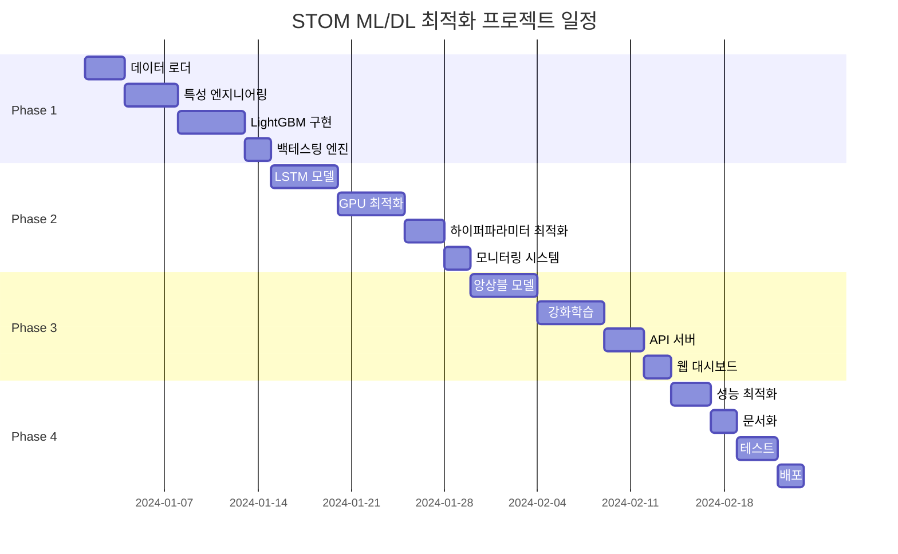

# STOM ML/DL 백테스팅 최적화 시스템 - 프로젝트 개요 및 아키텍처

## 1. 프로젝트 개요

### 1.1 프로젝트 목표
- **핵심 목표**: STOM 시스템의 수동 백테스팅 조건식 최적화를 ML/DL로 완전 자동화
- **성과 목표**: 기존 대비 1000배 빠른 조건식 탐색, 20-50% 수익률 개선
- **기술 목표**: GPU 활용 최적화, 실시간 학습 및 예측 시스템 구축

### 1.2 핵심 문제 해결
1. **수동 최적화의 한계** → 자동화된 특성 선택 및 하이퍼파라미터 최적화
2. **변수 조합의 복잡성** → 딥러닝 자동 특성 추출
3. **최적점 탐색의 어려움** → 베이지안 최적화 및 강화학습 적용
4. **과적합 위험** → 시계열 교차검증 및 Walk-forward 분석

## 2. 시스템 아키텍처

### 2.1 전체 아키텍처 다이어그램
```
┌─────────────────────────────────────────────────────────────┐
│                        User Interface                        │
│              (Streamlit Dashboard / CLI Interface)          │
└─────────────────────────────────────────────────────────────┘
                               │
┌─────────────────────────────────────────────────────────────┐
│                    Model Serving Layer                       │
│         (FastAPI + Model Registry + Prediction API)         │
└─────────────────────────────────────────────────────────────┘
                               │
┌──────────────────┬──────────────────┬──────────────────────┐
│   ML Pipeline    │   DL Pipeline    │    RL Pipeline       │
│   (LightGBM)     │  (LSTM/Trans)    │    (DQN/PPO)        │
└──────────────────┴──────────────────┴──────────────────────┘
                               │
┌─────────────────────────────────────────────────────────────┐
│                   Feature Engineering                        │
│          (Technical Indicators + Order Book Analysis)       │
└─────────────────────────────────────────────────────────────┘
                               │
┌─────────────────────────────────────────────────────────────┐
│                      Data Pipeline                           │
│            (SQLite Connector + Data Preprocessor)           │
└─────────────────────────────────────────────────────────────┘
                               │
┌─────────────────────────────────────────────────────────────┐
│                  STOM Database (SQLite)                     │
│                    (54 columns per tick)                    │
└─────────────────────────────────────────────────────────────┘
```

### 2.2 모듈 구성

#### 2.2.1 Core Modules
```python
stom_ml_optimizer/
├── core/
│   ├── __init__.py
│   ├── config.py           # 설정 관리
│   ├── database.py         # SQLite 연결 관리
│   └── logger.py           # 로깅 시스템
├── data/
│   ├── __init__.py
│   ├── loader.py           # 데이터 로딩
│   ├── preprocessor.py    # 전처리
│   └── feature_engineer.py # 특성 엔지니어링
├── models/
│   ├── __init__.py
│   ├── lightgbm_model.py  # LightGBM 모델
│   ├── lstm_model.py       # LSTM 모델
│   └── ensemble.py         # 앙상블 모델
├── training/
│   ├── __init__.py
│   ├── trainer.py          # 학습 관리
│   ├── optimizer.py        # 하이퍼파라미터 최적화
│   └── validator.py        # 교차 검증
├── backtesting/
│   ├── __init__.py
│   ├── engine.py           # 백테스팅 엔진
│   ├── metrics.py          # 성과 지표
│   └── visualizer.py       # 시각화
└── api/
    ├── __init__.py
    ├── server.py           # FastAPI 서버
    └── predictor.py        # 예측 API
```

## 3. 기술 스택

### 3.1 필수 기술 스택
```yaml
# 핵심 라이브러리
Python: 3.9+
PyTorch: 2.0+  # GPU 가속
LightGBM: 4.0+  # 빠른 프로토타이핑
SQLite3: 내장  # 데이터베이스

# 데이터 처리
pandas: 1.5+
numpy: 1.24+
scikit-learn: 1.3+

# GPU 가속
CUDA: 11.8+
cuDF: 23.0+  # GPU DataFrame
cuPy: 12.0+  # GPU 배열 연산

# 최적화
optuna: 3.3+  # 베이지안 최적화

# API 및 UI
FastAPI: 0.100+
Streamlit: 1.25+
```

### 3.2 선택적 기술 스택
```yaml
# 고급 기능
Ray: 2.5+  # 분산 학습
MLflow: 2.5+  # 실험 추적
DVC: 3.0+  # 데이터 버전 관리
```

## 4. 개발 단계

### Phase 1: MVP (2주)
- SQLite 데이터 로더 구현
- 기본 특성 엔지니어링
- LightGBM 모델 구현
- 간단한 백테스팅 엔진

### Phase 2: Core Features (3주)
- LSTM 시계열 모델
- GPU 최적화 적용
- 하이퍼파라미터 최적화
- 실시간 모니터링

### Phase 3: Advanced (3주)
- 앙상블 모델
- 강화학습 에이전트
- API 서버 구축
- 웹 대시보드

### Phase 4: Production (2주)
- 성능 최적화
- 문서화
- 테스트 코드
- 배포 자동화

## 5. 성능 목표

### 5.1 처리 성능
- **데이터 로딩**: 100만 틱/초
- **특성 생성**: 10만 틱/초  
- **모델 학습**: 1시간 이내 (1년치 데이터)
- **예측 속도**: 1만 틱/초

### 5.2 모델 성능
- **정확도**: 65% 이상
- **샤프 비율**: 1.5 이상
- **최대 낙폭**: 15% 이하
- **승률**: 55% 이상

## 6. 리스크 관리

### 6.1 기술적 리스크
- **과적합**: Walk-forward 분석, 교차검증
- **데이터 누수**: 엄격한 시간 분할
- **메모리 부족**: 배치 처리, 증분 학습

### 6.2 운영 리스크
- **시스템 장애**: 자동 복구, 체크포인트
- **성능 저하**: 정기 재학습, A/B 테스트
- **데이터 품질**: 이상치 탐지, 검증 로직

## 7. 성공 지표 (KPI)

### 7.1 개발 지표
- 코드 커버리지: 80% 이상
- 응답 시간: 100ms 이하
- 가용성: 99.9% 이상

### 7.2 비즈니스 지표
- 수익률 개선: 20% 이상
- 조건식 탐색 속도: 1000배 향상
- 운영 비용: 50% 절감

## 8. 의존성 및 제약사항

### 8.1 필수 요구사항
- GPU: NVIDIA GPU (최소 8GB VRAM)
- 메모리: 32GB RAM 이상
- 저장공간: 100GB SSD 이상
- OS: Windows 10/11 또는 Linux

### 8.2 데이터 요구사항
- 최소 1년치 틱 데이터
- 54개 컬럼 완전성
- 초당 1회 이상 수집 주기

## 9. 프로젝트 일정



## 10. 다음 단계

1. **즉시 시작 가능한 작업**
   - SQLite 데이터베이스 연결 테스트
   - 샘플 데이터로 특성 엔지니어링 프로토타입
   - LightGBM 기본 모델 구현

2. **준비 필요한 작업**
   - GPU 환경 설정 (CUDA, cuDF)
   - 대용량 데이터 수집 및 정제
   - 백테스팅 프레임워크 설계

3. **검토 필요한 사항**
   - STOM 시스템과의 통합 방안
   - 실시간 예측 요구사항
   - 라이선스 및 보안 정책
