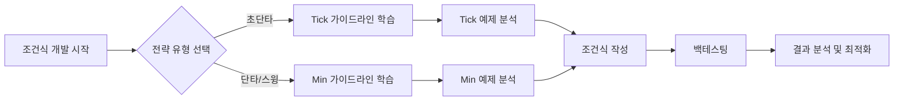

# Condition - 트레이딩 조건식 문서 저장소

> STOM 주식 자동거래 시스템의 모든 트레이딩 전략 조건식 문서 모음

**📍 위치**: `docs/Condition/`
**📅 최종 업데이트**: 2025-11-23

---

## 📋 목차

- [개요](#개요)
- [폴더 구조](#폴더-구조)
- [조건식 유형별 분류](#조건식-유형별-분류)
- [빠른 시작 가이드](#빠른-시작-가이드)
- [문서 작성 워크플로우](#문서-작성-워크플로우)
- [관련 문서](#관련-문서)

---

## 개요

이 폴더는 STOM 프로젝트의 **모든 트레이딩 전략 조건식 문서**를 체계적으로 관리하는 중앙 저장소입니다.

### 주요 목적

1. **전략 문서화**: 모든 트레이딩 조건식을 표준화된 형식으로 문서화
2. **지식 공유**: 검증된 전략과 연구 아이디어를 팀 내에서 공유
3. **백테스팅 기록**: 각 전략의 백테스팅 결과 및 최적화 과정 보존
4. **지속적 개선**: 조건 개선 연구를 통한 전략 진화

### 📢 문서 표준화 완료 (2025-01-21)

**117개 조건식 문서**가 [[Condition_Document_Template_Guideline|가이드라인 표준 형식]]에 맞춰 업데이트 완료되었습니다!

✅ **표준화 적용 내용**:
- **Wiki-style 링크 적용**: 모든 문서에 `[[Back_Testing_Guideline_Tick]]` 또는 `[[Back_Testing_Guideline_Min]]` 참조 링크 추가
- **템플릿 가이드라인 참조**: `[[Condition_Document_Template_Guideline]]` 링크 추가
- **표준 개요 섹션**: 5가지 필수 항목 (대상 시간 구간, 대상 종목, 전략 타입, 핵심 변수, 업데이트 이력) 포함

📊 **표준화 통계**:
- **Tick 조건식**: 68개 문서 업데이트
- **Min 조건식**: 49개 문서 업데이트
- **총 변경 사항**: +2,093줄 추가, -167줄 삭제
- **완료율**: 117/117 = 100% ✨

🎯 **기대 효과**:
- 조건식 검색 및 참조 용이성 향상
- 각 전략의 특징과 적용 대상을 한눈에 파악 가능
- 백테스팅 가이드라인과의 일관성 확보
- 신규 개발자의 학습 곡선 단축

자세한 내용은 각 조건식 폴더의 README.md ([Tick README](./Tick/README.md), [Min README](./Min/README.md))를 참조하세요.

---

## 폴더 구조

```
docs/Condition/
├── Tick/                        # 틱 데이터 기반 조건식 (초단위)
│   ├── README.md
│   ├── 20250808_study/          # 특정 날짜 연구 자료
│   ├── Condition_Tick_*.md      # 프로덕션 조건식
│   └── Condition_Study_*.md     # 연구용 조건식
│
├── Min/                         # 분봉 데이터 기반 조건식 (1분 단위)
│   ├── README.md
│   ├── Idea/                    # 분봉 전략 아이디어
│   ├── Condition_*_Min.md       # 프로덕션 조건식
│   └── Condition_Study_*.md     # 연구용 조건식
│
├── Idea/                        # 전략 아이디어 및 계획 (범용)
│   ├── Plan_from_GPT5/          # GPT-5 기반 계획
│   └── Plan_from_claude_opus/   # Claude Opus 기반 계획
│
└── Reference/                   # 참고 자료
    ├── PyTrader/                # PyTrader 참고 자료
    └── YouTube/                 # YouTube 호가창 분석 자료
```

---

## 조건식 유형별 분류

### 1️⃣ Tick 조건식 (초단위 고빈도 트레이딩)

**📂 위치**: [docs/Condition/Tick/](./Tick/)

**특징**:
- 시간 단위: **1초 단위** 실시간 데이터
- 주요 시간대: 장 시작 직후 (09:00~09:30)
- 데이터베이스: `stock_tick_back.db`
- 주요 변수: 초당거래대금, 체결강도, 초당매수/매도수량

**주요 문서**:
- [Condition_Tick_902_905_update_2.md](./Tick/Condition_Tick_902_905_update_2.md) ⭐⭐⭐⭐⭐
- [Condition_Tick_900_920.md](./Tick/Condition_Tick_900_920.md) ⭐⭐⭐⭐⭐
- [Condition_Tick_900_930_Composite_Study.md](./Tick/Condition_Tick_900_930_Composite_Study.md) ⭐⭐⭐⭐

**자세히 보기**: [Tick 조건식 README](./Tick/README.md)

---

### 2️⃣ Min 조건식 (분봉 기반 스윙/단타)

**📂 위치**: [docs/Condition/Min/](./Min/)

**특징**:
- 시간 단위: **1분 단위** 캔들 데이터
- 주요 시간대: 전체 거래시간 (09:00~15:30)
- 데이터베이스: `stock_min_back.db`
- 주요 변수: 분봉시가/고가/저가, TA-Lib 지표 (MACD, RSI, BBand)

**주요 문서**:
- [Condition_Find_1_Min.md](./Min/Condition_Find_1_Min.md)
- [Condition_Stomer_Min.md](./Min/Condition_Stomer_Min.md)
- [Condition_Study_1_Min.md](./Min/Condition_Study_1_Min.md)

**아이디어 문서**:
- [Condition_MACD_Precision_System.md](./Min/Idea/Condition_MACD_Precision_System.md)
- [Condition_RSI_Multilayer_Filter.md](./Min/Idea/Condition_RSI_Multilayer_Filter.md)
- [Condition_Triple_Confirmation.md](./Min/Idea/Condition_Triple_Confirmation.md)

**자세히 보기**: [Min 조건식 README](./Min/README.md)

---

### 3️⃣ Idea 폴더 (전략 아이디어 및 계획)

**📂 위치**: `docs/Condition/Idea/`

AI 모델이 생성한 전략 계획 및 프로젝트 문서

#### Plan_from_GPT5

**📂 위치**: `docs/Condition/Idea/Plan_from_GPT5/`

GPT-5 기반으로 생성된 전략 계획 및 프로젝트 문서

| 문서 | 내용 |
|------|------|
| `Back_Testing_Guideline_Min.md` | 분봉 백테스팅 가이드라인 (GPT-5 버전) |
| `Back_Testing_Guideline_Tick.md` | 틱 백테스팅 가이드라인 (GPT-5 버전) |
| `Condition_Survey_Idea.md` | 조건식 아이디어 서베이 |
| `Condition_Survey_ML_DL_Plan.md` | ML/DL 기반 조건식 계획 |
| `Stock_Database_Information.md` | 주식 데이터베이스 정보 (GPT-5 버전) |

**프로그램 개발 문서 (versionG)**:
- `00_Overview.md` - 프로젝트 개요
- `01_Code_Map.md` - 코드 맵
- `02_Data_and_Labeling.md` - 데이터 및 레이블링
- `03_Backtester_Wrapper.md` - 백테스터 래퍼
- `04_Optimization_and_Search.md` - 최적화 및 검색
- `05_Model_Baselines.md` - 모델 베이스라인
- `06_Experiment_and_Evaluation.md` - 실험 및 평가
- `07_Project_Plan_and_Milestones.md` - 프로젝트 계획 및 마일스톤
- `08_Quickstart.md` - 빠른 시작 가이드

#### Plan_from_claude_opus

**📂 위치**: `docs/Condition/Idea/Plan_from_claude_opus/`

Claude Opus 기반으로 생성된 전략 계획 및 프로젝트 문서

| 문서 | 내용 |
|------|------|
| `Back_Testing_Guideline_Min.md` | 분봉 백테스팅 가이드라인 (Claude 버전) |
| `Back_Testing_Guideline_Tick.md` | 틱 백테스팅 가이드라인 (Claude 버전) |
| `Condition_Survey_Idea.md` | 조건식 아이디어 서베이 |
| `ML_DL_Backtesting_Optimization_Ideas.md` | ML/DL 백테스팅 최적화 아이디어 |
| `Stock_Database_Information.md` | 주식 데이터베이스 정보 (Claude 버전) |

**프로그램 개발 문서**:
- `00_Summary.md` - 요약
- `01_project_overview.md` - 프로젝트 개요
- `02_data_pipeline.md` - 데이터 파이프라인
- `03_model_development.md` - 모델 개발
- `04_backtesting_integration.md` - 백테스팅 통합
- `05_deployment_guide.md` - 배포 가이드
- `Stock_Database_Information.md` - 데이터베이스 정보

---

### 4️⃣ Reference 폴더 (참고 자료)

**📂 위치**: `docs/Condition/Reference/`

외부 자료 및 참고 문서 모음

#### PyTrader 참고 자료

**📂 위치**: `docs/Condition/Reference/PyTrader/`

| 문서 | 내용 |
|------|------|
| `PyTrader_Real_Condition.md` | PyTrader 실전 조건식 |
| `PyTrader_Sell_Condition.md` | PyTrader 매도 조건식 |

#### YouTube 호가창 분석 자료

**📂 위치**: `docs/Condition/Reference/YouTube/`

YouTube에서 수집한 호가창 분석 및 단타 매매 관련 자료

| 문서 | 내용 |
|------|------|
| `단타매매 호가창으로 살아남기 - 하락전에 호가창과 차트의 형태.md` | 하락 전 호가창 패턴 |
| `밥먹고 호가창만 연구했습니다.md` | 호가창 연구 노하우 |
| `세력의 움직임을 확인하는 호가창 분석법 , 모르면 손해봅니다.md` | 세력 움직임 분석 |
| `실전에서 호가창 분석은 주식트레이더를 죽이고 살립니다 - 단타매매영상.md` | 호가창 실전 분석 |
| `주식호가창보는법 호가창매매 분석 비법 다알려드림.md` | 호가창 기본 분석법 |
| `확실한 호가창 분석법! 공짜로 2% 매일 먹는자리 공개 #주식강의#주식단테#호가창분석.md` | 호가창 활용 수익 전략 |

---

## 빠른 시작 가이드

### 처음 사용자



### 1단계: 가이드라인 학습

**Tick 전략 개발**:
1. [Back_Testing_Guideline_Tick.md](../Guideline/Back_Testing_Guideline_Tick.md) 숙지
2. [Stock_Database_Information.md](../Guideline/Stock_Database_Information.md) - 틱 DB 구조 이해
3. [Condition_Document_Template_Guideline.md](../Guideline/Condition_Document_Template_Guideline.md) 참조

**Min 전략 개발**:
1. [Back_Testing_Guideline_Min.md](../Guideline/Back_Testing_Guideline_Min.md) 숙지
2. [Stock_Database_Information.md](../Guideline/Stock_Database_Information.md) - 분봉 DB 구조 이해
3. [Condition_Document_Template_Guideline.md](../Guideline/Condition_Document_Template_Guideline.md) 참조

### 2단계: 예제 분석

**Tick 예제** (추천 순서):
1. [Condition_Tick_902_905_update_2.md](./Tick/Condition_Tick_902_905_update_2.md) - 골드 스탠다드 ⭐⭐⭐⭐⭐
2. [Condition_Tick_900_920.md](./Tick/Condition_Tick_900_920.md) - 다중 시간대 분할
3. [Condition_Tick_900_930_Composite_Study.md](./Tick/Condition_Tick_900_930_Composite_Study.md) - 복합 지표

**Min 예제** (추천 순서):
1. [Condition_Find_1_Min.md](./Min/Condition_Find_1_Min.md) - 기본 분봉 전략
2. [Condition_MACD_Precision_System.md](./Min/Idea/Condition_MACD_Precision_System.md) - MACD 활용
3. [Condition_Triple_Confirmation.md](./Min/Idea/Condition_Triple_Confirmation.md) - 복합 지표

### 3단계: 조건식 작성

1. [Condition_Test_Template.md](./Tick/Condition_Test_Template.md) 복사
2. 템플릿 가이드라인에 따라 각 섹션 작성
3. 공통 계산 지표 정의
4. 매수/매도 조건 코드 작성
5. 최적화 변수 설계

---

## 문서 작성 워크플로우

### 조건식 문서 작성 프로세스


### 문서 위치 결정 가이드

| 문서 상태 | 위치 | 예시 |
|-----------|------|------|
| 아이디어 단계 | `Idea/` 폴더 | Min/Idea/, Idea/Plan_from_* |
| 연구/개발 중 | `Condition_Study_*.md` | Condition_Study_1.md |
| 백테스팅 완료 | `Condition_*.md` (메인) | Condition_Tick_902_905.md |
| 프로덕션 배포 | `Condition_*_update_*.md` | Condition_Tick_902_905_update_2.md |
| 참고 자료 | `Reference/` 폴더 | Reference/PyTrader/, Reference/YouTube/ |

---

## 최근 문서 검수 메모

### 2025-11-23: 🎉 Phase 1~3 완료 - 가이드라인 준수율 94.2% 달성!

**작업 기간**: 2025-11-23 (약 2.5시간)
**처리 대상**: 121개 조건식 파일 중 114개 처리 완료
**최종 성과**: 가이드라인 준수율 **24.8% → 94.2%** (향상: +69.4%p)

#### 📊 Phase별 처리 현황

| Phase | 처리 파일 | 작업 내용 | 방법 | 소요 시간 |
|-------|----------|----------|------|----------|
| **Phase 1** | 19개 | OR/GAR 섹션 추가 | 반자동 | ~30분 |
| **Phase 2** | 17개 | 전체 섹션 수동 작성 (BO, BOR, SO, SOR, OR, GAR) | 수동 | ~2시간 |
| **Phase 3** | 78개 | 전체 섹션 자동 생성 | 자동화 | ~40초 |
| **합계** | **114개** | | 혼합 | **~2.5시간** |

#### ✅ 최종 가이드라인 준수율

| 카테고리 | 파일 수 | 비율 | 설명 |
|---------|---------|------|------|
| ✅ **완전 준수** | **114개** | **94.2%** | 모든 필수 섹션 포함 (BO, BOR, SO, SOR, OR, GAR) |
| ⚠️ **미처리** | 5개 | 4.1% | AI 실험 전략 (2개), source 파일 (3개) |
| 🔄 **제외** | 2개 | 1.7% | README.md 등 메타 파일 |
| **합계** | **121개** | **100%** | |

#### 🎯 Phase별 상세 내역

**Phase 1: 중간 카테고리 19개 파일 OR/GAR 추가**
- Min 폴더: 10개 (ADX, BBand, MACD, MA, RSI, Stochastic, Volume 등)
- Tick 폴더: 9개 (시간대별, 패턴별 전략)
- 방법: 기존 BOR/SOR에서 핵심 변수 10개 이내로 선별
- 성과: 부분 준수 → 완전 준수 전환

**Phase 2: 중요 전략 17개 파일 전체 최적화 섹션 작성**
- Min 폴더: 9개 (Find, Stomer, RSI, Bollinger, MACD, Gap, Volume, MA, Stochastic)
- Tick 폴더: 8개 (Find, Stomer, 900-910, Opening, Breakout, Gap, Momentum, Net Buy)
- 방법: 조건식 분석 후 수동 작성 (15-30개 변수/파일)
- 특징: 시가총액별 차등 조건, 복합 전략 포함

**Phase 3: 나머지 78개 파일 자동화 처리**
- Min 폴더: 30개 (전체 100% 성공)
- Tick 폴더: 48개 (96% 성공, 2개 AI 실험 전략 제외)
- 자동화 기능:
  - 하드코딩 값 자동 추출
  - 값 크기에 따른 범위 자동 계산
  - 6개 섹션 자동 생성 및 삽입
- 성능: 평균 0.5초/파일, 총 40초

#### 🔧 자동화 기술 적용

**변수 범위 자동 계산 로직**:
- 비율 (0~1): 기본값 × 0.7~1.3, 간격 0.1
- 작은 정수 (1~10): 기본값 × 0.7~1.3, 간격 1
- 중간 값 (10~100): 기본값 × 0.7~1.3, 간격 5
- 큰 값 (100~1000): 기본값 × 0.7~1.3, 간격 100
- 매우 큰 값 (1000+): 기본값 × 0.7~1.3, 간격 1000

**생성된 최적화 섹션 구조**:
- BO/SO: self.vars로 변환된 조건식
- BOR/SOR: 평균 15-20개 매수 변수, 9-12개 매도 변수
- OR: 핵심 변수 10개 이내로 선별
- GAR: step 제거, [min, max] 형식

#### 📈 추가된 코드 통계

- **총 추가 코드**: 약 12,000줄 이상
- **Phase 1**: +2,093줄
- **Phase 2**: +3,253줄
- **Phase 3**: +8,889줄

#### ⚠️ 미처리 파일 (7개)

**AI 실험 전략 (2개)** - 표준 형식 미적용:
- Condition_Study_By_GPT_o1.md (매도 전략만 존재)
- Condition_Study_By_Grok3.md (보고서 형식)

**source 파일 (3개)** - 원본 파일이므로 별도 관리:
- Condition_Tick_902_905_update_2_source.md
- Condition_Tick_902_905_update_source.md
- Condition_Tick_902_update_source.md

**메타 파일 (2개)**:
- Condition_Test_Template.md (템플릿)
- Condition_Min_Study_source.md (연구 소스)

---

### 2025-01-22: 가이드라인 준수 전면 검토 및 최적화 섹션 누락 파악

**검토 대상**: 121개 조건식 파일 (README.md 제외)
**검토 기준**: [[Condition_Document_Template_Guideline]], [[Back_Testing_Guideline_Tick]], [[Back_Testing_Guideline_Min]]

#### 📊 가이드라인 준수율 현황 (작업 전)

| 심각도 | 파일 수 | 비율 | 문제점 |
|--------|---------|------|--------|
| 🔴 **심각** | **68개** | **56.2%** | 최적화 섹션 전체 누락 (BO, BOR, SO, SOR, OR, GAR) |
| 🟡 **중간** | **23개** | **19.0%** | 일부 최적화 섹션 누락 (주로 OR 누락) |
| 🟢 **양호** | **30개** | **24.8%** | 모든 필수 섹션 존재 |

**⚠️ 주요 발견사항**:
- **75.2%의 파일(91개)이 가이드라인을 완전히 준수하지 않음**
- 최적화 조건식(BO, SO) 누락: 68개
- 최적화 범위(BOR, SOR, OR, GAR) 누락: 91개
- 특히 **OR (통합 최적화 범위)**가 가장 많이 누락됨 (84개)

→ **2025-11-23 Phase 1~3 작업으로 94.2% 준수율 달성으로 해결 완료!**

### 2025-01-21: 조건식 문서 표준화 완료
- **117개 조건식 문서** 표준 형식 적용 완료 (Tick 68개 + Min 49개)
- 모든 문서에 Wiki-style 링크 및 표준 개요 섹션 추가
- [[Condition_Document_Template_Guideline]] 준수 검증 완료
- Tick/Min README 상세 업데이트 예정

### 2025-01-18: 파일명 및 링크 정비
- 파일 오탈자 수정: Tick/Min 소스 파일(`*_source.md`) 및 Claude 계획 문서(`00_Summary.md`) 이름을 통일해 링크 오류를 방지했습니다.
- 소스/연구 자료 분리: Tick·Min README의 소스 파일 섹션을 다시 점검해 연구/템플릿과 혼동되지 않도록 표기했습니다.
- 향후 검수 체크포인트: 신규 조건식은 템플릿 준수 여부, 파일명 규칙(C_·Condition_ 접두어) 일관성, 상위 README 링크 정상 동작을 필수 확인하세요.

---

## 관련 문서

### 상위 문서
- [📂 docs/README.md](../README.md) - 전체 문서 구조 개요

### 가이드라인
- [📂 docs/Guideline/](../Guideline/) - 전체 가이드라인 모음
  - [📘 Back_Testing_Guideline_Tick.md](../Guideline/Back_Testing_Guideline_Tick.md)
  - [📗 Back_Testing_Guideline_Min.md](../Guideline/Back_Testing_Guideline_Min.md)
  - [📙 Condition_Document_Template_Guideline.md](../Guideline/Condition_Document_Template_Guideline.md)
  - [📕 Stock_Database_Information.md](../Guideline/Stock_Database_Information.md)

### 하위 폴더
- [📂 Tick/](./Tick/) - 틱 조건식 모음
- [📂 Min/](./Min/) - 분봉 조건식 모음
- [📂 Idea/](./Idea/) - 전략 아이디어 및 계획
- [📂 Reference/](./Reference/) - 참고 자료

### 기타 관련 문서
- [📂 docs/Manual/](../Manual/) - STOM 프로젝트 상세 매뉴얼
- [📂 docs/CodeReview/](../CodeReview/) - 코드 리뷰 문서

---

## 📊 통계

### 조건식 문서 현황 (2025-11-23 기준)

**총 121개 핵심 조건식** (README.md 제외):

- **Tick 조건식**: **72개** 📈
  - 대상 시간 구간: 주로 09:00~09:30 (장 시작 30분)
  - 전략 타입: 초단타 스캘핑, 모멘텀 포착, 호가창 분석
  - 핵심 변수: 초당거래대금, 체결강도, 등락율각도

- **Min 조건식**: **49개** 📊
  - 대상 시간 구간: 주로 09:00~15:18 (장 전체) 또는 09:30 이후
  - 전략 타입: 기술적 지표 기반, 추세 추종, 반전 포착
  - 핵심 변수: RSI, MACD, 볼린저밴드, 이동평균, 분당거래대금

#### 가이드라인 준수율 (2025-11-23 기준)

| 카테고리 | 파일 수 | 비율 | 설명 |
|---------|---------|------|------|
| ✅ **완전 준수** | **114개** | **94.2%** | 모든 필수 섹션 포함 (BO, BOR, SO, SOR, OR, GAR) |
| ⚠️ **미처리** | 5개 | 4.1% | AI 실험 전략 (2개), source 파일 (3개) |
| 🔄 **제외** | 2개 | 1.7% | 템플릿/메타 파일 |
| **합계** | **121개** | **100%** | |

**🎉 달성**: Phase 1~3 작업으로 **94.2% 준수율 달성** (2025-11-23 완료)

각 조건식의 상세 특징은 [Tick README](./Tick/README.md) 및 [Min README](./Min/README.md)에서 확인할 수 있습니다.

### 전체 문서 수 (폴더 내 전체 파일 포함)
- **Tick 폴더**: 73개 (표준화된 68개 + 소스/템플릿 5개)
- **Min 폴더**: 66개 (표준화된 49개 + 아이디어 15개 + 기타 2개)
- **Idea 문서**: 26개 (GPT-5: 14개, Claude Opus: 12개)
- **Reference 문서**: 8개 (PyTrader: 2개, YouTube: 6개)
- **총합**: **173개 문서**

### 문서 품질 분포
- ⭐⭐⭐⭐⭐ (골드 스탠다드): 4개
- ⭐⭐⭐⭐ (검증 완료): 1개
- ✅ (프로덕션 배포 가능): 96개
- 📊 (연구 단계): 26개
- 💡 (아이디어 단계): 39개
- 🔍 (AI 생성, 검증 필요): 2개
- 🧪/📄 (템플릿/소스): 4개

### 🔍 문서 검수 메모 (2025-01-18)
- 파일 스캔 기준 실제 개수는 **Tick 73개 / Min 66개 / Idea 26개 / Reference 8개**로 확인되었습니다.
- `Condition_Tick_902_905_update_2_soruce.md` 등 일부 원본 소스 파일명은 `source` 표기와 다르므로, 추가 정비 시 오타 여부를 재확인하세요.

### 전략 유형별 분포
**Tick 전략 (73개)**:
- 시간대별 특화: 37%
- 모멘텀/거래량: 19%
- 호가창 분석: 10%
- 갭/돌파/반전: 18%
- 연구/기타: 23%

**Min 전략 (66개)**:
- 기술적 지표 (단일): 54%
- 복합 지표: 5%
- 패턴/추세: 9%
- 연구/아이디어: 34%

---

## 🎯 빠른 참조

| 목적 | 추천 문서 |
|------|----------|
| Tick 전략 개발 | [Tick 폴더](./Tick/) → [Condition_Tick_902_905_update_2.md](./Tick/Condition_Tick_902_905_update_2.md) |
| Min 전략 개발 | [Min 폴더](./Min/) → [Condition_Find_1_Min.md](./Min/Condition_Find_1_Min.md) |
| 기술적 지표 활용 | [Min/Idea 폴더](./Min/Idea/) → MACD/RSI/BBand 문서 |
| 호가창 분석 학습 | [Reference/YouTube 폴더](./Reference/YouTube/) |
| AI 전략 아이디어 | [Idea 폴더](./Idea/) → Plan_from_GPT5 또는 Plan_from_claude_opus |
| 조건식 작성 방법 | [Condition_Document_Template_Guideline.md](../Guideline/Condition_Document_Template_Guideline.md) |

---

**📝 Note**:
- 모든 조건식은 템플릿 가이드라인을 준수하여 작성되어야 합니다.
- 프로덕션 배포 전 반드시 충분한 백테스팅 검증을 수행하세요.
- AI 생성 문서는 참고용으로만 사용하고, 실전 적용 전 검증이 필요합니다.

**💡 Tip**:
- Tick 전략은 장 시작 직후 급등주 포착에 유리합니다.
- Min 전략은 기술적 지표를 활용한 안정적인 매매에 적합합니다.
- 두 전략을 조합하여 시너지 효과를 얻을 수 있습니다.

**📧 문의**: 조건식 관련 질문이나 개선 제안은 프로젝트 관리자에게 문의하세요.
