# Condition - 트레이딩 조건식 문서 저장소

> STOM 주식 자동거래 시스템의 모든 트레이딩 전략 조건식 문서 모음

**📍 위치**: `docs/Condition/`
**📅 최종 업데이트**: 2025-01-15

---

## 📋 목차

- [개요](#개요)
- [폴더 구조](#폴더-구조)
- [조건식 유형별 분류](#조건식-유형별-분류)
- [빠른 시작 가이드](#빠른-시작-가이드)
- [문서 작성 워크플로우](#문서-작성-워크플로우)
- [관련 문서](#관련-문서)

---

## 개요

이 폴더는 STOM 프로젝트의 **모든 트레이딩 전략 조건식 문서**를 체계적으로 관리하는 중앙 저장소입니다.

### 주요 목적

1. **전략 문서화**: 모든 트레이딩 조건식을 표준화된 형식으로 문서화
2. **지식 공유**: 검증된 전략과 연구 아이디어를 팀 내에서 공유
3. **백테스팅 기록**: 각 전략의 백테스팅 결과 및 최적화 과정 보존
4. **지속적 개선**: 조건 개선 연구를 통한 전략 진화

---

## 폴더 구조

```
docs/Condition/
├── Tick/                        # 틱 데이터 기반 조건식 (초단위)
│   ├── README.md
│   ├── 20250808_study/          # 특정 날짜 연구 자료
│   ├── Condition_Tick_*.md      # 프로덕션 조건식
│   └── Condition_Study_*.md     # 연구용 조건식
│
├── Min/                         # 분봉 데이터 기반 조건식 (1분 단위)
│   ├── README.md
│   ├── Idea/                    # 분봉 전략 아이디어
│   ├── Condition_*_Min.md       # 프로덕션 조건식
│   └── Condition_Study_*.md     # 연구용 조건식
│
├── Idea/                        # 전략 아이디어 및 계획 (범용)
│   ├── Plan_from_GPT5/          # GPT-5 기반 계획
│   └── Plan_from_claude_opus/   # Claude Opus 기반 계획
│
└── Reference/                   # 참고 자료
    ├── PyTrader/                # PyTrader 참고 자료
    └── YouTube/                 # YouTube 호가창 분석 자료
```

---

## 조건식 유형별 분류

### 1️⃣ Tick 조건식 (초단위 고빈도 트레이딩)

**📂 위치**: [docs/Condition/Tick/](./Tick/)

**특징**:
- 시간 단위: **1초 단위** 실시간 데이터
- 주요 시간대: 장 시작 직후 (09:00~09:30)
- 데이터베이스: `stock_tick_back.db`
- 주요 변수: 초당거래대금, 체결강도, 초당매수/매도수량

**주요 문서**:
- [Condition_Tick_902_905_update_2.md](./Tick/Condition_Tick_902_905_update_2.md) ⭐⭐⭐⭐⭐
- [Condition_Tick_900_920.md](./Tick/Condition_Tick_900_920.md) ⭐⭐⭐⭐⭐
- [Condition_Tick_900_930_Composite_Study.md](./Tick/Condition_Tick_900_930_Composite_Study.md) ⭐⭐⭐⭐

**자세히 보기**: [Tick 조건식 README](./Tick/README.md)

---

### 2️⃣ Min 조건식 (분봉 기반 스윙/단타)

**📂 위치**: [docs/Condition/Min/](./Min/)

**특징**:
- 시간 단위: **1분 단위** 캔들 데이터
- 주요 시간대: 전체 거래시간 (09:00~15:30)
- 데이터베이스: `stock_min_back.db`
- 주요 변수: 분봉시가/고가/저가, TA-Lib 지표 (MACD, RSI, BBand)

**주요 문서**:
- [Condition_Find_1_Min.md](./Min/Condition_Find_1_Min.md)
- [Condition_Stomer_Min.md](./Min/Condition_Stomer_Min.md)
- [Condition_Study_1_Min.md](./Min/Condition_Study_1_Min.md)

**아이디어 문서**:
- [Condition_MACD_Precision_System.md](./Min/Idea/Condition_MACD_Precision_System.md)
- [Condition_RSI_Multilayer_Filter.md](./Min/Idea/Condition_RSI_Multilayer_Filter.md)
- [Condition_Triple_Confirmation.md](./Min/Idea/Condition_Triple_Confirmation.md)

**자세히 보기**: [Min 조건식 README](./Min/README.md)

---

### 3️⃣ Idea 폴더 (전략 아이디어 및 계획)

**📂 위치**: `docs/Condition/Idea/`

AI 모델이 생성한 전략 계획 및 프로젝트 문서

#### Plan_from_GPT5

**📂 위치**: `docs/Condition/Idea/Plan_from_GPT5/`

GPT-5 기반으로 생성된 전략 계획 및 프로젝트 문서

| 문서 | 내용 |
|------|------|
| `Back_Testing_Guideline_Min.md` | 분봉 백테스팅 가이드라인 (GPT-5 버전) |
| `Back_Testing_Guideline_Tick.md` | 틱 백테스팅 가이드라인 (GPT-5 버전) |
| `Condition_Survey_Idea.md` | 조건식 아이디어 서베이 |
| `Condition_Survey_ML_DL_Plan.md` | ML/DL 기반 조건식 계획 |
| `Stock_Database_Information.md` | 주식 데이터베이스 정보 (GPT-5 버전) |

**프로그램 개발 문서 (versionG)**:
- `00_Overview.md` - 프로젝트 개요
- `01_Code_Map.md` - 코드 맵
- `02_Data_and_Labeling.md` - 데이터 및 레이블링
- `03_Backtester_Wrapper.md` - 백테스터 래퍼
- `04_Optimization_and_Search.md` - 최적화 및 검색
- `05_Model_Baselines.md` - 모델 베이스라인
- `06_Experiment_and_Evaluation.md` - 실험 및 평가
- `07_Project_Plan_and_Milestones.md` - 프로젝트 계획 및 마일스톤
- `08_Quickstart.md` - 빠른 시작 가이드

#### Plan_from_claude_opus

**📂 위치**: `docs/Condition/Idea/Plan_from_claude_opus/`

Claude Opus 기반으로 생성된 전략 계획 및 프로젝트 문서

| 문서 | 내용 |
|------|------|
| `Back_Testing_Guideline_Min.md` | 분봉 백테스팅 가이드라인 (Claude 버전) |
| `Back_Testing_Guideline_Tick.md` | 틱 백테스팅 가이드라인 (Claude 버전) |
| `Condition_Survey_Idea.md` | 조건식 아이디어 서베이 |
| `ML_DL_Backtesting_Optimization_Ideas.md` | ML/DL 백테스팅 최적화 아이디어 |
| `Stock_Database_Information.md` | 주식 데이터베이스 정보 (Claude 버전) |

**프로그램 개발 문서**:
- `00_Smmary.md` - 요약
- `01_project_overview.md` - 프로젝트 개요
- `02_data_pipeline.md` - 데이터 파이프라인
- `03_model_development.md` - 모델 개발
- `04_backtesting_integration.md` - 백테스팅 통합
- `05_deployment_guide.md` - 배포 가이드
- `Stock_Database_Information.md` - 데이터베이스 정보

---

### 4️⃣ Reference 폴더 (참고 자료)

**📂 위치**: `docs/Condition/Reference/`

외부 자료 및 참고 문서 모음

#### PyTrader 참고 자료

**📂 위치**: `docs/Condition/Reference/PyTrader/`

| 문서 | 내용 |
|------|------|
| `PyTrader_Real_Condition.md` | PyTrader 실전 조건식 |
| `PyTrader_Sell_Condition.md` | PyTrader 매도 조건식 |

#### YouTube 호가창 분석 자료

**📂 위치**: `docs/Condition/Reference/YouTube/`

YouTube에서 수집한 호가창 분석 및 단타 매매 관련 자료

| 문서 | 내용 |
|------|------|
| `단타매매 호가창으로 살아남기 - 하락전에 호가창과 차트의 형태.md` | 하락 전 호가창 패턴 |
| `밥먹고 호가창만 연구했습니다.md` | 호가창 연구 노하우 |
| `세력의 움직임을 확인하는 호가창 분석법 , 모르면 손해봅니다.md` | 세력 움직임 분석 |
| `실전에서 호가창 분석은 주식트레이더를 죽이고 살립니다 - 단타매매영상.md` | 호가창 실전 분석 |
| `주식호가창보는법 호가창매매 분석 비법 다알려드림.md` | 호가창 기본 분석법 |
| `확실한 호가창 분석법! 공짜로 2% 매일 먹는자리 공개 #주식강의#주식단테#호가창분석.md` | 호가창 활용 수익 전략 |

---

## 빠른 시작 가이드

### 처음 사용자

```mermaid
graph LR
    A[조건식 개발 시작] --> B{전략 유형 선택}
    B -->|초단타| C[Tick 가이드라인 학습]
    B -->|단타/스윙| D[Min 가이드라인 학습]
    C --> E[Tick 예제 분석]
    D --> F[Min 예제 분석]
    E --> G[조건식 작성]
    F --> G
    G --> H[백테스팅]
    H --> I[결과 분석 및 최적화]
```



### 1단계: 가이드라인 학습

**Tick 전략 개발**:
1. [Back_Testing_Guideline_Tick.md](../Guideline/Back_Testing_Guideline_Tick.md) 숙지
2. [Stock_Database_Information.md](../Guideline/Stock_Database_Information.md) - 틱 DB 구조 이해
3. [Condition_Document_Template_Guideline.md](../Guideline/Condition_Document_Template_Guideline.md) 참조

**Min 전략 개발**:
1. [Back_Testing_Guideline_Min.md](../Guideline/Back_Testing_Guideline_Min.md) 숙지
2. [Stock_Database_Information.md](../Guideline/Stock_Database_Information.md) - 분봉 DB 구조 이해
3. [Condition_Document_Template_Guideline.md](../Guideline/Condition_Document_Template_Guideline.md) 참조

### 2단계: 예제 분석

**Tick 예제** (추천 순서):
1. [Condition_Tick_902_905_update_2.md](./Tick/Condition_Tick_902_905_update_2.md) - 골드 스탠다드 ⭐⭐⭐⭐⭐
2. [Condition_Tick_900_920.md](./Tick/Condition_Tick_900_920.md) - 다중 시간대 분할
3. [Condition_Tick_900_930_Composite_Study.md](./Tick/Condition_Tick_900_930_Composite_Study.md) - 복합 지표

**Min 예제** (추천 순서):
1. [Condition_Find_1_Min.md](./Min/Condition_Find_1_Min.md) - 기본 분봉 전략
2. [Condition_MACD_Precision_System.md](./Min/Idea/Condition_MACD_Precision_System.md) - MACD 활용
3. [Condition_Triple_Confirmation.md](./Min/Idea/Condition_Triple_Confirmation.md) - 복합 지표

### 3단계: 조건식 작성

1. [Condition_Test_Template.md](./Tick/Condition_Test_Template.md) 복사
2. 템플릿 가이드라인에 따라 각 섹션 작성
3. 공통 계산 지표 정의
4. 매수/매도 조건 코드 작성
5. 최적화 변수 설계

---

## 문서 작성 워크플로우

### 조건식 문서 작성 프로세스

```mermaid
graph TD
    A[전략 아이디어 도출] --> B[가이드라인 참조]
    B --> C[템플릿 복사]
    C --> D[개요 섹션 작성]
    D --> E[조건식 코드 작성]
    E --> F[최적화 변수 설계]
    F --> G[백테스팅 실행]
    G --> H{결과 만족?}
    H -->|Yes| I[문서 완성]
    H -->|No| J[조건 개선 연구]
    J --> E
    I --> K[프로덕션 폴더로 이동]
```



### 문서 위치 결정 가이드

| 문서 상태 | 위치 | 예시 |
|-----------|------|------|
| 아이디어 단계 | `Idea/` 폴더 | Min/Idea/, Idea/Plan_from_* |
| 연구/개발 중 | `Condition_Study_*.md` | Condition_Study_1.md |
| 백테스팅 완료 | `Condition_*.md` (메인) | Condition_Tick_902_905.md |
| 프로덕션 배포 | `Condition_*_update_*.md` | Condition_Tick_902_905_update_2.md |
| 참고 자료 | `Reference/` 폴더 | Reference/PyTrader/, Reference/YouTube/ |

---

## 관련 문서

### 상위 문서
- [📂 docs/README.md](../README.md) - 전체 문서 구조 개요

### 가이드라인
- [📂 docs/Guideline/](../Guideline/) - 전체 가이드라인 모음
  - [📘 Back_Testing_Guideline_Tick.md](../Guideline/Back_Testing_Guideline_Tick.md)
  - [📗 Back_Testing_Guideline_Min.md](../Guideline/Back_Testing_Guideline_Min.md)
  - [📙 Condition_Document_Template_Guideline.md](../Guideline/Condition_Document_Template_Guideline.md)
  - [📕 Stock_Database_Information.md](../Guideline/Stock_Database_Information.md)

### 하위 폴더
- [📂 Tick/](./Tick/) - 틱 조건식 모음
- [📂 Min/](./Min/) - 분봉 조건식 모음
- [📂 Idea/](./Idea/) - 전략 아이디어 및 계획
- [📂 Reference/](./Reference/) - 참고 자료

### 기타 관련 문서
- [📂 docs/Manual/](../Manual/) - STOM 프로젝트 상세 매뉴얼
- [📂 docs/CodeReview/](../CodeReview/) - 코드 리뷰 문서

---

## 📊 통계

### 전체 문서 수
- **Tick 조건식**: 30개 (프로덕션 9개, 연구 11개, AI 2개, 기타 8개)
- **Min 조건식**: 20개 (프로덕션 2개, 연구 5개, 아이디어 15개)
- **Idea 문서**: 29개 (GPT-5: 13개, Claude Opus: 11개)
- **Reference 문서**: 8개 (PyTrader: 2개, YouTube: 6개)
- **총합**: 87개 문서

### 문서 품질 분포
- ⭐⭐⭐⭐⭐ (골드 스탠다드): 3개
- ⭐⭐⭐⭐ (검증 완료): 6개
- 📊 (연구 단계): 16개
- 💡 (아이디어 단계): 15개
- 🔍 (검증 필요): 2개

---

## 🎯 빠른 참조

| 목적 | 추천 문서 |
|------|----------|
| Tick 전략 개발 | [Tick 폴더](./Tick/) → [Condition_Tick_902_905_update_2.md](./Tick/Condition_Tick_902_905_update_2.md) |
| Min 전략 개발 | [Min 폴더](./Min/) → [Condition_Find_1_Min.md](./Min/Condition_Find_1_Min.md) |
| 기술적 지표 활용 | [Min/Idea 폴더](./Min/Idea/) → MACD/RSI/BBand 문서 |
| 호가창 분석 학습 | [Reference/YouTube 폴더](./Reference/YouTube/) |
| AI 전략 아이디어 | [Idea 폴더](./Idea/) → Plan_from_GPT5 또는 Plan_from_claude_opus |
| 조건식 작성 방법 | [Condition_Document_Template_Guideline.md](../Guideline/Condition_Document_Template_Guideline.md) |

---

**📝 Note**:
- 모든 조건식은 템플릿 가이드라인을 준수하여 작성되어야 합니다.
- 프로덕션 배포 전 반드시 충분한 백테스팅 검증을 수행하세요.
- AI 생성 문서는 참고용으로만 사용하고, 실전 적용 전 검증이 필요합니다.

**💡 Tip**:
- Tick 전략은 장 시작 직후 급등주 포착에 유리합니다.
- Min 전략은 기술적 지표를 활용한 안정적인 매매에 적합합니다.
- 두 전략을 조합하여 시너지 효과를 얻을 수 있습니다.

**📧 문의**: 조건식 관련 질문이나 개선 제안은 프로젝트 관리자에게 문의하세요.
