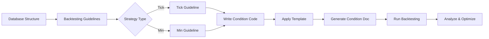

<!-- Parent: ../AGENTS.md -->
# Development Guidelines

## Purpose

This directory contains comprehensive development standards, backtesting guidelines, variable documentation, and user manuals for the STOM trading system. It serves as the authoritative source for strategy development patterns, documentation templates, and system usage instructions.

**Key Functions**:
- **Backtesting Standards**: Complete variable documentation for Tick (826 vars) and Min (752 vars) strategies
- **Documentation Templates**: Standardized format for trading condition documentation (98.3% compliance rate)
- **Database Schema**: Stock database structure and column definitions
- **User Education**: Korean user manuals for system operation
- **Variable Management**: Unified variable registry and classification system

## Key Files

### 1. **Back_Testing_Guideline_Tick.md** (33KB, 826 variables)
Complete reference for tick-level (second-by-second) backtesting strategy development.

**Coverage**:
- Single variable and interval calculation functions
- 826 documented buy/sell variables
- Historical tick data access patterns (`N(1)`, `N(2)`)
- Interval functions (`등락율각도(30)`, `체결강도평균(30)`)
- Real-world examples and best practices

**Use Cases**: High-frequency trading strategy development, ultra-short-term pattern recognition

### 2. **Back_Testing_Guideline_Min.md** (25KB, 752 variables)
Complete reference for minute-level candlestick backtesting strategy development.

**Coverage**:
- Tick vs Min data differences
- 752 documented buy/sell variables
- Candlestick data utilization (OHLC)
- TA-Lib technical indicators (MACD, RSI, BBand)
- Minute interval calculation functions

**Use Cases**: Swing trading, short-term chart-based strategies

### 3. **Condition_Document_Template_Guideline.md** (75KB, 850+ lines)
Comprehensive template and rules for trading condition documentation.

**Structure**:
1. Overview section (strategy summary, target times, market characteristics)
2. Condition expressions (buy/sell logic with common indicators)
3. Optimization sections (variable design, ranges, GA conversion, timing)
4. Backtesting results (performance metrics and analysis)
5. Improvement research (10 category improvement directions)

**Purpose**: Maintains 98.3% documentation compliance rate across 133 condition files

**Reference Example**: [Condition_Tick_902_905_update_2.md](../Condition/Tick/Condition_Tick_902_905_update_2.md)

### 4. **Stock_Database_Information.md** (21KB)
Detailed documentation of SQLite database structure for stock trading data.

**Coverage**:
- `stock_min_back.db` (minute data) - 108 columns documented
- `stock_tick_back.db` (tick data) - 93 columns documented
- Timestamp storage patterns (`index` column usage)
- SQL query examples and best practices

**Last Verified**: 2025-01-15

**Use Cases**: Data analysis, custom backtesting engines, database schema modifications

### 5. **Variable_Management_Guide.md** (42KB)
Unified variable classification and management system for backtesting analysis.

**Coverage**:
- Variable classification (Raw, Derived, Filter, Segment Filter)
- Variable naming conventions
- Variable creation flow and dependencies
- Unified registry design patterns
- Code refactoring recommendations

**Files Covered**: `metric_registry.py`, `metrics_enhanced.py`, `filters.py`, `segmentation.py`, `detail_schema.py`

**Purpose**: Centralized variable management across 50+ derived variables and multiple filter types

### 6. **Manual_Generation_Guideline.md** (32KB)
Systematic methodology for STOM codebase analysis and documentation generation.

**Methodology**:
1. Project structure analysis
2. Code analysis patterns
3. Process flow mapping
4. Documentation strategy
5. Obsidian integration (markdown standards, linking)

**Target Audience**: Documentation maintainers, LLM-assisted developers

**Reference Implementation**: [docs/Manual/](../Manual/) directory

## Subdirectories

### `사용설명서/` (Korean User Manual)
Step-by-step user guides with script and summary versions (8 files total).

**Structure**:
- **Part 1**: Basic setup and getting started (37KB script + 12KB summary)
- **Part 2**: Strategy configuration and backtesting (41KB script + 13KB summary)
- **Part 3**: Live trading and monitoring (75KB script + 11KB summary)
- **Part 4**: Advanced settings and troubleshooting (9KB script + 6KB summary)

**Usage Pattern**: Beginners read summaries first, then reference scripts for details

See [사용설명서/AGENTS.md](./사용설명서/AGENTS.md) for detailed structure.

## For AI Agents

### Primary Directives

**CRITICAL RULES**:
1. **Read Before Edit**: ALWAYS read guideline files before suggesting modifications
2. **Maintain Compliance**: Preserve 98.3%+ documentation compliance rate
3. **Variable Preservation**: Never modify documented variable counts (826 Tick, 752 Min) without verification
4. **Korean Variables**: Preserve Korean variable names (현재가, 시가, 고가, 저가) - DO NOT translate
5. **Template Adherence**: All condition documents MUST follow Condition_Document_Template_Guideline.md structure

### Development Workflow Integration

**When Creating New Trading Strategies**:

**Step-by-Step**:
1. **Understand Data**: Read `Stock_Database_Information.md` for database schema
2. **Learn Variables**: Reference appropriate guideline (`Back_Testing_Guideline_Tick.md` or `Back_Testing_Guideline_Min.md`)
3. **Write Strategy**: Use documented variables and calculation functions
4. **Document Strategy**: Apply `Condition_Document_Template_Guideline.md` template
5. **Verify Compliance**: Check all required sections (BO, BOR, SO, SOR, OR, GAR)
6. **Validate**: Ensure code references match documentation (see [DOCUMENTATION_GUIDE.md](../DOCUMENTATION_GUIDE.md))

### Recommended Learning Path

**Beginner**: User manual (Parts 1-2) → Stock_Database_Information.md
**Intermediate**: Back_Testing_Guideline_Tick.md OR Back_Testing_Guideline_Min.md
**Advanced**: Condition_Document_Template_Guideline.md → Write actual conditions
**Documentation**: Manual_Generation_Guideline.md → Generate system documentation
**Variable Management**: Variable_Management_Guide.md → Understand unified registry

### File Modification Guidelines

**When Updating Backtesting Guidelines**:
- Verify variable counts match actual codebase (`stock/kiwoom_strategy_tick.py`, etc.)
- Update both guideline file AND related condition documents
- Maintain alphabetical/categorical ordering of variables
- Include usage examples for new calculation functions

**When Creating Condition Documents**:
- Use template from `Condition_Document_Template_Guideline.md`
- Include ALL required sections: Overview, Conditions, Optimization (BO/BOR/SO/SOR/OR/GAR), Results
- Reference actual source code files (e.g., `stock/kiwoom_strategy_tick.py:142-156`)
- Ensure optimization sections are auto-generated or manually verified for accuracy

**When Modifying Database Schema**:
- Update `Stock_Database_Information.md` with new columns
- Update affected backtesting guidelines
- Verify SQL query examples still work
- Run `utility/database_check.py` for integrity validation

### Documentation Quality Standards

**Compliance Metrics** (as of 2025-11-26):
- 119/121 condition files (98.3%) meet documentation standards
- All 7 guideline files verified with code references
- 138 code blocks validated across manual documentation

**Quality Gates**:
- [ ] All sections present (Overview, Conditions, Optimization, Results)
- [ ] Code references link to actual source files
- [ ] Variable counts match documented totals
- [ ] Korean variable names preserved
- [ ] Optimization sections complete (BO, BOR, SO, SOR, OR, GAR)

### Common Tasks

**Add New Variable to Backtesting System**:
1. Add to appropriate strategy file (`*_strategy_tick.py` or `*_strategy_min.py`)
2. Update backtesting guideline (Tick or Min) with variable definition
3. Add to `Variable_Management_Guide.md` classification
4. If used in filters: Update `metric_registry.py`
5. Update condition documents that use this variable

**Generate New Manual Section**:
1. Follow `Manual_Generation_Guideline.md` methodology
2. Use Obsidian markdown conventions
3. Include code references with file paths and line numbers
4. Cross-link to related guideline documents
5. Verify examples match actual codebase behavior

**Troubleshoot Documentation Compliance**:
1. Review `DOCUMENTATION_GUIDE.md` for validation procedures
2. Check condition document against template guideline
3. Verify all 6 optimization sections present (BO, BOR, SO, SOR, OR, GAR)
4. Ensure code snippets reference actual source files
5. Run automated compliance checks if available

## Dependencies

### Internal Dependencies

**Template Standards**:
- `Condition_Document_Template_Guideline.md` defines structure for all condition docs in `docs/Condition/Tick/` and `docs/Condition/Min/`

**Variable Documentation**:
- `Back_Testing_Guideline_Tick.md` and `Back_Testing_Guideline_Min.md` source variables from strategy files:
  - `stock/kiwoom_strategy_tick.py` (primary tick strategy)
  - `stock/kiwoom_strategy_min.py` (primary minute strategy)
  - `coin/upbit_strategy_min.py`, `coin/binance_strategy_min.py` (crypto strategies)

**Database Schema**:
- `Stock_Database_Information.md` documents schemas from:
  - `_database/stock_min_back.db`
  - `_database/stock_tick_back.db`
  - `utility/setting.py` (database path configuration)

**Variable Registry**:
- `Variable_Management_Guide.md` consolidates variables from:
  - `backtester/metric_registry.py`
  - `backtester/metrics_enhanced.py`
  - `backtester/filters.py`
  - `backtester/segmentation.py`

### External Dependencies

**Referenced Documentation**:
- [docs/Condition/](../Condition/) - Real condition implementations
- [docs/Manual/](../Manual/) - System architecture documentation
- [docs/DOCUMENTATION_GUIDE.md](../DOCUMENTATION_GUIDE.md) - Validation procedures

**Source Code Dependencies**:
- `/stock/` - Stock trading strategy implementations
- `/coin/` - Cryptocurrency trading implementations
- `/backtester/` - Backtesting engine and optimization
- `/utility/` - Database management and settings

**Tools and Utilities**:
- `utility/database_check.py` - Schema validation
- `backtester/back_code_test.py` - Condition code validation
- Python TA-Lib - Technical indicator calculations

### Cross-Reference Matrix

| Guideline File | Primary Source Files | Documentation Impact |
|----------------|---------------------|---------------------|
| Back_Testing_Guideline_Tick.md | `stock/kiwoom_strategy_tick.py` | 72 Tick condition docs |
| Back_Testing_Guideline_Min.md | `*_strategy_min.py` files | 61 Min condition docs |
| Condition_Document_Template_Guideline.md | N/A (template definition) | All 133 condition docs |
| Stock_Database_Information.md | `_database/*.db`, `utility/setting.py` | Database query examples |
| Variable_Management_Guide.md | `backtester/metric_*.py`, `filters.py` | Filter/segment definitions |
| Manual_Generation_Guideline.md | Entire codebase | `docs/Manual/` structure |

---

**Last Updated**: 2026-01-19
**Compliance Rate**: 98.3% (119/121 condition files)
**Total Variables Documented**: 1,578 (826 Tick + 752 Min)
**Manual Files**: 8 (4 script + 4 summary versions)
