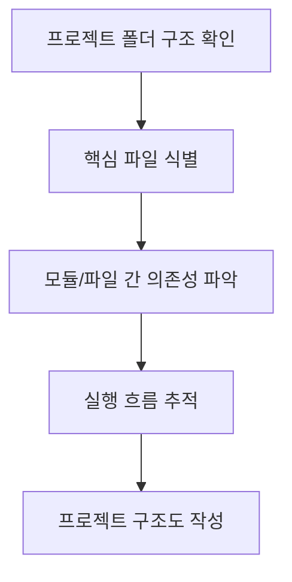
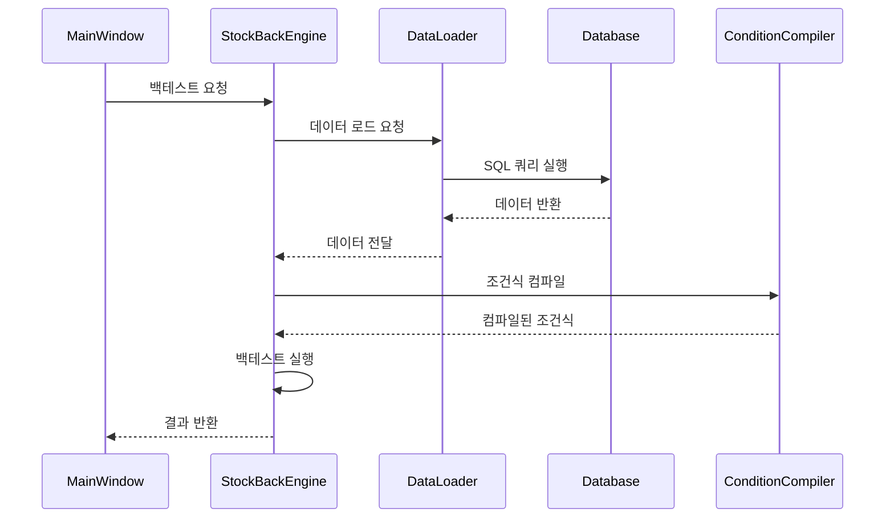
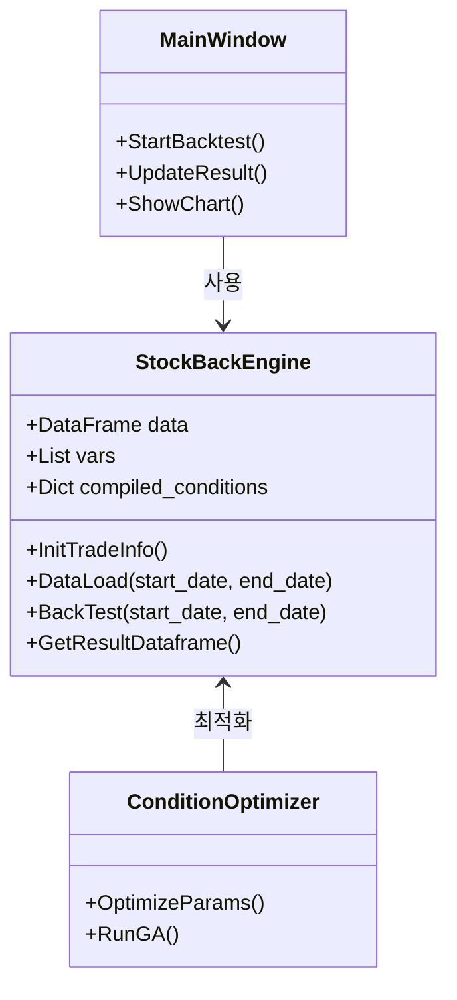

# STOM 프로젝트 분석 및 문서화 전략 가이드라인

## 목차
- [📌 프로젝트 분석 및 문서화 전략 개요](#-프로젝트-분석-및-문서화-전략-개요)
- [📊 단계별 분석 방법론](#-단계별-분석-방법론)
  - [1단계: 프로젝트 구조 파악](#1단계-프로젝트-구조-파악)
  - [2단계: 핵심 기능별 코드 분석](#2단계-핵심-기능별-코드-분석)
  - [3단계: 세부 프로세스 흐름 분석](#3단계-세부-프로세스-흐름-분석)
  - [4단계: 심층 분석 영역](#4단계-심층-분석-영역)
- [📝 문서화 전략](#-문서화-전략)
  - [매뉴얼 구조 설계](#매뉴얼-구조-설계)
  - [파일별 매뉴얼 작성 원칙](#파일별-매뉴얼-작성-원칙)
  - [통합 매뉴얼과 파일별 매뉴얼의 관계](#통합-매뉴얼과-파일별-매뉴얼의-관계)
  - [옵시디언 활용을 위한 마크다운 작성 규칙](#옵시디언-활용을-위한-마크다운-작성-규칙)

## 📌 프로젝트 분석 및 문서화 전략 개요

STOM 프로젝트를 체계적으로 분석하고 이해하기 위한 전략적 접근법을 제시합니다. 이 가이드라인을 통해 코드 구조 파악부터 상세 문서화까지 단계별로 진행할 수 있습니다.

### 🎯 최종 목표

1. STOM 프로젝트 코드 전체를 심층 분석
2. 프로그램의 핵심 기능과 구조를 이해하고 문서화
3. LLM/GPT와 함께 활용할 수 있는 마크다운 형식의 상세 매뉴얼 작성
4. 추후 참조 및 질의응답에 활용 가능한 지식베이스 구축

## 📊 단계별 분석 방법론

### 1단계: 프로젝트 구조 파악



#### 수행 작업
- **폴더 구조 매핑**: 주요 디렉토리와 파일 목록 작성
- **핵심 파일 식별**: `stom.py`, `backengine_stock.py` 등 주요 파일 확인
- **의존성 분석**: `import` 문 추적으로 모듈 간 연결성 확인
- **시작점 파악**: 메인 실행 스크립트와 진입점 확인

### 2단계: 핵심 기능별 코드 분석

| 기능 영역 | 관련 파일 | 주요 클래스/함수 |
|---------|--------|---------------|
| UI 처리 | ui/*.py | MainWindow, UI 관련 클래스 |
| 백테스팅 엔진 | backengine_stock.py | StockBackEngine, BackTest 함수 |
| 데이터 처리 | utility/static.py | 데이터 로딩/변환 함수 |
| 멀티프로세싱 | - | Queue, SharedMemory 활용 코드 |
| 조건식/전략 | Condition_*.md | 매매 전략 정의 및 최적화 |

#### 수행 작업
- **클래스/함수 목록화**: 각 파일의 주요 클래스와 함수 추출
- **파라미터/반환값 분석**: 핵심 함수의 입출력 형식 정리
- **함수 호출 관계**: 함수 간 호출 흐름 추적
- **주요 알고리즘 분석**: 백테스팅, 최적화 등 핵심 알고리즘 분석

### 3단계: 세부 프로세스 흐름 분석

#### 백테스팅 프로세스 
```
초기화 → 데이터 로드 → 조건식 컴파일 → 백테스트 실행 → 결과 집계 → 시각화
```

#### 멀티프로세싱 구조
```
메인 프로세스 → 큐 생성(beq, bq, tq) → 워커 프로세스 생성 → 
메시지 교환 → 결과 수집 → 프로세스 종료
```

#### 조건식 처리 흐름
```
조건식 로드 → Python 코드 변환 → 컴파일 → 변수 세팅 → 
exec() 실행 → 결과 평가 → 최적화
```

### 4단계: 심층 분석 영역

#### 멀티프로세싱 메커니즘
- **프로세스 간 통신**: Queue를 통한 명령/데이터 전달 방식
- **SharedMemory**: 대용량 데이터 공유 메커니즘
- **작업 분배**: 작업 분할 및 결과 병합 로직

#### 백테스팅 알고리즘
- **시뮬레이션 로직**: 틱 데이터 순회 및 조건 평가 방식
- **성능 최적화**: NumPy/Pandas 활용 방식
- **결과 집계**: 수익률, 승률, 최대 손실 등 계산 방식

#### 전략 최적화 기법
- **GA(유전 알고리즘)**: 파라미터 최적화 방법
- **변수 조정**: self.vars를 통한 전략 파라미터 조정
- **백테스트 평가**: 전략 성능 지표 및 평가 기준

## 📝 문서화 전략

### 매뉴얼 구조 설계

```
STOM 프로젝트 매뉴얼/
├── 1. 프로젝트 개요/
│   ├── 1.1 목적 및 기능
│   ├── 1.2 시스템 요구사항
│   └── 1.3 핵심 라이브러리
├── 2. 프로젝트 구조/
│   ├── 2.1 폴더 구조
│   ├── 2.2 주요 파일 설명
│   └── 2.3 데이터 흐름도
├── 3. 핵심 기능 설명/
│   ├── 3.1 UI 및 사용자 인터페이스
│   ├── 3.2 백테스팅 엔진
│   ├── 3.3 멀티프로세싱 구현
│   └── 3.4 조건식 및 전략 정의
├── 4. 백테스팅 상세 가이드/
│   ├── 4.1 데이터 준비
│   ├── 4.2 전략 설정
│   ├── 4.3 백테스트 실행
│   └── 4.4 결과 분석
├── 5. 조건식 작성 가이드/
│   ├── 5.1 기본 문법
│   ├── 5.2 변수 활용법
│   ├── 5.3 최적화 기법
│   └── 5.4 예제 전략
├── 6. 확장 및 커스터마이징/
│   ├── 6.1 신규 기능 추가
│   ├── 6.2 기존 기능 수정
│   └── 6.3 성능 최적화 팁
├── 7. 파일별 상세 매뉴얼/
│   ├── 7.1 stom.py
│   ├── 7.2 backengine_stock.py
│   ├── 7.3 backengine_stock2.py
│   └── 7.4 기타 모든 .py 파일들
└── 8. 부록/
    ├── 8.1 FAQ
    ├── 8.2 용어 사전
    ├── 8.3 참고 자료
    └── 8.4 트러블슈팅
```

### 파일별 매뉴얼 작성 원칙

프로젝트 내의 **모든 파이썬 파일은 개별 매뉴얼로 작성**되어야 합니다. 이는 다음 원칙을 따릅니다:

1. **완전성(Completeness)**: 프로젝트 내 모든 `.py` 파일을 누락 없이 문서화해야 합니다. 아무리 작은 유틸리티 스크립트라도 제외되어서는 안 됩니다.

2. **상세성(Thoroughness)**: 각 파일에 대한 문서는 해당 파일의 모든 함수, 클래스, 중요 변수를 포함해야 합니다.

3. **일관성(Consistency)**: 모든 파일별 매뉴얼은 동일한 형식과 구조를 따라야 합니다.

4. **연결성(Interconnectedness)**: 파일 간 의존성과 상호작용을 명확히 설명해야 합니다.

#### 파일별 매뉴얼 템플릿

각 파일별 매뉴얼은 다음 형식을 따라야 합니다:

```markdown
# [파일명].py 매뉴얼

## 개요
- 파일의 주요 목적
- 프로젝트 내 역할
- 주요 의존성

## 목차
- [[#클래스 ClassName1]]
- [[#함수 function_name1]]
- [[#함수 function_name2]]
- ...

## 클래스 ClassName1
- 목적:
- 주요 속성:
- 메서드 목록:
  - `method1()`: 설명
  - `method2()`: 설명
  
## 함수 function_name1
- 목적:
- 파라미터:
- 반환값:
- 사용 예시:
```

### 통합 매뉴얼과 파일별 매뉴얼의 관계

프로젝트 문서화는 두 가지 계층으로 구성됩니다:

1. **메인 통합 매뉴얼**: 프로젝트 전체를 포괄하는 상위 수준의 문서로, 모든 주요 개념과 기능을 설명합니다.

2. **파일별 상세 매뉴얼**: 각 파이썬 파일에 대한 세부 문서로, 해당 파일의 모든 구성 요소를 자세히 설명합니다.

두 계층 간에는 명확한 상호 참조가 있어야 하며, 통합 매뉴얼에서 모든 파일별 매뉴얼로 쉽게 이동할 수 있어야 합니다.

### 옵시디언 활용을 위한 마크다운 작성 규칙

모든 매뉴얼은 [옵시디언(Obsidian)](https://obsidian.md/)에서 최적으로 활용할 수 있도록 다음 규칙을 따라 작성해야 합니다:

1. **내부 링크**: 문서 간 연결은 `[[파일명]]` 또는 `[[파일명#섹션]]` 형식의 위키링크를 사용합니다.

2. **목차 및 앵커**: 각 섹션은 `## 제목` 형식으로 명확히 구분하고, 내부 링크를 통해 참조할 수 있어야 합니다.

3. **태그 활용**: 주요 개념과 기능에 `#태그` 형식으로 태그를 추가해 검색과 연결성을 강화합니다.

4. **임베딩**: 필요한 경우 `![[파일명]]` 형식으로 다른 문서 내용을 현재 문서에 임베딩할 수 있습니다.

5. **코드 블록**: 코드는 ````python` 형식의 코드 블록으로 구분하고, 문법 강조를 적용합니다.

예시:
```markdown
## 백테스트 엔진

백테스트 엔진은 [[backengine_stock.py]] 파일에 구현되어 있습니다. 주요 기능:

- 데이터 로딩: [[backengine_stock.py#DataLoad]] 함수 참조
- 시뮬레이션: [[backengine_stock.py#BackTest]] 함수 참조

#백테스팅 #핵심기능
```

### 주요 문서화 요소

#### 1. 코드 설명
```python
# 함수: BackTest(self, start_date, end_date)
# 목적: 지정된 기간 동안 백테스트 실행
# 파라미터:
#   - start_date (str): 'YYYYMMDD' 형식의 시작일
#   - end_date (str): 'YYYYMMDD' 형식의 종료일
# 반환값:
#   - DataFrame: 백테스트 결과 (수익률, 거래횟수 등)
# 프로세스:
#   1. 데이터 로드
#   2. 조건식 컴파일
#   3. 틱 데이터 순회하며 조건 평가
#   4. 매매 시뮬레이션
#   5. 결과 집계
```

#### 2. 프로세스 흐름도


#### 3. 클래스 다이어그램


## 🔍 문서화 실행 전략

### 단계별 접근법

1. **1차 스캔: 구조 파악**
   - 폴더 구조, 파일 목록 작성
   - 주요 클래스와 함수 목록화
   - **파일 인벤토리 생성**: 프로젝트의 모든 `.py` 파일을 빠짐없이 목록화하여 문서화 대상 확인

2. **2차 분석: 기능별 심층 분석**
   - 백테스팅 로직
   - 멀티프로세싱 구현
   - 조건식 처리 방식
   - **파일별 주요 구성요소 식별**: 각 파일의 클래스, 함수, 중요 변수 목록 작성

3. **3차 통합: 전체 흐름 정리**
   - 모듈 간 상호작용
   - 데이터 흐름
   - 실행 시나리오
   - **파일 간 의존성 매핑**: 어떤 파일이 다른 파일을 import하는지 관계도 작성

4. **4차 문서화: 매뉴얼 작성**
   - 마크다운 포맷 문서 작성
   - 코드 설명, 다이어그램 포함
   - 사용자 가이드 추가
   - **파일별 매뉴얼 작성**: 각 파이썬 파일에 대한 독립적인 매뉴얼 작성
   - **통합 매뉴얼 작성**: 개별 파일 매뉴얼을 참조하는 종합 문서 작성
   - **완전성 검증**: 모든 파일이 누락 없이 문서화되었는지 최종 확인

### 문서화 완전성 확보 전략

프로젝트 내 모든 파이썬 파일이 문서화되도록 다음 절차를 따릅니다:

1. **파일 인벤토리 체크리스트**:
   ```markdown
   # STOM 프로젝트 파일 인벤토리
   
   ## 메인 파일
   - [ ] stom.py
   
   ## 백테스팅 관련
   - [ ] backengine_stock.py
   - [ ] backengine_stock2.py
   - [ ] backtest.py
   
   ## 유틸리티
   - [ ] utility/static.py
   - [ ] ...
   ```

2. **진행 상황 추적**:
   - 체크리스트를 활용해 각 파일의 문서화 상태를 추적
   - 각 파일별로 "초안 작성", "검토 완료", "최종 버전" 등의 상태 표시

3. **누락 방지 절차**:
   - 프로젝트 루트에서 `find . -name "*.py" | sort` 명령으로 모든 파이썬 파일 목록 추출
   - 추출한 목록과 인벤토리 체크리스트 비교
   - 누락된 파일 추가 및 문서화

4. **상호 참조 검증**:
   - 모든 파일별 매뉴얼에서 해당 파일이 import하는 다른 파일들에 대한 링크 확인
   - 통합 매뉴얼에서 모든 파일별 매뉴얼로의 링크 확인

### Cursor와 LLM/GPT 활용 전략

#### Cursor 활용
- **코드 네비게이션**: 함수/클래스 정의 점프 기능 활용
- **전역 검색**: 특정 함수/변수의 사용처 찾기
- **주석 추가**: 분석 내용을 코드에 직접 주석으로 기록

#### LLM/GPT 활용
- **코드 해석 질의**: "이 함수는 어떤 역할을 하나요?"
- **프로세스 이해**: "이 클래스의 데이터 흐름은 어떻게 되나요?"
- **문서 작성 지원**: "이 코드 블록에 대한 설명을 작성해주세요"
- **질의 응답 반복**: 작성된 문서를 기반으로 지속적 질의응답

## 💡 고급 문서화 팁

### 효과적인 문서화 기법

1. **계층적 구조화**
   - 상위 개념부터 하위 세부사항으로 구조화
   - 목차와 색인을 통한 빠른 참조 지원

2. **시각적 자료 활용**
   - 다이어그램, 흐름도, 차트 적극 활용
   - 복잡한 프로세스를 시각화하여 이해도 향상

3. **예시 코드 포함**
   - 실제 사용 사례와 예시 코드 제공
   - 단계별 실행 결과 캡처 이미지 추가

4. **반복적 개선**
   - 초안 작성 후 지속적인 리뷰와 개선
   - LLM/GPT를 활용한 질의응답으로 내용 보완

### 옵시디언 특화 문서화 전략

[옵시디언(Obsidian)](https://obsidian.md/)은 마크다운 기반의 지식 관리 도구로, STOM 프로젝트 문서화에 이상적입니다. 아래는 옵시디언의 강점을 최대한 활용하기 위한 전략입니다:

1. **그래프 뷰 최적화**:
   - 문서 간 관계가 시각적으로 명확하게 보이도록 적절한 링크 설계
   - 핵심 개념에는 고유한 노트를 생성하여 여러 문서에서 참조할 수 있게 함
   - 예: `[[SharedMemory]]` 개념 노트를 생성하고 관련 파일 매뉴얼에서 모두 참조

2. **YAML 프론트매터 활용**:
   ```yaml
   ---
   title: backengine_stock.py 매뉴얼
   category: 백테스팅 엔진
   tags: [백테스팅, 코어모듈, 주가데이터]
   관련파일: [stom.py, backtest.py]
   작성날짜: 2023-06-15
   수정날짜: 2023-06-20
   ---
   ```

3. **템플릿 활용**:
   - 파일별 매뉴얼, 클래스 설명, 함수 설명 등을 위한 템플릿 생성
   - 새 문서 작성 시 일관된 형식을 빠르게 적용

4. **캔버스 기능 활용**:
   - 복잡한 프로세스 흐름이나 시스템 아키텍처를 시각적으로 표현
   - 관련 문서를 캔버스에 배치하고 관계를 화살표로 표시

5. **데일리 노트 활용**:
   - 문서화 작업의 진행 상황을 데일리 노트에 기록
   - 발견한 인사이트나 질문을 일지 형태로 관리

6. **Callout 블록 활용**:
   ```markdown
   > [!NOTE]
   > 이 함수는 멀티프로세스 환경에서만 작동합니다.
   
   > [!WARNING]
   > 대용량 데이터 처리 시 메모리 관리에 주의하세요.
   
   > [!TIP]
   > 성능 최적화를 위해 NumPy 배열로 변환하는 것이 좋습니다.
   ```

7. **코드 블록과 실행 결과 함께 표시**:
   ```markdown
   ```python
   # 예시 코드
   engine = StockBackEngine()
   engine.DataLoad("20230101", "20230131")
   results = engine.BackTest("20230101", "20230131")
   ```
   
   **실행 결과:**
   ```
   데이터 로드 완료: 31일치, 1,240,567개 틱
   백테스트 실행 중...
   완료: 152회 거래, 수익률 7.5%
   ```
   ```

### 지속적 학습 및 문서 개선 전략

1. **지식 갭 관리**
   - 미해결 질문 목록화
   - 코드 분석 시 발견된 불명확한 부분 표시

2. **반복 학습 질의 전략**
   - 문서 섹션별로 LLM에 업로드 및 질의
   - 응답 내용을 문서에 통합하며 지식 확장

3. **사용자 관점 검증**
   - "이 설명으로 초보자가 이해할 수 있을까?"
   - 다양한 질문 패턴으로 문서 완성도 검증

## 🏁 결론 및 활용 방안

이 가이드라인에 따라 STOM 프로젝트를 분석하고 문서화하면:

1. **프로젝트 이해도 극대화**
   - 코드 구조와 로직에 대한 깊은 이해
   - 기능 간 상호작용 파악

2. **지식 베이스 구축**
   - 체계적인 마크다운 문서
   - LLM/GPT와 함께 활용 가능한 참조 자료

3. **효율적인 개발 및 유지보수**
   - 문제 해결 시간 단축
   - 코드 수정 및 확장 시 빠른 참조

4. **지속적 학습 지원**
   - 문서를 바탕으로 한 질의응답 시스템
   - 새로운 개발자의 온보딩 지원

이 가이드라인을 토대로 STOM 프로젝트의 전체 구조와 기능을 이해하고, 체계적인 문서화를 진행하시면 프로젝트 이해도를 극대화하고 효율적인 개발 환경을 구축하실 수 있습니다.

## 🔄 매뉴얼 지속 개선 및 보완 전략

### 사용자 중심 접근법

1. **사용자 유형별 매뉴얼 계층화**
   - **초보자용 가이드**: 기본 개념과 간단한 사용법 중심
   - **중급자용 가이드**: 응용 기능과 커스터마이징 방법
   - **전문가용 참조**: 고급 활용 및 내부 구조 이해

2. **사용 시나리오 기반 가이드**
   ```markdown
   # 시나리오: 신규 전략 개발 및 백테스트
   
   ## 1단계: 전략 아이디어 구체화
   - 진입/청산 조건 정의
   - 위험 관리 규칙 설정
   
   ## 2단계: 조건식 작성
   ```

3. **작업 중심 매뉴얼 구성**
   - "~하는 방법(How to)" 형식의 문서 섹션 추가
   - 가장 자주 수행하는 작업 TOP 10 리스트와 상세 가이드

### 멀티미디어 및 인터랙티브 요소

1. **시각적 자료 강화**
   - 주요 화면별 스크린샷 및 설명
   - 애니메이션 GIF로 복잡한 프로세스 시각화
   - 인포그래픽으로 핵심 개념 설명

2. **동영상 튜토리얼 통합**
   ```markdown
   ## 백테스팅 실행 튜토리얼
   
   아래 영상에서 백테스팅 실행 과정을 확인하세요:
   
   
   
   ### 주요 타임스탬프:
   - 00:15 - 데이터 준비
   - 01:23 - 조건식 설정
   - 02:47 - 결과 분석
   ```

3. **인터랙티브 예제**
   - Jupyter Notebook 형식의 실습 예제 포함
   - 단계별 실행 결과를 확인할 수 있는 예제 코드

### 포괄적인 트러블슈팅 가이드

1. **문제 해결 트리**
   ```mermaid
   flowchart TD
      A[오류 발생] --> B{데이터 관련?}
      B -->|Yes| C[데이터 검증]
      B -->|No| D{조건식 관련?}
      D -->|Yes| E[조건식 디버깅]
      D -->|No| F[기타 오류]
      C --> G[데이터 포맷 확인]
      C --> H[누락 데이터 처리]
      E --> I[문법 오류 확인]
      E --> J[로직 검증]
   ```

2. **일반적인 오류 카탈로그**
   ```markdown
   ## 오류 코드: ERR-DATA-001
   - **증상**: "데이터 로드 실패: 파일을 찾을 수 없음"
   - **원인**: 지정된 경로에 데이터 파일이 존재하지 않음
   - **해결방법**: 
     1. 데이터 폴더 경로 확인
     2. 파일명 철자 확인
     3. 권한 설정 확인
   - **예방책**: 데이터 로드 전 경로 유효성 검사 루틴 추가
   ```

3. **자주 묻는 질문(FAQ) 확장**
   - 사용자 피드백 기반 FAQ 지속적 업데이트
   - 문제 상황별 색인 및 검색 기능 강화

### 효율적인 매뉴얼 버전 관리

1. **변경 이력 추적 시스템**
   ```markdown
   # 매뉴얼 변경 이력
   
   | 버전 | 날짜 | 변경 내용 | 작성자 |
   |------|------|------------|--------|
   | 1.0.0 | 2023-06-15 | 초기 매뉴얼 작성 | 홍길동 |
   | 1.0.1 | 2023-06-20 | 백테스팅 섹션 업데이트 | 김철수 |
   | 1.1.0 | 2023-07-05 | 조건식 가이드 추가 | 이영희 |
   ```

2. **코드-문서 동기화 전략**
   - 코드 변경 시 관련 문서 업데이트 체크리스트
   - 문서화 담당자와 개발자 간 협업 프로세스
   - 지속적 통합(CI) 파이프라인에 문서 검증 단계 포함

3. **매뉴얼 리뷰 주기 설정**
   - 분기별 정기 리뷰 및 업데이트
   - 주요 기능 추가/변경 시 즉시 업데이트

### 다국어 및 접근성 지원

1. **다국어 매뉴얼 구조**
   ```
   Manual/
   ├── ko/
   │   ├── 1_개요.md
   │   └── 2_설치_가이드.md
   ├── en/
   │   ├── 1_overview.md
   │   └── 2_installation_guide.md
   └── resources/
       ├── images/
       └── videos/
   ```

2. **번역 관리 전략**
   - 핵심 용어집(Glossary) 다국어 관리
   - 번역 우선순위 정의 (주요 섹션 우선)
   - 일관된 용어 사용을 위한 스타일 가이드

3. **접근성 고려사항**
   - 스크린 리더 호환성을 위한 대체 텍스트
   - 색상 대비와 가독성 확보
   - 키보드 네비게이션 지원 설명

### 사용자 경험(UX) 최적화

1. **직관적인 탐색 구조**
   - 단계적으로 확장되는 목차 시스템
   - 관련 주제 간 상호 참조 강화
   - 빠른 탐색을 위한 사이드바 네비게이션

2. **검색 최적화**
   - 키워드 태그 시스템 확장
   - 검색 가능한 색인 구축
   - 자동 완성 및 추천 검색어 기능

3. **적응형 콘텐츠**
   - 사용자 역할/경험 수준에 따른 콘텐츠 조정
   - 확장 가능한 설명(기본→상세) 구조
   - 단계별 학습 경로 제공

## 📊 매뉴얼 효과성 측정 및 개선

### 피드백 수집 메커니즘

1. **문서 내 피드백 기능**
   ```markdown
   > [!feedback]
   > 이 섹션이 도움이 되었나요? 개선점이 있다면 알려주세요.
   > [피드백 제출](mailto:feedback@stom-project.com?subject=Manual%20Feedback:%20Backtesting%20Guide)
   ```

2. **사용자 설문 및 인터뷰**
   - 분기별 사용자 만족도 설문
   - 심층 사용자 인터뷰를 통한 상세 피드백 수집

3. **사용 패턴 분석**
   - 가장 많이 참조되는 섹션 추적
   - 검색 키워드 분석으로 사용자 요구 파악

### 지속적 개선 사이클

1. **PDCA 사이클 적용**
   ```mermaid
   graph TD
      A[Plan: 매뉴얼 개선 계획] --> B[Do: 매뉴얼 업데이트]
      B --> C[Check: 사용자 피드백 수집]
      C --> D[Act: 개선점 식별]
      D --> A
   ```

2. **매뉴얼 품질 지표**
   - 완전성(Completeness): 모든 기능이 문서화됨
   - 정확성(Accuracy): 내용이 최신 상태로 유지됨
   - 이해도(Comprehensibility): 목표 사용자가 쉽게 이해할 수 있음
   - 탐색성(Navigability): 필요한 정보를 빠르게 찾을 수 있음

3. **A/B 테스트**
   - 새로운 문서화 접근법의 효과성 테스트
   - 다양한 설명 방식의 사용자 이해도 비교

### 미래 지향적 매뉴얼 전략

1. **AI 보조 매뉴얼**
   - 문서와 통합된 대화형 AI 도우미
   - 사용자 컨텍스트에 맞는 맞춤형 답변 제공
   - 자연어 질의를 통한 정보 접근

2. **확장 현실(XR) 통합**
   - AR/VR을 활용한 시각적 학습 자료
   - 복잡한 데이터 흐름을 3D 시각화
   - 가상 환경에서의 인터랙티브 튜토리얼

3. **실시간 컨텍스트 도움말**
   - 애플리케이션 내 통합 도움말 시스템
   - 사용자 작업에 따른 맞춤형 가이드 제공
   - 프로그램 사용 중 발생하는 질문에 즉시 답변

## 📋 프로젝트별 맞춤 매뉴얼 템플릿

STOM 프로젝트의 특성에 맞게 다음과 같은 맞춤형 매뉴얼 템플릿을 추가로 제안합니다:

### 알고리즘 트레이딩 특화 문서 구조

```
📁 알고리즘 트레이딩 백과사전/
├── 📄 기본 개념/
│   ├── 📝 백테스팅이란?
│   ├── 📝 최적화 방법론
│   └── 📝 위험 관리 원칙
├── 📄 전략 라이브러리/
│   ├── 📝 추세 추종 전략
│   ├── 📝 평균 회귀 전략
│   └── 📝 변동성 돌파 전략
├── 📄 지표 설명서/
│   ├── 📝 기술적 지표 목록
│   ├── 📝 지표 조합 가이드
│   └── 📝 사용자 정의 지표 생성
└── 📄 성능 분석 가이드/
    ├── 📝 수익률 계산 방법
    ├── 📝 리스크 측정 지표
    └── 📝 최적화 매개변수 영향 분석
```

### 케이스 스터디 및 실전 예제

1. **실전 전략 분석**
   ```markdown
   # 케이스 스터디: 이동평균 돌파 전략
   
   ## 전략 개요
   - **기본 원리**: 단기 이동평균이 장기 이동평균을 상향 돌파할 때 매수
   - **시장 적합성**: 추세 시장에서 효과적
   
   ## 조건식 구현
   ```python
   # 매수 조건
   short_ma = MA(close, 10)
   long_ma = MA(close, 30)
   buy_signal = CROSS(short_ma, long_ma)
   
   # 매도 조건
   sell_signal = CROSS(long_ma, short_ma)
   ```
   
   ## 백테스트 결과
   - **테스트 기간**: 2022-01-01 ~ 2022-12-31
   - **수익률**: +15.7%
   - **MDD**: -8.2%
   - **승률**: 62.4%
   
   ## 개선 방향
   - 변동성 필터 추가
   - 손절 로직 최적화
   ```

2. **단계별 실습 가이드**
   - 기초부터 고급까지 순차적 학습 경로
   - 각 단계별 실습 과제와 해답

### 심화 디버깅 및 최적화 가이드

1. **성능 병목 진단**
   - 백테스팅 속도 최적화 기법
   - 메모리 사용량 모니터링 및 관리
   - 멀티프로세싱 효율 극대화 방법

2. **조건식 디버깅 전략**
   ```markdown
   ## 조건식 디버깅 체크리스트
   
   1. [ ] 문법 오류 확인
      - 괄호 짝 맞춤
      - 변수명 철자 확인
   
   2. [ ] 로직 검증
      - 각 하위 조건 개별 테스트
      - 엣지 케이스 처리 확인
   
   3. [ ] 성능 검증
      - 과적합(Overfitting) 징후 확인
      - 다른 기간/종목에서의 일관성
   ```

이러한 보완 사항을 기존 매뉴얼 가이드라인에 통합하면, STOM 프로젝트를 더욱 체계적으로 이해하고 활용할 수 있는 포괄적인 문서화 체계가 구축될 것입니다.

## 목차
- [1장. 소개 (Introduction)](#1장-소개-introduction)
- [2장. 요구사항 및 환경 (Requirements & Environment)](#2장-요구사항-및-환경-requirements--environment)
- [3장. 설치 및 설정 (Installation & Configuration)](#3장-설치-및-설정-installation--configuration)
- [4장. 동작 원리 (How It Works)](#4장-동작-원리-how-it-works)
- [5장. 사용 방법 (Usage)](#5장-사용-방법-usage)
- [6장. 유지보수 및 버전관리 (Maintenance & Version Control)](#6장-유지보수-및-버전관리-maintenance--version-control)
- [7장. 파일별 상세 매뉴얼 (Detailed Manuals per File)](#7장-파일별-상세-매뉴얼-detailed-manuals-per-file)
- [부록 (Appendix)](#부록-appendix)

---

## 1장. 소개 (Introduction)
해당 프로젝트(또는 소프트웨어)의 간략한 설명과 목적을 서술하세요.

---

## 2장. 요구사항 및 환경 (Requirements & Environment)
- 필수 라이브러리/패키지
- OS 및 호환성 정보
- 버전 정보 등

---

## 3장. 설치 및 설정 (Installation & Configuration)
- 설치 순서
- 구성 방법
- 설정 파일(config) 예시

---

## 4장. 동작 원리 (How It Works)
- 아키텍처 다이어그램
- 주요 컴포넌트 설명
- 내부 로직 개요

---

## 5장. 사용 방법 (Usage)
- 기본 사용 예시
- 테스트 시나리오
- 일반적인 문제 해결(Troubleshooting)

---

## 6장. 유지보수 및 버전관리 (Maintenance & Version Control)
- 코드/라이브러리 업데이트 방법
- Git 브랜치 전략
- 배포(Release) 주기

---

## 7장. 파일별 상세 매뉴얼 (Detailed Manuals per File)
- Chapter 7.1: 파일 A 매뉴얼
- Chapter 7.2: 파일 B 매뉴얼
- ...
- Chapter 7.7: 파일 G 매뉴얼

개별 파일별 기능, 주요 함수, 소스 코드 흐름 등을 구체적으로 기술하세요.

---

## 부록 (Appendix)
- 용어 정리(Glossary)
- 참고 자료(Reference)
- 기타 관련 링크

---

## 7장(파일별 상세 매뉴얼) 보완을 위한 가이드라인

### 파일(코드) 역할 정리
- 해당 파일이 어떤 기능을 담당하는지, 프로젝트 전체 구조에서 어떤 위치/역할을 수행하는지 설명합니다.
- 예: Controller, Model, Utility, Service, Helper, Config 등 분류를 명확히 기술.

### 내부 함수(메서드)별 상세 설명
- 각 함수에 대한 시그니처(인자, 반환값)와 역할을 정리합니다.
- 예외 상황(에러 발생 시 처리 로직), 주요 로직의 흐름, 의존성(다른 파일/함수와의 연동 관계)을 명확히 문서화합니다.

### 코드 플로우 차트 또는 시퀀스 다이어그램
- 코드의 복잡도나 의존성이 높은 경우, 플로우 차트 혹은 시퀀스 다이어그램을 추가합니다.
- 시각화 자료를 통해 빠른 이해가 가능하도록 구성합니다.

### 설정(환경 변수, 상수) 및 의존 관계 설명
- 다른 구성 파일(config.yml, .env 등)과 연동되는 부분이 있다면 함께 명시합니다.
- 예: "환경 변수 APP_ENV가 development 일 때는 DB 커넥션이 이 파일을 참고한다." 등의 정보.

### 예제(Usage Example) 혹은 테스트 케이스 제시
- 함수 혹은 모듈을 실제로 사용할 때 어떤 입력을 주고, 어떤 출력이 기대되는지 예시(또는 테스트 코드)를 기술합니다.
- 간단한 "Hello World" 수준 예시부터 복잡한 시나리오까지 단계적으로 설명하면 이해에 도움이 됩니다.

### 최적화/확장 포인트 안내
- 해당 파일에 대한 성능 이슈 혹은 향후 확장 포인트가 있다면 미리 코멘트를 남깁니다.
- 예: "이 부분은 대량의 데이터를 처리할 때 성능 저하가 있을 수 있으므로, A 알고리즘을 B 알고리즘으로 개선 가능" 등.

### 버전 기록(Revision History) 혹은 변경 로그(Changelog)
- 파일 단위로 큰 변경 사항이 있을 경우, 버전 기록(작성 날짜, 작성자, 변경 내용)을 간단하게라도 정리합니다.
- 오픈소스 프로젝트나 팀 협업에서는 매우 유용합니다.

### 관련 문서 연결(Reference Link)
- 해당 파일을 이해하기 위해 함께 봐야 하는 다른 문서, 외부 라이브러리 공식 문서 링크, RFC, 기술 블로그 등을 명시합니다.
- "필요 시 아래 링크 참고"와 같이 유지해두면 협업자들이 손쉽게 찾아볼 수 있습니다.

---

**작성일**: 2025-01-01
**최종 수정일**: 2025-11-17
**버전**: v1.0