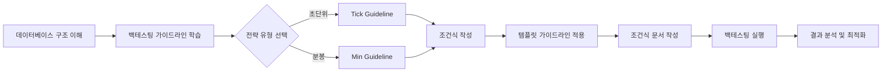

# Guideline - STOM 가이드라인 문서

> STOM 프로젝트의 전략 개발, 백테스팅, 문서화를 위한 종합 가이드라인 모음

**📍 위치**: `docs/Guideline/`
**📅 최종 업데이트**: 2025-01-15

---

## 📋 목차

- [개요](#개요)
- [주요 가이드라인 문서](#주요-가이드라인-문서)
- [사용설명서](#사용설명서)
- [문서 활용 방법](#문서-활용-방법)
- [관련 문서](#관련-문서)

---

## 개요

이 폴더는 STOM 프로젝트에서 트레이딩 전략을 개발하고 백테스팅하며, 문서화하는 과정에서 필요한 모든 가이드라인을 제공합니다.

### 주요 목적

1. **전략 개발 표준화**: Tick/Min 전략 작성을 위한 변수 사용법 및 코드 패턴 제시
2. **백테스팅 지침**: 최적화 방법, 변수 설계, 성과 평가 기준 제공
3. **문서화 표준**: 조건식 문서 작성 템플릿 및 매뉴얼 생성 가이드라인
4. **데이터베이스 이해**: STOM에서 사용하는 주식 데이터베이스 구조 설명

---

## 주요 가이드라인 문서

### 1. 백테스팅 가이드라인

#### 📘 [Back_Testing_Guideline_Tick.md](./Back_Testing_Guideline_Tick.md)
**Tick 데이터 백테스팅 완전 가이드**

- **내용**: 초(秒) 단위 틱 데이터를 활용한 백테스팅 전략 작성 가이드
- **주요 섹션**:
  - 단일 변수 및 구간 연산 함수 사용법
  - 주식 매수/매도 변수 826개 완전 목록
  - 과거 틱 데이터 조회 방법 (`N(1)`, `N(2)` 등)
  - 구간 연산 함수 (`등락율각도(30)`, `체결강도평균(30)` 등)
  - 실전 예제 및 베스트 프랙티스
- **대상**: 초단위 고빈도 트레이딩 전략 개발자
- **파일 크기**: ~33KB (826줄)

#### 📗 [Back_Testing_Guideline_Min.md](./Back_Testing_Guideline_Min.md)
**분봉 데이터 백테스팅 완전 가이드**

- **내용**: 1분봉 캔들 데이터를 활용한 백테스팅 전략 작성 가이드
- **주요 섹션**:
  - 분봉 vs 틱 데이터 차이점
  - 주식 매수/매도 변수 752개 완전 목록
  - 캔들스틱 정보 활용 (분봉시가, 고가, 저가, 종가)
  - TA-Lib 기술적 지표 활용 (MACD, RSI, BBand 등)
  - 분봉 구간 연산 함수
- **대상**: 분봉 차트 기반 스윙/단타 전략 개발자
- **파일 크기**: ~25KB (752줄)

---

### 2. 조건식 문서 작성 가이드

#### 📙 [Condition_Document_Template_Guideline.md](./Condition_Document_Template_Guideline.md)
**조건식 문서 작성 템플릿 완전 가이드**

- **내용**: Tick/Min 조건식 문서를 체계적으로 작성하기 위한 템플릿과 작성 규칙
- **주요 섹션**:
  1. **문서 구조**: 필수 섹션 및 작성 순서
  2. **개요 섹션**: 전략 요약, 타겟 시간대, 시장 특성
  3. **조건식 섹션**: 매수/매도 조건 코드 패턴 (공통 계산 지표 포함)
  4. **최적화 섹션**: 변수 설계, 범위 설정, GA 변환, 시간 계산
  5. **백테스팅 결과**: 성과 지표 및 분석
  6. **조건 개선 연구**: 10가지 카테고리별 개선 방향
  7. **실전 예제**: `Condition_Tick_902_905_update_2.md` 기반
- **대상**: 조건식 문서 작성자, 전략 개발자
- **파일 크기**: ~32KB (850줄+)
- **참고 문서**: [Condition_Tick_902_905_update_2.md](../Condition/Tick/Condition_Tick_902_905_update_2.md)

---

### 3. 데이터베이스 구조 문서

#### 📕 [Stock_Database_Information.md](./Stock_Database_Information.md)
**주식 백업 데이터베이스 구조 상세 문서**

- **내용**: STOM에서 사용하는 SQLite 데이터베이스 구조 및 컬럼 정보
- **주요 섹션**:
  - `stock_min_back.db` (분봉 데이터) 구조
  - `stock_tick_back.db` (틱 데이터) 구조
  - 시간 정보 저장 방식 (`index` 컬럼 활용)
  - 분봉 DB 컬럼 상세 (108개 컬럼)
  - 틱 DB 컬럼 상세 (93개 컬럼)
  - SQL 쿼리 예제 및 베스트 프랙티스
- **대상**: 데이터 분석가, 백테스팅 개발자
- **파일 크기**: ~20KB
- **최종 검증일**: 2025-01-15

---

### 4. 문서화 및 매뉴얼 작성 가이드

#### 📔 [Manual_Generation_Guideline.md](./Manual_Generation_Guideline.md)
**STOM 프로젝트 분석 및 문서화 전략 가이드**

- **내용**: STOM 코드베이스 분석 및 매뉴얼 작성을 위한 체계적 방법론
- **주요 섹션**:
  1. **단계별 분석 방법론**: 프로젝트 구조 파악 → 코드 분석 → 프로세스 흐름 분석
  2. **문서화 전략**: 매뉴얼 구조 설계, 파일별 작성 원칙
  3. **옵시디언 활용**: 마크다운 작성 규칙, 링크 전략
  4. **통합 매뉴얼**: 파일별 매뉴얼과의 연계
- **대상**: 프로젝트 문서화 담당자, LLM 활용 개발자
- **파일 크기**: ~31KB
- **활용 예시**: [docs/Manual/](../Manual/) 폴더 참조

---

## 사용설명서

**📂 위치**: `docs/Guideline/사용설명서/`

STOM 시스템 사용자를 위한 단계별 설명서 (스크립트 및 요약본)

### 구성

| 파일명 | 내용 | 유형 |
|--------|------|------|
| `21_스톰사용설명서 1부_스크립트.md` | 1부: 기본 설정 및 시작 (상세) | 스크립트 |
| `21_스톰사용설명서 1부_요약.md` | 1부: 기본 설정 및 시작 (요약) | 요약본 |
| `22_스톰사용설명서 2부_스크립트.md` | 2부: 전략 설정 및 백테스팅 (상세) | 스크립트 |
| `22_스톰사용설명서 2부_요약.md` | 2부: 전략 설정 및 백테스팅 (요약) | 요약본 |
| `23_스톰사용설명서 3부_스크립트.md` | 3부: 실전 거래 및 모니터링 (상세) | 스크립트 |
| `23_스톰사용설명서 3부_요약.md` | 3부: 실전 거래 및 모니터링 (요약) | 요약본 |
| `24_스톰사용설명서 4부_스크립트.md` | 4부: 고급 설정 및 문제 해결 (상세) | 스크립트 |
| `24_스톰사용설명서 4부_요약.md` | 4부: 고급 설정 및 문제 해결 (요약) | 요약본 |

**사용 팁**:
- 처음 사용자: 요약본 위주로 학습 후 상세본 참조
- 숙련 사용자: 스크립트로 세부 기능 확인

---

## 문서 활용 방법

### 전략 개발 워크플로우



### 추천 학습 순서

1. **초급**: `사용설명서 1~2부` → `Stock_Database_Information.md`
2. **중급**: `Back_Testing_Guideline_Tick.md` 또는 `Back_Testing_Guideline_Min.md`
3. **고급**: `Condition_Document_Template_Guideline.md` → 실제 조건식 작성
4. **문서화**: `Manual_Generation_Guideline.md` → 매뉴얼 작성

### 문서 간 연관 관계

```
Stock_Database_Information.md
    ↓ (데이터 구조 이해)
Back_Testing_Guideline_Tick.md / Back_Testing_Guideline_Min.md
    ↓ (변수 및 함수 학습)
Condition_Document_Template_Guideline.md
    ↓ (템플릿 적용)
실제 조건식 문서 (docs/Condition/Tick 또는 Min)
```

---

## 관련 문서

### 상위 문서
- [📂 docs/README.md](../README.md) - 전체 문서 구조 개요

### 관련 폴더
- [📂 docs/Condition/](../Condition/) - 실제 작성된 조건식 문서들
  - [📂 docs/Condition/Tick/](../Condition/Tick/) - Tick 조건식 모음
  - [📂 docs/Condition/Min/](../Condition/Min/) - Min 조건식 모음
- [📂 docs/Manual/](../Manual/) - STOM 프로젝트 상세 매뉴얼

### 실전 예제
- [Condition_Tick_902_905_update_2.md](../Condition/Tick/Condition_Tick_902_905_update_2.md) - 완성도 높은 Tick 조건식 예제
- [Condition_Tick_900_920.md](../Condition/Tick/Condition_Tick_900_920.md) - 다중 시간대 분할 전략 예제

---

## 🎯 빠른 참조

| 목적 | 추천 문서 |
|------|----------|
| Tick 전략 개발 | [Back_Testing_Guideline_Tick.md](./Back_Testing_Guideline_Tick.md) |
| 분봉 전략 개발 | [Back_Testing_Guideline_Min.md](./Back_Testing_Guideline_Min.md) |
| 조건식 문서 작성 | [Condition_Document_Template_Guideline.md](./Condition_Document_Template_Guideline.md) |
| DB 구조 확인 | [Stock_Database_Information.md](./Stock_Database_Information.md) |
| STOM 시스템 사용 | [사용설명서/](./사용설명서/) |
| 프로젝트 문서화 | [Manual_Generation_Guideline.md](./Manual_Generation_Guideline.md) |

---

**📝 Note**: 모든 가이드라인 문서는 실제 STOM 시스템 및 백테스팅 엔진과 검증된 내용을 기반으로 작성되었습니다.

**📧 문의**: 가이드라인 관련 개선 사항이나 질문은 프로젝트 관리자에게 문의하세요.
