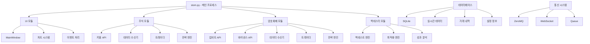
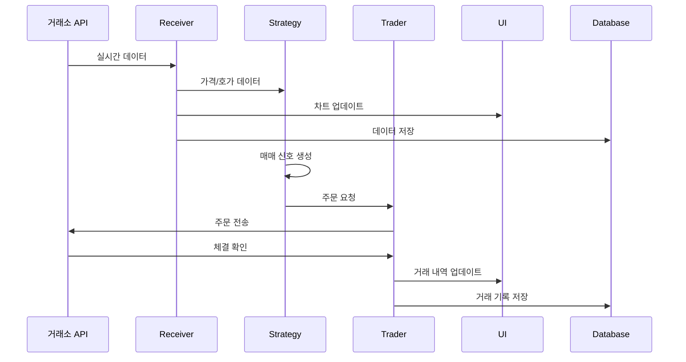

# 02. 시스템 아키텍처

## 🏗 전체 시스템 구조

STOM은 **멀티프로세스 아키텍처**를 기반으로 한 고성능 시스템 트레이딩 플랫폼입니다. 각 모듈이 독립적인 프로세스로 실행되어 안정성과 성능을 보장합니다.

### 시스템 구성도



## 🔄 프로세스 아키텍처

### 1. 메인 프로세스 (stom.py)
- **역할**: 전체 시스템 초기화 및 GUI 실행
- **기능**: 
  - PyQt5 애플리케이션 생성
  - 테마 및 스타일 설정
  - 자동 실행 모드 처리 (주식/코인)
  - 시간 동기화

**소스**: `stom.py:9-34`

```python
# stom.py 핵심 구조
if __name__ == '__main__':
    # 콘솔 모드 설정
    kernel32 = ctypes.windll.kernel32
    kernel32.SetConsoleMode(kernel32.GetStdHandle(-10), 128)

    # 자동 실행 모드 확인
    auto_run = 0
    if len(sys.argv) > 1:
        if sys.argv[1] == 'stock':  auto_run = 1
        elif sys.argv[1] == 'coin': auto_run = 2

    # 시간 동기화
    timesync()

    # PyQt5 애플리케이션 생성
    app = QApplication(sys.argv)
    app.setStyle('fusion')

    # 메인 윈도우 실행
    mainwindow = MainWindow(auto_run)
    mainwindow.show()
    app.exec_()
```

### 2. UI 프로세스 (ui/)
- **MainWindow**: 중앙 집중식 UI 관리
- **Writer 스레드**: UI 업데이트 전용 스레드
- **ZmqServ/ZmqRecv**: 프로세스 간 통신 관리

### 3. 거래 프로세스
#### 주식 거래 프로세스 (stock/)
- **Receiver**: 실시간 데이터 수신
- **Trader**: 주문 실행 및 관리
- **Strategy**: 매매 전략 실행

#### 암호화폐 거래 프로세스 (coin/)
- **Receiver**: 실시간 데이터 수신 (업비트/바이낸스)
- **Trader**: 주문 실행 및 관리
- **Strategy**: 매매 전략 실행

### 4. 백테스팅 프로세스 (backtester/)
- **BackEngine**: 백테스트 실행
- **Optimizer**: 파라미터 최적화
- **Analyzer**: 성과 분석

## 📡 데이터 플로우

### 실시간 데이터 플로우


### 백테스팅 데이터 플로우
```mermaid
sequenceDiagram
    participant UI as UI
    participant BE as BackEngine
    participant DB as Database
    participant OPT as Optimizer
    
    UI->>BE: 백테스트 요청
    BE->>DB: 과거 데이터 로드
    BE->>BE: 전략 실행
    BE->>UI: 결과 전송
    
    UI->>OPT: 최적화 요청
    OPT->>BE: 파라미터 조합 테스트
    BE->>OPT: 성과 결과
    OPT->>UI: 최적 파라미터
```

## 🔗 모듈 간 의존성

### 의존성 계층 구조
```
Level 1: utility/ (기본 유틸리티)
├── setting.py (설정 관리)
├── static.py (정적 함수)
├── query.py (DB 쿼리)
└── chart.py (차트 유틸리티)

Level 2: 핵심 모듈
├── stock/ (주식 거래)
├── coin/ (암호화폐 거래)
└── backtester/ (백테스팅)

Level 3: ui/ (사용자 인터페이스)
└── 모든 하위 모듈 통합

Level 4: stom.py (메인 실행)
└── 전체 시스템 통합
```

### 주요 의존성 관계

#### 1. 설정 의존성
- 모든 모듈 → `utility/setting.py`
- 중앙 집중식 설정 관리
- 암호화된 API 키 관리

#### 2. 데이터베이스 의존성
- 모든 모듈 → `utility/query.py`
- SQLite 데이터베이스 통합 관리
- 트랜잭션 안전성 보장

#### 3. 통신 의존성
- UI ↔ 거래 모듈: ZeroMQ 큐 시스템
- 거래소 ↔ 거래 모듈: WebSocket/REST API
- 모듈 내부: threading.Queue

## 🚀 프로세스 간 통신

### 1. ZeroMQ 기반 통신

**소스**: `ui/ui_mainwindow.py:346-390`

```python
class ZmqServ(QThread):
    """ZeroMQ 서버 - 데이터 송신"""
    def __init__(self, wdzservQ_, port_num):
        super().__init__()
        self.wdzservQ = wdzservQ_
        self.port_num = port_num

    def run(self):
        context = zmq.Context()
        socket = context.socket(zmq.PUB)
        socket.bind(f'tcp://*:{self.port_num}')
        # 데이터 송신 로직

class ZmqRecv(QThread):
    """ZeroMQ 클라이언트 - 데이터 수신"""
    def __init__(self, qlist_, port_num):
        super().__init__()
        self.qlist = qlist_
        self.port_num = port_num

    def run(self):
        context = zmq.Context()
        socket = context.socket(zmq.SUB)
        socket.connect(f'tcp://localhost:{self.port_num}')
        # 데이터 수신 로직
```

### 2. Queue 시스템
UI 메인 윈도우에서 관리하는 큐 시스템:

**소스**: `ui/ui_mainwindow.py:422-425`

```python
# UI 메인 윈도우의 큐 리스트
self.qlist = [
    self.windowQ,    # 0: UI 업데이트
    self.soundQ,     # 1: 알림 소리
    self.queryQ,     # 2: DB 쿼리
    self.teleQ,      # 3: 텔레그램
    self.chartQ,     # 4: 차트 데이터
    self.hogaQ,      # 5: 호가 데이터
    self.webcQ,      # 6: 웹 크롤링
    self.backQ,      # 7: 백테스팅
    self.creceivQ,   # 8: 코인 수신
    self.ctraderQ,   # 9: 코인 거래
    self.cstgQ,      # 10: 코인 전략
    self.liveQ,      # 11: 실시간 라이브
    self.kimpQ,      # 12: 김프 (프리미엄)
    self.wdzservQ,   # 13: ZMQ 서버
    self.totalQ      # 14: 통합 데이터
]
```

**주의**:
- 주식(stock) 모듈은 **별도의 독립적인 큐 시스템**을 사용합니다 (`stock/kiwoom_trader.py` 참조)
- UI의 qlist는 주로 **코인 거래와 공통 유틸리티**를 위한 큐입니다
- 총 15개 큐로 프로세스 간 통신을 관리합니다

### 3. 실시간 데이터 스트리밍

**소스**: `ui/ui_mainwindow.py:80-100`

```python
class LiveSender(Thread):
    """실시간 데이터 송신 스레드"""
    def __init__(self, sock, liveQ):
        super().__init__()
        self.sock = sock
        self.liveQ = liveQ

    def run(self):
        send_time = timedelta_sec(5)
        while True:
            try:
                if not self.liveQ.empty():
                    data = self.liveQ.get()
                    if type(data) == tuple:
                        if self.liveQ.empty() and now() > send_time:
                            gubun, df = data
                            # 데이터를 문자열로 변환하여 전송
                            text = f"{gubun};{';'.join(...)}"
                            self.sock.sendall(text.encode('utf-8'))
                            send_time = timedelta_sec(5)
            except:
                break
```

## 🔧 시스템 설정 관리

### 설정 파일 구조

**소스**: `utility/setting.py:93-150` (일부)

```python
# utility/setting.py
DICT_SET = {
    # 기본 설정
    '증권사': '키움증권',
    '거래소': '업비트',

    # 프로세스 설정
    '주식리시버': True,
    '주식트레이더': True,
    '코인리시버': True,
    '코인트레이더': True,

    # 투자 설정
    '주식투자금': 10000000,
    '코인투자금': 1000000,
    '주식최대매수종목수': 10,
    '코인최대매수종목수': 5,

    # 리스크 관리
    '주식손실중지': True,
    '주식손실중지수익률': -5.0,
    '주식수익중지': True,
    '주식수익중지수익률': 10.0,
}
```

### 데이터베이스 구조

**소스**: 예제 코드 (실제 테이블은 각 모듈에서 동적 생성)

```sql
-- 설정 데이터베이스 (setting.db)
CREATE TABLE main (설정명, 값);
CREATE TABLE stock (주식설정명, 값);
CREATE TABLE coin (코인설정명, 값);
CREATE TABLE sacc (계좌정보);
CREATE TABLE cacc (API키정보);
CREATE TABLE telegram (텔레그램설정);

-- 거래 데이터베이스 (tradelist.db)
CREATE TABLE s_chegeollist (주식체결내역);
CREATE TABLE c_chegeollist (코인체결내역);
CREATE TABLE s_tradelist (주식거래내역);
CREATE TABLE c_tradelist (코인거래내역);

-- 시장 데이터베이스
CREATE TABLE stock_tick (주식틱데이터);
CREATE TABLE coin_tick (코인틱데이터);
CREATE TABLE stock_min (주식분봉데이터);
CREATE TABLE coin_min (코인분봉데이터);
```

## 🛡 안정성 및 성능

### 1. 프로세스 격리
- 각 모듈이 독립 프로세스로 실행
- 한 모듈의 오류가 전체 시스템에 영향 없음
- 메모리 누수 방지

### 2. 비동기 처리
- 멀티스레딩으로 UI 반응성 유지
- 논블로킹 I/O로 실시간 데이터 처리
- 큐 기반 메시지 패싱

### 3. 에러 처리

**소스**: 예제 코드 (공통 패턴)

```python
# 예외 처리 패턴
try:
    # 거래소 API 호출
    result = api_call()
except Exception as e:
    # 로그 기록
    self.windowQ.put((ui_num['로그'], f'오류: {e}'))
    # 재연결 시도
    self.reconnect()
```

### 4. 리소스 관리
- 데이터베이스 연결 풀링
- 메모리 사용량 모니터링
- 자동 가비지 컬렉션

---

*다음: [03. 모듈 분석](../03_Modules/modules_analysis.md)* 