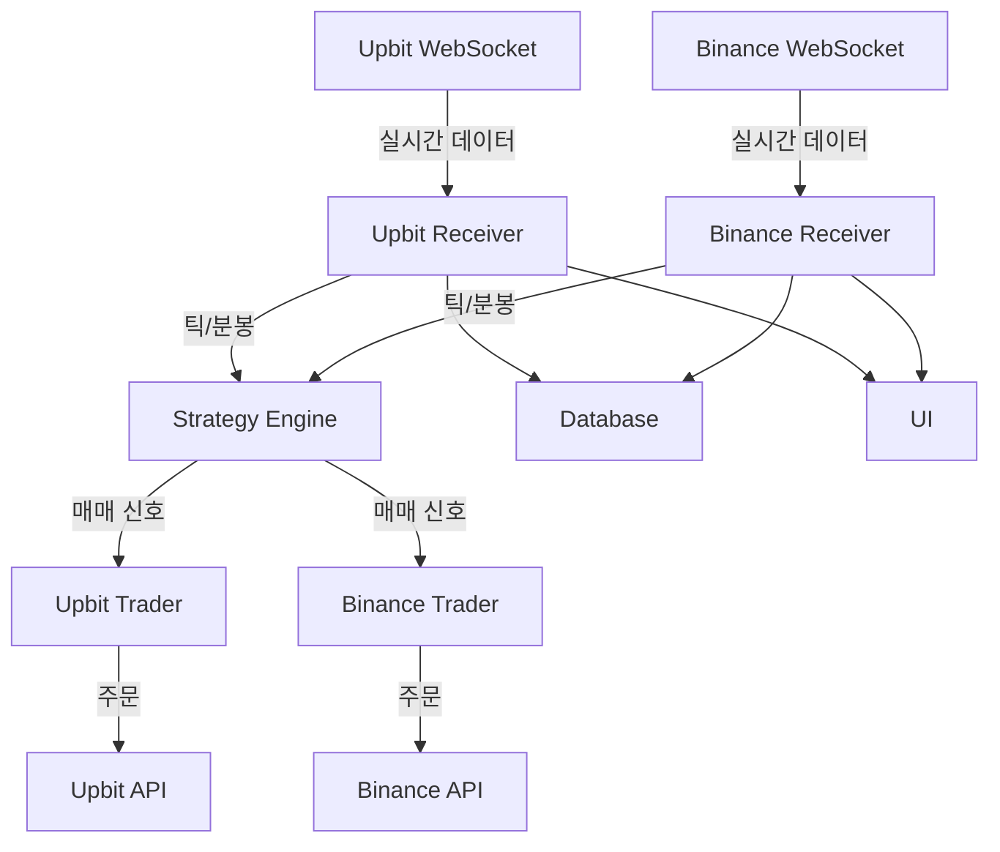

# 암호화폐 모듈 (coin/)

## 📋 개요

암호화폐 모듈은 **업비트(Upbit)**와 **바이낸스(Binance)** 거래소를 지원하는 멀티 거래소 트레이딩 시스템입니다. WebSocket 기반 실시간 데이터 처리와 REST API를 통한 주문 실행을 구현합니다.

---

## 🏗 모듈 구조

```
coin/
├── upbit_receiver_tick.py           # 업비트 틱 데이터 수신
├── upbit_receiver_min.py            # 업비트 분봉 데이터 수신
├── upbit_receiver_client.py         # 업비트 클라이언트 수신기
├── upbit_trader.py                  # 업비트 주문 실행
├── upbit_strategy_tick.py           # 업비트 틱 전략
├── upbit_strategy_min.py            # 업비트 분봉 전략
├── upbit_websocket.py               # 업비트 WebSocket 연결
├── binance_receiver_tick.py         # 바이낸스 틱 데이터 수신
├── binance_receiver_min.py          # 바이낸스 분봉 데이터 수신
├── binance_receiver_client.py       # 바이낸스 클라이언트 수신기
├── binance_trader.py                # 바이낸스 주문 실행
├── binance_strategy_tick.py         # 바이낸스 틱 전략
├── binance_strategy_min.py          # 바이낸스 분봉 전략
├── binance_websocket.py             # 바이낸스 WebSocket 연결
└── kimp_upbit_binance.py            # 김프(프리미엄) 모니터링
```

**참고**: 업비트와 바이낸스 파일들이 모두 `coin/` 디렉토리에 직접 위치합니다. 별도의 서브폴더는 없습니다.

---

## 🔷 업비트 모듈

### 1. WebSocket 연결 (upbit_websocket.py)

#### WebSocket 클라이언트 구현

**소스**: `coin/upbit_websocket.py:9-50`

```python
import websockets
import json
import asyncio

class UpbitWebSocket:
    """업비트 WebSocket 클라이언트"""
    def __init__(self, queue):
        self.ws_url = 'wss://api.upbit.com/websocket/v1'
        self.queue = queue
        self.is_running = False

    async def connect(self):
        """WebSocket 연결"""
        async with websockets.connect(self.ws_url) as websocket:
            # 구독 메시지 전송
            subscribe_data = [
                {"ticket": "STOM"},
                {
                    "type": "ticker",
                    "codes": ["KRW-BTC", "KRW-ETH", "KRW-XRP"],
                    "isOnlyRealtime": True
                }
            ]
            await websocket.send(json.dumps(subscribe_data))

            # 실시간 데이터 수신
            while self.is_running:
                data = await websocket.recv()
                await self.on_message(data)

    async def on_message(self, message):
        """메시지 수신 처리"""
        data = json.loads(message)

        if data['type'] == 'ticker':
            ticker_data = {
                'code': data['code'],
                'trade_price': data['trade_price'],
                'trade_volume': data['trade_volume'],
                'timestamp': data['timestamp']
            }
            self.queue.put(('ticker', ticker_data))
```

#### 호가 데이터 구독

**소스**: `coin/upbit_websocket.py:46-53` (예제 코드, 실제 connect_orderb 메서드 참조)

```python
async def subscribe_orderbook(self, codes):
    """호가창 구독"""
    subscribe_data = [
        {"ticket": "STOM"},
        {
            "type": "orderbook",
            "codes": codes
        }
    ]
    await self.websocket.send(json.dumps(subscribe_data))
```

### 2. 데이터 수신기 (upbit_receiver_tick.py)

#### 실시간 데이터 처리

**소스**: `coin/upbit_receiver_tick.py:30-144`

```python
class UpbitReceiverTick:
    def __init__(self, qlist):
        # 큐 시스템
        self.creceivQ = qlist[11]  # 수신기 큐
        self.ctraderQ = qlist[12]  # 트레이더 큐
        self.cstgQs = qlist[13]    # 전략 큐

        # WebSocket 클라이언트
        self.ws_client = UpbitWebSocket(self.creceivQ)

    def run(self):
        """데이터 수신 시작"""
        while True:
            msg_type, data = self.creceivQ.get()

            if msg_type == 'ticker':
                self.process_ticker(data)
            elif msg_type == 'orderbook':
                self.process_orderbook(data)

    def process_ticker(self, data):
        """체결 데이터 처리"""
        code = data['code']
        price = data['trade_price']
        volume = data['trade_volume']
        timestamp = data['timestamp']

        # 데이터베이스 저장
        self.save_tick_data(code, price, volume, timestamp)

        # 전략 엔진으로 전달
        self.cstgQs.put(('tick', code, price, volume, timestamp))

        # UI 업데이트
        self.update_ui(code, price, volume)
```

### 3. 주문 실행기 (upbit_trader.py)

#### REST API 주문

**소스**: `coin/upbit_trader.py:11-779`

```python
import pyupbit
import jwt
import hashlib
import uuid

class UpbitTrader:
    def __init__(self, qlist):
        # API 키 설정
        self.access_key = self.load_access_key()
        self.secret_key = self.load_secret_key()

        # Upbit 클라이언트
        self.upbit = pyupbit.Upbit(self.access_key, self.secret_key)

        # 주문 관리
        self.active_orders = {}

    def create_buy_order(self, market, price, volume):
        """매수 주문"""
        try:
            # 지정가 매수
            order = self.upbit.buy_limit_order(
                ticker=market,
                price=price,
                volume=volume
            )

            # 주문 저장
            self.active_orders[order['uuid']] = {
                'market': market,
                'side': 'bid',
                'price': price,
                'volume': volume,
                'state': 'wait'
            }

            return order

        except Exception as e:
            self.log_error(f"매수 주문 실패: {e}")
            return None

    def create_sell_order(self, market, price, volume):
        """매도 주문"""
        try:
            # 지정가 매도
            order = self.upbit.sell_limit_order(
                ticker=market,
                price=price,
                volume=volume
            )

            # 주문 저장
            self.active_orders[order['uuid']] = {
                'market': market,
                'side': 'ask',
                'price': price,
                'volume': volume,
                'state': 'wait'
            }

            return order

        except Exception as e:
            self.log_error(f"매도 주문 실패: {e}")
            return None

    def cancel_order(self, uuid):
        """주문 취소"""
        try:
            result = self.upbit.cancel_order(uuid)
            if uuid in self.active_orders:
                del self.active_orders[uuid]
            return result
        except Exception as e:
            self.log_error(f"주문 취소 실패: {e}")
            return None

    def get_balances(self):
        """잔고 조회"""
        return self.upbit.get_balances()
```

### 4. 매매 전략 (upbit_strategy_tick.py)

#### 전략 구조

**소스**: `coin/upbit_strategy_tick.py:15-701`

```python
class UpbitStrategyTick:
    def __init__(self, qlist):
        # 전략 파라미터
        self.params = self.load_strategy_params()

        # 기술적 지표
        self.indicators = CryptoIndicators()

        # 포지션 관리
        self.positions = {}

    def Strategy(self, market, price, volume, timestamp):
        """매매 신호 생성"""
        # 1. 데이터 검증
        if not self.validate_data(market, price):
            return

        # 2. 변동성 체크
        volatility = self.calculate_volatility(market)
        if volatility > self.params['max_volatility']:
            return

        # 3. 기술적 분석
        signals = self.analyze_crypto(market, price)

        # 4. 매매 신호 생성
        if self.is_buy_signal(signals):
            self.generate_buy_signal(market, price)
        elif self.is_sell_signal(signals):
            self.generate_sell_signal(market, price)

    def analyze_crypto(self, market, price):
        """암호화폐 기술적 분석"""
        # 이동평균선
        ma7 = self.indicators.ema(self.price_data[market], 7)
        ma25 = self.indicators.ema(self.price_data[market], 25)
        ma99 = self.indicators.ema(self.price_data[market], 99)

        # RSI
        rsi = self.indicators.rsi(self.price_data[market], 14)

        # MACD
        macd, signal, hist = self.indicators.macd(self.price_data[market])

        return {
            'ma7': ma7,
            'ma25': ma25,
            'ma99': ma99,
            'rsi': rsi,
            'macd': macd,
            'signal': signal,
            'histogram': hist
        }
```

---

## 🔶 바이낸스 모듈

### 1. WebSocket 연결 (binance_websocket.py)

#### WebSocket 스트림

**소스**: `coin/binance_websocket.py:8-116`

```python
from binance.client import Client
from binance.streams import BinanceSocketManager

class BinanceWebSocket:
    """바이낸스 WebSocket 클라이언트"""
    def __init__(self, queue):
        self.api_key = self.load_api_key()
        self.api_secret = self.load_api_secret()

        # Binance 클라이언트
        self.client = Client(self.api_key, self.api_secret)
        self.bsm = BinanceSocketManager(self.client)

        self.queue = queue

    def start_ticker_socket(self, symbols):
        """체결 데이터 스트림"""
        for symbol in symbols:
            conn_key = self.bsm.start_symbol_ticker_socket(
                symbol,
                self.on_ticker_message
            )
        self.bsm.start()

    def on_ticker_message(self, msg):
        """체결 메시지 처리"""
        if msg['e'] == '24hrTicker':
            ticker_data = {
                'symbol': msg['s'],
                'price': float(msg['c']),
                'volume': float(msg['v']),
                'timestamp': msg['E']
            }
            self.queue.put(('ticker', ticker_data))

    def start_kline_socket(self, symbol, interval):
        """캔들 데이터 스트림"""
        conn_key = self.bsm.start_kline_socket(
            symbol,
            self.on_kline_message,
            interval=interval
        )

    def on_kline_message(self, msg):
        """캔들 메시지 처리"""
        if msg['e'] == 'kline':
            kline = msg['k']
            candle_data = {
                'symbol': kline['s'],
                'open': float(kline['o']),
                'high': float(kline['h']),
                'low': float(kline['l']),
                'close': float(kline['c']),
                'volume': float(kline['v']),
                'is_closed': kline['x']
            }
            self.queue.put(('kline', candle_data))
```

### 2. 주문 실행기 (binance_trader.py)

#### 선물 거래 지원

**소스**: `coin/binance_trader.py:15-933`

```python
from binance.client import Client

class BinanceTrader:
    def __init__(self, qlist):
        self.client = Client(self.api_key, self.api_secret)

        # 선물 거래 활성화
        self.futures_enabled = True

    def create_futures_order(self, symbol, side, quantity, leverage=10):
        """선물 주문"""
        try:
            # 레버리지 설정
            self.client.futures_change_leverage(
                symbol=symbol,
                leverage=leverage
            )

            # 주문 생성
            order = self.client.futures_create_order(
                symbol=symbol,
                side=side,  # 'BUY' or 'SELL'
                type='MARKET',
                quantity=quantity
            )

            return order

        except Exception as e:
            self.log_error(f"선물 주문 실패: {e}")
            return None

    def set_stop_loss(self, symbol, stop_price):
        """손절 설정"""
        try:
            order = self.client.futures_create_order(
                symbol=symbol,
                side='SELL',
                type='STOP_MARKET',
                stopPrice=stop_price
            )
            return order
        except Exception as e:
            self.log_error(f"손절 설정 실패: {e}")
            return None

    def set_take_profit(self, symbol, take_profit_price):
        """익절 설정"""
        try:
            order = self.client.futures_create_order(
                symbol=symbol,
                side='SELL',
                type='TAKE_PROFIT_MARKET',
                stopPrice=take_profit_price
            )
            return order
        except Exception as e:
            self.log_error(f"익절 설정 실패: {e}")
            return None
```

---

## 💰 김프 모니터링 (kimp_upbit_binance.py)

### 김치프리미엄 계산

**소스**: `coin/kimp_upbit_binance.py:17-148`

```python
class KimpMonitor:
    """김치프리미엄 모니터링"""
    def __init__(self):
        # 업비트 클라이언트
        self.upbit = pyupbit.Upbit(access_key, secret_key)

        # 바이낸스 클라이언트
        self.binance = Client(api_key, api_secret)

        # 환율 정보
        self.exchange_rate = 1300  # USD/KRW

    def calculate_kimp(self, symbol):
        """김프 계산"""
        # 업비트 가격 (KRW)
        upbit_price = self.upbit.get_current_price(f"KRW-{symbol}")

        # 바이낸스 가격 (USDT)
        binance_ticker = self.binance.get_symbol_ticker(symbol=f"{symbol}USDT")
        binance_price = float(binance_ticker['price'])

        # 바이낸스 가격을 원화로 환산
        binance_price_krw = binance_price * self.exchange_rate

        # 김프 계산
        kimp = ((upbit_price - binance_price_krw) / binance_price_krw) * 100

        return {
            'symbol': symbol,
            'upbit_price': upbit_price,
            'binance_price': binance_price,
            'binance_price_krw': binance_price_krw,
            'kimp': kimp,
            'timestamp': now()
        }

    def monitor_arbitrage_opportunity(self):
        """차익거래 기회 감지"""
        symbols = ['BTC', 'ETH', 'XRP', 'ADA']

        for symbol in symbols:
            kimp_data = self.calculate_kimp(symbol)

            # 김프가 3% 이상인 경우
            if kimp_data['kimp'] > 3.0:
                self.send_alert(f"{symbol} 김프 {kimp_data['kimp']:.2f}% 발생!")
                self.log_opportunity(kimp_data)

            # 역김프가 -2% 이하인 경우
            elif kimp_data['kimp'] < -2.0:
                self.send_alert(f"{symbol} 역김프 {kimp_data['kimp']:.2f}% 발생!")
                self.log_opportunity(kimp_data)
```

---

## 📊 데이터 플로우



---

## 🔧 주요 파라미터

### 업비트 전략 파라미터

**소스**: 예제 코드 (실제 파라미터는 `utility/setting.py`의 DICT_SET 참조)

```python
UPBIT_PARAMS = {
    # 이동평균선
    'ema_short': 7,
    'ema_mid': 25,
    'ema_long': 99,

    # RSI
    'rsi_period': 14,
    'rsi_oversold': 30,
    'rsi_overbought': 70,

    # MACD
    'macd_fast': 12,
    'macd_slow': 26,
    'macd_signal': 9,

    # 변동성
    'max_volatility': 0.05,  # 5%
}
```

### 바이낸스 선물 파라미터

**소스**: 예제 코드 (실제 파라미터는 `utility/setting.py`의 DICT_SET 참조)

```python
BINANCE_FUTURES_PARAMS = {
    # 레버리지
    'default_leverage': 10,
    'max_leverage': 20,

    # 리스크 관리
    'stop_loss_percent': 0.02,   # 2%
    'take_profit_percent': 0.05,  # 5%

    # 포지션 관리
    'max_position_size': 0.3,     # 전체 자금의 30%
}
```

---

## 🛡 리스크 관리

### 1. API Rate Limit 관리

**소스**: 예제 코드 (실제 구현 참조 필요)

```python
class RateLimiter:
    """API 호출 제한 관리"""
    def __init__(self):
        self.call_count = 0
        self.last_reset = time.time()
        self.max_calls_per_minute = 100

    def check_limit(self):
        """호출 한도 체크"""
        current_time = time.time()

        # 1분 경과 시 카운트 리셋
        if current_time - self.last_reset > 60:
            self.call_count = 0
            self.last_reset = current_time

        # 한도 초과 체크
        if self.call_count >= self.max_calls_per_minute:
            sleep_time = 60 - (current_time - self.last_reset)
            time.sleep(sleep_time)
            self.call_count = 0
            self.last_reset = time.time()

        self.call_count += 1
```

### 2. 주문 검증

**소스**: 예제 코드 (실제 검증 로직은 `coin/upbit_trader.py:201-277` CheckOrder 메서드 참조)

```python
def validate_order(self, market, side, volume, price):
    """주문 유효성 검증"""
    # 최소 주문 금액 체크
    min_order_amount = 5000  # 5,000원
    if volume * price < min_order_amount:
        return False

    # 잔고 확인
    balance = self.get_balance('KRW')
    if side == 'bid' and balance < volume * price:
        return False

    # 보유 수량 확인
    if side == 'ask':
        holding = self.get_balance(market.split('-')[1])
        if holding < volume:
            return False

    return True
```

---

## 🚀 성능 최적화

### 1. WebSocket 연결 관리

**소스**: `coin/kimp_upbit_binance.py:83-148` (유사한 WebSocketManager 클래스)

```python
class WebSocketManager:
    """WebSocket 연결 풀 관리"""
    def __init__(self):
        self.connections = {}
        self.max_connections = 5

    async def get_connection(self, exchange):
        """연결 재사용"""
        if exchange not in self.connections:
            self.connections[exchange] = await self.create_connection(exchange)
        return self.connections[exchange]

    async def reconnect(self, exchange):
        """재연결"""
        if exchange in self.connections:
            await self.connections[exchange].close()
        self.connections[exchange] = await self.create_connection(exchange)
```

### 2. 데이터 압축

**소스**: 예제 코드 (실제 데이터 저장은 `coin/upbit_strategy_tick.py:662-701` SaveData 메서드 참조)

```python
def compress_tick_data(self, ticks):
    """틱 데이터 압축"""
    # 중복 제거
    unique_ticks = []
    last_price = None

    for tick in ticks:
        if tick['price'] != last_price:
            unique_ticks.append(tick)
            last_price = tick['price']

    return unique_ticks
```

---

*다음: [UI 모듈](ui_module.md)*
*이전: [주식 모듈](stock_module.md)*
