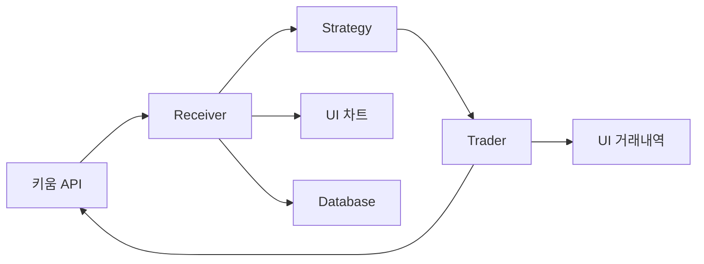
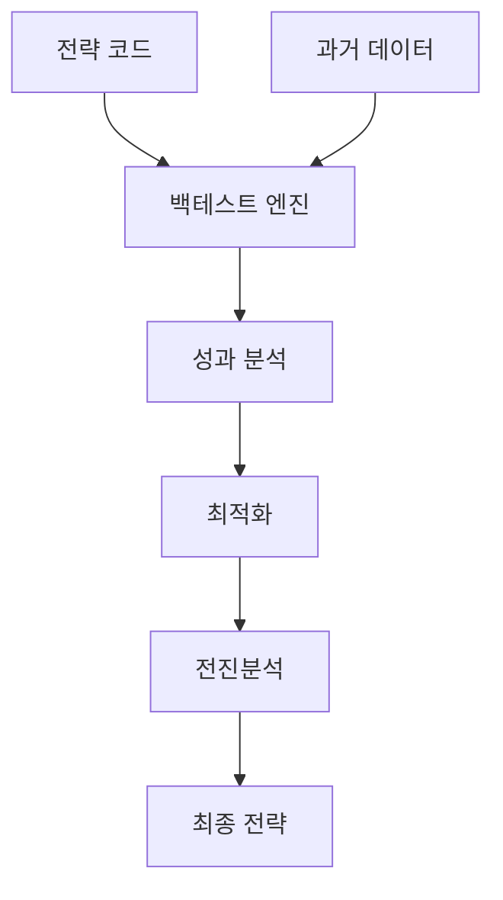

# 03. 모듈 분석

## 📁 모듈 구조 개요

STOM 프로젝트는 **모듈화된 아키텍처**로 설계되어 각 기능이 독립적으로 동작하면서도 유기적으로 연결됩니다.

### 모듈 계층 구조
```
STOM/
├── stom.py                 # 메인 실행 파일
├── ui/                     # 사용자 인터페이스 모듈
├── stock/                  # 주식 거래 모듈
├── coin/                   # 암호화폐 거래 모듈
├── backtester/             # 백테스팅 모듈
├── utility/                # 공통 유틸리티 모듈
└── login/                  # 로그인 관련 모듈
```

---

## 🖥 UI 모듈 (ui/)

### 핵심 구성 요소

#### 1. MainWindow (`ui_mainwindow.py`)
- **역할**: 전체 UI의 중앙 관리자
- **주요 기능**:
  - 멀티스레드 UI 업데이트 관리
  - ZeroMQ 기반 프로세스 간 통신
  - 실시간 데이터 시각화
  - 사용자 이벤트 처리

```python
class MainWindow(QMainWindow):
    def __init__(self, auto_run_):
        # UI 초기화
        self.auto_run = auto_run_
        self.dict_set = DICT_SET
        
        # 큐 시스템 초기화 (15개 전용 큐)
        self.qlist = [Queue() for _ in range(15)]
        
        # ZeroMQ 통신 설정
        self.zmqserver = ZmqServ(self.qlist[13], 5555)
        self.zmqclient = ZmqRecv(self.qlist, 5777)
        
        # Writer 스레드 (UI 업데이트 전용)
        self.writer = Writer(self.qlist[0])
```

#### 2. Writer 스레드 (`ui_mainwindow.py`)
- **역할**: UI 업데이트 전용 스레드
- **특징**: 
  - 8개의 pyqtSignal로 다양한 UI 컴포넌트 업데이트
  - 논블로킹 UI 반응성 보장

```python
class Writer(QThread):
    signal1 = pyqtSignal(tuple)  # 텍스트 업데이트
    signal2 = pyqtSignal(tuple)  # 테이블 업데이트
    signal3 = pyqtSignal(tuple)  # 차트 업데이트
    signal4 = pyqtSignal(tuple)  # 호가 업데이트
    signal5 = pyqtSignal(tuple)  # 프로그레스바 업데이트
    signal6 = pyqtSignal(tuple)  # 트리맵 업데이트
    signal7 = pyqtSignal(tuple)  # 지수차트 업데이트
    signal8 = pyqtSignal(tuple)  # 실시간차트 업데이트
    signal9 = pyqtSignal(str)    # 상태바 업데이트
```

#### 3. 주요 UI 컴포넌트

| 파일명 | 기능 | 설명 |
|--------|------|------|
| `ui_draw_chart.py` | 차트 시스템 | matplotlib 기반 차트 렌더링 |
| `ui_draw_realchart.py` | 실시간 차트 | pyqtgraph 기반 실시간 차트 |
| `ui_update_tablewidget.py` | 테이블 업데이트 | 거래 내역, 잔고 등 테이블 관리 |
| `ui_button_clicked_*.py` | 버튼 이벤트 | 각 탭별 버튼 클릭 이벤트 처리 |
| `set_*.py` | UI 설정 | 각 탭과 다이얼로그 초기 설정 |

### UI 아키텍처 특징

#### 1. 탭 기반 구조
```python
# 주요 탭 구성
- 주식 거래 탭 (Stock Trading)
- 코인 거래 탭 (Coin Trading)  
- 백테스팅 탭 (Backtesting)
- 설정 탭 (Settings)
- 로그 탭 (Logs)
- 차트 탭 (Charts)
```

#### 2. 실시간 데이터 처리
```python
class LiveClient:
    """실시간 데이터 클라이언트"""
    def UpdateStomLiveData(self, data):
        # 주식/코인 당일/통계 데이터 파싱
        # 백테스트 결과 데이터 파싱
        # UI 업데이트 신호 발송
```

---

## 📈 주식 모듈 (stock/)

### 모듈 구성

#### 1. 키움 API 통합 (`kiwoom.py`)
- **역할**: 키움증권 OpenAPI 래퍼 클래스
- **기능**: 
  - API 로그인 및 인증
  - 실시간 데이터 수신
  - 주문 실행 및 관리

#### 2. 데이터 수신기 (`kiwoom_receiver_tick.py`)
```python
class KiwoomReceiverTick:
    """키움 틱 데이터 수신기"""
    def __init__(self, qlist):
        # 15개 큐 시스템 연결
        self.kwzservQ = qlist[0]  # UI 통신
        self.sreceivQ = qlist[1]  # 수신기 내부
        self.straderQ = qlist[2]  # 트레이더 통신
        self.sstgQs   = qlist[3]  # 전략 통신
        
    def OnReceiveRealData(self, code, realtype, realdata):
        """실시간 데이터 수신 콜백"""
        # 체결 데이터 처리
        # 호가 데이터 처리
        # VI 발동 감지
        # 상한가/하한가 감지
```

#### 3. 거래 실행기 (`kiwoom_trader.py`)
```python
class KiwoomTrader:
    """주식 거래 실행기"""
    def __init__(self, qlist):
        # 주문 관리 시스템
        self.dict_order = {}      # 주문 딕셔너리
        self.dict_jango = {}      # 잔고 딕셔너리
        self.dict_holding = {}    # 보유종목 딕셔너리
        
    def SendOrder(self, 주문구분, 종목코드, 주문수량, 주문가격):
        """주문 전송"""
        # 주문 유효성 검증
        # API 주문 전송
        # 주문 상태 관리
```

#### 4. 전략 엔진 (`kiwoom_strategy_tick.py`, `kiwoom_strategy_min.py`)
```python
class StrategyKiwoom:
    """주식 매매 전략"""
    def __init__(self, qlist):
        # 전략 파라미터 로드
        # 기술적 지표 계산기 초기화
        
    def Strategy(self, code, data):
        """매매 신호 생성"""
        # 기술적 분석
        # 매수/매도 조건 검증
        # 리스크 관리
        # 주문 신호 생성
```

### 주식 모듈 데이터 플로우



---

## 🪙 암호화폐 모듈 (coin/)

### 거래소별 구성

#### 1. 업비트 모듈
- `upbit_receiver_tick.py`: 업비트 실시간 데이터 수신
- `upbit_trader.py`: 업비트 거래 실행
- `upbit_strategy_tick.py`: 업비트 매매 전략
- `upbit_websocket.py`: WebSocket 연결 관리

#### 2. 바이낸스 모듈  
- `binance_receiver_tick.py`: 바이낸스 실시간 데이터 수신
- `binance_trader.py`: 바이낸스 거래 실행
- `binance_strategy_tick.py`: 바이낸스 매매 전략
- `binance_websocket.py`: WebSocket 연결 관리

#### 3. 김프 모니터링 (`kimp_upbit_binance.py`)
```python
class KimpMonitor:
    """김치프리미엄 모니터링"""
    def __init__(self):
        # 업비트-바이낸스 가격 차이 계산
        # 김프 알림 시스템
        # 차익거래 기회 탐지
```

### 암호화폐 모듈 특징

#### 1. 멀티 거래소 지원
```python
# 거래소별 API 통합
UPBIT_API = {
    'base_url': 'https://api.upbit.com',
    'websocket': 'wss://api.upbit.com/websocket/v1'
}

BINANCE_API = {
    'base_url': 'https://api.binance.com',
    'websocket': 'wss://stream.binance.com:9443'
}
```

#### 2. WebSocket 기반 실시간 처리
```python
class UpbitWebSocket:
    """업비트 WebSocket 클라이언트"""
    async def connect(self):
        # WebSocket 연결
        # 구독 메시지 전송
        # 실시간 데이터 수신
        
    async def on_message(self, message):
        # JSON 데이터 파싱
        # 틱/호가 데이터 처리
        # 큐로 데이터 전송
```

---

## 🔬 백테스팅 모듈 (backtester/)

### 엔진별 구성

#### 1. 백테스트 엔진
| 파일명 | 대상 | 데이터 타입 |
|--------|------|-------------|
| `backengine_kiwoom_tick.py` | 주식 | 틱 데이터 |
| `backengine_kiwoom_min.py` | 주식 | 분봉 데이터 |
| `backengine_upbit_tick.py` | 업비트 | 틱 데이터 |
| `backengine_upbit_min.py` | 업비트 | 분봉 데이터 |
| `backengine_binance_tick.py` | 바이낸스 | 틱 데이터 |
| `backengine_binance_min.py` | 바이낸스 | 분봉 데이터 |

#### 2. 최적화 엔진 (`optimiz.py`)
```python
class Optimizer:
    """파라미터 최적화"""
    def __init__(self):
        # 최적화 알고리즘 설정
        # 파라미터 범위 정의
        # 성과 지표 설정
        
    def optimize(self, strategy, data):
        # 그리드 서치
        # 유전 알고리즘
        # 베이지안 최적화
        # 결과 분석
```

#### 3. 전진분석 (`rolling_walk_forward_test.py`)
```python
class WalkForwardTest:
    """전진분석 테스트"""
    def run_test(self, strategy, data, window_size):
        # 시계열 분할
        # 순차적 백테스트
        # 성과 안정성 검증
        # 오버피팅 방지
```

### 백테스팅 워크플로우



---

## 🛠 유틸리티 모듈 (utility/)

### 핵심 유틸리티

#### 1. 설정 관리 (`setting.py`)
```python
# 전역 설정 딕셔너리
DICT_SET = {
    # 거래 설정
    '증권사': '키움증권',
    '거래소': '업비트',
    '주식투자금': 10000000,
    '코인투자금': 1000000,
    
    # 프로세스 설정
    '주식리시버': True,
    '주식트레이더': True,
    '코인리시버': True,
    '코인트레이더': True,
    
    # 리스크 관리
    '주식손실중지': True,
    '주식손실중지수익률': -5.0,
}

# 데이터베이스 경로
DB_SETTING = 'C:/System_Trading/STOM/STOM_V1/DB/setting.db'
DB_STOCK_TICK = 'C:/System_Trading/STOM/STOM_V1/DB/stock_tick.db'
DB_COIN_TICK = 'C:/System_Trading/STOM/STOM_V1/DB/coin_tick.db'
```

#### 2. 데이터베이스 쿼리 (`query.py`)
```python
class QueryManager:
    """데이터베이스 쿼리 관리"""
    def __init__(self):
        # 연결 풀 관리
        # 트랜잭션 처리
        
    def execute_query(self, query, params=None):
        # SQL 실행
        # 예외 처리
        # 결과 반환
```

#### 3. 정적 함수 (`static.py`)
```python
# 시간 관련 함수
def now(): return datetime.now()
def strf_time(format_str): return now().strftime(format_str)
def strp_time(format_str, time_str): return datetime.strptime(time_str, format_str)

# 수학 함수
def roundfigure_upper5(x): return math.ceil(x / 5) * 5
def GetVIPrice(price): return int(price * 0.1)

# 데이터 변환
def comma_format(x): return f"{x:,}"
def percent_format(x): return f"{x:.2f}%"
```

#### 4. 차트 유틸리티 (`chart.py`)
```python
class ChartManager:
    """차트 관리"""
    def __init__(self):
        # matplotlib 설정
        # 한글 폰트 설정
        # 스타일 테마 적용
        
    def draw_candlestick(self, data):
        # 캔들스틱 차트
        # 거래량 차트
        # 기술적 지표 오버레이
```

### 통신 시스템

#### 1. ZeroMQ 통신
```python
class ZmqServ(QThread):
    """ZeroMQ 서버"""
    def run(self):
        context = zmq.Context()
        socket = context.socket(zmq.PUB)
        socket.bind(f'tcp://*:{self.port_num}')
        
        while True:
            msg, data = self.queue.get()
            socket.send_string(msg, zmq.SNDMORE)
            socket.send_pyobj(data)
```

#### 2. Queue 시스템
```python
# 15개 전용 큐 정의
QUEUE_MAPPING = {
    0: 'windowQ',     # UI 업데이트
    1: 'soundQ',      # 알림 소리
    2: 'queryQ',      # DB 쿼리
    3: 'teleQ',       # 텔레그램
    4: 'chartQ',      # 차트 데이터
    5: 'hogaQ',       # 호가 데이터
    6: 'webcQ',       # 웹 크롤링
    7: 'backQ',       # 백테스팅
    8: 'sreceivQ',    # 주식 수신
    9: 'straderQ',    # 주식 거래
    10: 'sstgQ',      # 주식 전략
    11: 'creceivQ',   # 코인 수신
    12: 'ctraderQ',   # 코인 거래
    13: 'cstgQ',      # 코인 전략
    14: 'totalQ'      # 통합 데이터
}
```

---

## 🔐 보안 및 인증

### API 키 관리
```python
# 암호화된 API 키 저장
def encrypt_api_key(key):
    # AES 암호화
    # 안전한 키 저장
    
def decrypt_api_key(encrypted_key):
    # 복호화
    # 메모리 보안
```

### 로그인 시스템
```python
# 키움 로그인
def kiwoom_login():
    # 공인인증서 인증
    # 자동 로그인 처리
    
# 거래소 API 인증
def exchange_auth():
    # API 키 검증
    # 권한 확인
```

---

## 📊 성능 최적화

### 1. 메모리 관리
- 대용량 데이터 스트리밍 처리
- 가비지 컬렉션 최적화
- 메모리 누수 방지

### 2. 멀티프로세싱
- CPU 집약적 작업 분산
- 프로세스 간 효율적 통신
- 리소스 격리

### 3. 데이터베이스 최적화
- 인덱스 최적화
- 배치 처리
- 연결 풀링

---

*다음: [04. API 통합](../04_API/api_integration.md)* 