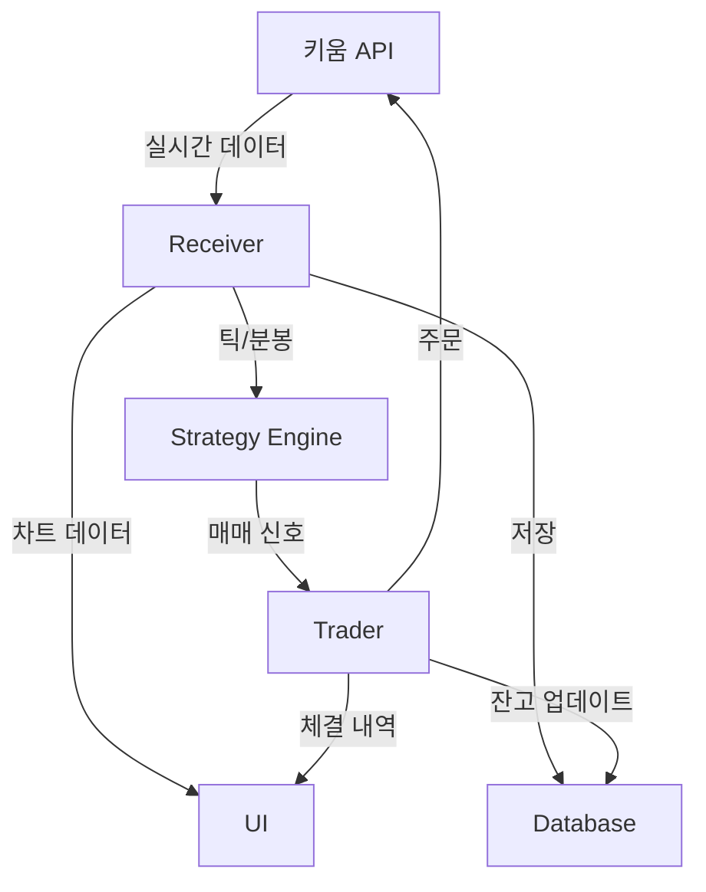

# 주식 모듈 (stock/)

## 📋 개요

주식 모듈은 **키움증권 OpenAPI**를 활용하여 한국 주식시장의 실시간 거래를 수행하는 핵심 모듈입니다. 멀티프로세스 아키텍처를 통해 데이터 수신, 전략 실행, 주문 처리를 병렬로 처리합니다.

---

## 🏗 모듈 구조

```
stock/
├── kiwoom.py                    # 키움 API 래퍼 클래스
├── kiwoom_receiver_tick.py      # 틱 데이터 수신기
├── kiwoom_receiver_min.py       # 분봉 데이터 수신기
├── kiwoom_trader.py             # 주문 실행 및 관리
├── kiwoom_strategy_tick.py      # 틱 기반 매매 전략
└── kiwoom_strategy_min.py       # 분봉 기반 매매 전략
```

---

## 🔌 키움 API 통합 (kiwoom.py)

### 핵심 기능

#### 1. API 초기화 및 로그인

**소스**: `stock/kiwoom.py:36-70`

```python
class Kiwoom:
    """키움증권 OpenAPI 래퍼 (Composition 패턴 사용)"""
    def __init__(self, user_class, gubun):
        # 상태 관리 딕셔너리
        self.dict_bool = {
            '로그인': False,
            'TR수신': False,
            'TR다음': False,
            'CD로딩': False,
            'CD수신': False
        }

        # QAxWidget 인스턴스를 내부에 포함 (상속이 아님)
        self.ocx = QAxWidget('KHOPENAPI.KHOpenAPICtrl.1')

        # 이벤트 핸들러 연결
        self.ocx.OnEventConnect.connect(self.OnEventConnect)
        self.ocx.OnReceiveTrData.connect(self.OnReceiveTrData)

        # 사용 목적에 따라 추가 이벤트 연결
        if gubun == 'Receiver':
            self.ocx.OnReceiveRealData.connect(user_class.OnReceiveRealData)
        elif gubun == 'Trader':
            self.ocx.OnReceiveChejanData.connect(user_class.OnReceiveChejanData)

    def CommConnect(self):
        """로그인 요청"""
        self.ocx.dynamicCall('CommConnect()')
        while not self.dict_bool['로그인']:
            pythoncom.PumpWaitingMessages()
```

**주요 특징**:
- **Composition 패턴**: QAxWidget을 상속받지 않고 `self.ocx`로 포함
- **gubun 파라미터**: 'Receiver', 'Trader', 'Downloader' 등 용도별 초기화
- **이벤트 기반**: pythoncom.PumpWaitingMessages()로 동기식 처리

#### 2. TR 데이터 조회

**소스**: `stock/kiwoom.py:83-100`

```python
def Block_Request(self, *args, **kwargs):
    """TR 블록 데이터 요청 (동기식)"""
    trcode = args[0].lower()
    self.dict_item = parseDat(trcode)  # .enc 파일에서 TR 구조 파싱
    self.tr_name = kwargs['output']
    nnext = kwargs['next']

    # 입력값 설정
    for i in kwargs:
        if i.lower() != 'output' and i.lower() != 'next':
            self.ocx.dynamicCall('SetInputValue(QString, QString)', i, kwargs[i])

    # TR 요청 및 응답 대기
    self.dict_bool['TR수신'] = False
    self.ocx.dynamicCall('CommRqData(QString, QString, int, QString)',
                         self.tr_name, trcode, nnext, sn_brrq)

    # 동기식 대기
    while not self.dict_bool['TR수신']:
        pythoncom.PumpWaitingMessages()

    return self.tr_df
```

**특징**:
- **parseDat()**: OpenAPI의 .enc 파일에서 TR 구조 자동 파싱
- **동기식 처리**: PumpWaitingMessages()로 응답 대기
- **DataFrame 반환**: pandas DataFrame 형태로 결과 반환

#### 3. 실시간 데이터 등록

**소스**: `stock/kiwoom.py:155-159`

```python
def SetRealReg(self, rreg):
    """실시간 시세 등록"""
    self.ocx.dynamicCall('SetRealReg(QString, QString, QString, QString)', rreg)

def SetRealRemove(self, rreg):
    """실시간 시세 해제"""
    self.ocx.dynamicCall('SetRealRemove(QString, QString)', rreg)
```

**사용 예**:
```python
# 실시간 시세 등록: (화면번호, 종목코드, FID, 등록구분)
kiwoom.SetRealReg(['1000', '005930;000660', '10;20', '0'])
```

#### 4. 주문 전송

**소스**: `stock/kiwoom.py:181-182`

```python
def SendOrder(self, order):
    """매매 주문 전송"""
    return self.ocx.dynamicCall(
        'SendOrder(QString, QString, QString, int, QString, int, int, QString, QString)',
        order
    )
```

**주문 파라미터 형식** (리스트):
```python
order = [
    '매수주문',        # rqname: 주문명
    '1000',          # screen_no: 화면번호
    '1234567890',    # acc_no: 계좌번호
    1,               # order_type: 1=신규매수, 2=신규매도, 3=매수취소 등
    '005930',        # code: 종목코드
    10,              # qty: 수량
    0,               # price: 가격 (0=시장가)
    '03',            # hoga_gb: 호가구분 ('00'=지정가, '03'=시장가)
    ''               # order_no: 원주문번호 (정정/취소시)
]
kiwoom.SendOrder(order)
```

---

## 📊 데이터 수신기

### 틱 데이터 수신기 (kiwoom_receiver_tick.py)

#### 주요 기능

1. **실시간 체결 데이터 수신**

**소스**: `stock/kiwoom_receiver_tick.py:327-357`

```python
class KiwoomReceiverTick:
    def OnReceiveRealData(self, code, realtype, realdata):
        """실시간 데이터 수신 콜백"""
        if realtype == '주식체결':
            # 현재가, 체결량, 체결시간 추출
            c = abs(int(self.kiwoom.GetCommRealData(code, 10)))  # 현재가
            v = abs(int(self.kiwoom.GetCommRealData(code, 15)))  # 거래량
            t = self.kiwoom.GetCommRealData(code, 20)            # 체결시간

            # 데이터베이스 저장
            self.save_tick_data(code, c, v, t)

            # 전략 엔진으로 전달
            self.sstgQs.put(('tick', code, c, v, t))
```

2. **호가 데이터 수신**

**소스**: 예제 코드 (실제는 OnReceiveRealData 내에서 처리)

```python
def receive_hoga_data(self, code):
    """호가창 데이터 수신"""
    hoga_dict = {
        '매도호가1': int(self.kiwoom.GetCommRealData(code, 41)),
        '매도잔량1': int(self.kiwoom.GetCommRealData(code, 61)),
        '매수호가1': int(self.kiwoom.GetCommRealData(code, 51)),
        '매수잔량1': int(self.kiwoom.GetCommRealData(code, 71)),
    }
    return hoga_dict
```

3. **VI 발동 감지**

**소스**: 예제 코드 (실제는 OnReceiveRealData 내에서 처리)

```python
def detect_vi(self, code, realtype):
    """변동성완화장치 감지"""
    if realtype == 'VI발동':
        vi_type = self.kiwoom.GetCommRealData(code, 300)
        if vi_type == '1':  # 정적VI
            self.handle_static_vi(code)
        elif vi_type == '2':  # 동적VI
            self.handle_dynamic_vi(code)
```

### 분봉 데이터 수신기 (kiwoom_receiver_min.py)

#### 주요 기능

1. **분봉 데이터 생성**

**소스**: 예제 코드 (분봉은 틱 데이터 집계로 생성)

```python
class KiwoomReceiverMin:
    def generate_minute_candle(self, code, tick_data):
        """틱 데이터로 분봉 생성"""
        # 1분봉 OHLCV 생성
        candle = {
            'open': tick_data['first_price'],
            'high': max(tick_data['prices']),
            'low': min(tick_data['prices']),
            'close': tick_data['last_price'],
            'volume': sum(tick_data['volumes'])
        }

        # 전략 엔진으로 전달
        self.sstgQs.put(('candle', code, candle))
```

---

## 💹 매매 전략 엔진

### 틱 기반 전략 (kiwoom_strategy_tick.py)

#### 전략 구조

**소스**: `stock/kiwoom_strategy_tick.py:18-100`

```python
class StrategyKiwoomTick:
    def __init__(self, qlist):
        # 전략 파라미터 로드
        self.load_strategy_params()

        # 기술적 지표 계산기
        self.indicators = TechnicalIndicators()

        # 주문 관리
        self.positions = {}

    def Strategy(self, code, price, volume, time):
        """매매 신호 생성"""
        # 1. 데이터 검증
        if not self.validate_data(code, price):
            return

        # 2. 기술적 분석
        signals = self.analyze_technical(code, price)

        # 3. 매수/매도 조건 검증
        if self.check_buy_condition(code, signals):
            self.generate_buy_signal(code, price)
        elif self.check_sell_condition(code, signals):
            self.generate_sell_signal(code, price)
```

#### 기술적 분석 예시

**소스**: 예제 코드 (전략은 사용자 정의 코드로 DB에서 동적 로드)

```python
def analyze_technical(self, code, price):
    """기술적 지표 계산"""
    # 이동평균선
    ma5 = self.indicators.sma(self.price_data[code], 5)
    ma20 = self.indicators.sma(self.price_data[code], 20)

    # RSI
    rsi = self.indicators.rsi(self.price_data[code], 14)

    # 볼린저 밴드
    bb_upper, bb_middle, bb_lower = self.indicators.bollinger_bands(
        self.price_data[code], 20, 2
    )

    return {
        'ma5': ma5,
        'ma20': ma20,
        'rsi': rsi,
        'bb_upper': bb_upper,
        'bb_lower': bb_lower
    }
```

### 분봉 기반 전략 (kiwoom_strategy_min.py)

#### 전략 구조

**소스**: 예제 코드 (전략은 사용자 정의 코드로 DB에서 동적 로드)

```python
class StrategyKiwoomMin:
    def Strategy(self, code, candle):
        """분봉 기반 매매 전략"""
        # 1. 캔들 패턴 분석
        pattern = self.detect_candle_pattern(candle)

        # 2. 추세 분석
        trend = self.analyze_trend(code)

        # 3. 거래량 분석
        volume_signal = self.analyze_volume(candle)

        # 4. 매매 신호 생성
        if self.is_buy_signal(pattern, trend, volume_signal):
            return self.create_buy_order(code, candle['close'])
        elif self.is_sell_signal(pattern, trend, volume_signal):
            return self.create_sell_order(code, candle['close'])
```

---

## 🔄 주문 실행기 (kiwoom_trader.py)

### 주문 관리 시스템

#### 1. 주문 딕셔너리 관리

**소스**: `stock/kiwoom_trader.py:27-102`

```python
class KiwoomTrader:
    def __init__(self, qlist):
        # 주문 관리
        self.dict_order = {}      # {주문번호: 주문정보}
        self.dict_jango = {}      # {종목코드: 잔고정보}
        self.dict_holding = {}    # {종목코드: 보유수량}

        # 큐 시스템
        self.straderQ = qlist[2]  # 주문 요청 큐
        self.kwzservQ = qlist[0]  # UI 통신 큐
```

#### 2. 주문 전송

**소스**: 예제 코드 (실제는 CheckOrder 메서드 내에서 처리)

```python
def SendOrder(self, 주문구분, 종목코드, 주문수량, 주문가격):
    """주문 전송"""
    # 1. 주문 유효성 검증
    if not self.validate_order(종목코드, 주문수량):
        return False

    # 2. 계좌번호 조회
    acc_no = self.get_account_no()

    # 3. API 주문 전송
    order_no = self.kiwoom.send_order(
        rqname='주식주문',
        scr_no='0101',
        acc_no=acc_no,
        order_type=주문구분,  # 1:신규매수, 2:신규매도
        code=종목코드,
        qty=주문수량,
        price=주문가격,
        hoga='00',  # 지정가
        order_no=''
    )

    # 4. 주문 상태 저장
    self.dict_order[order_no] = {
        '종목코드': 종목코드,
        '주문수량': 주문수량,
        '주문가격': 주문가격,
        '주문시간': now()
    }
```

#### 3. 체결 처리

**소스**: `stock/kiwoom_trader.py:621-650`

```python
def OnReceiveChejanData(self, gubun, item_cnt, fid_list):
    """체결 데이터 수신"""
    if gubun == '0':  # 주문체결
        order_no = self.GetChejanData(9203)
        code = self.GetChejanData(9001)
        qty = int(self.GetChejanData(911))
        price = int(self.GetChejanData(910))

        # 잔고 업데이트
        self.update_position(code, qty, price)

        # UI 업데이트
        self.kwzservQ.put(('체결', code, qty, price))
```

#### 4. 리스크 관리

**소스**: 예제 코드 (리스크 관리는 각 전략에서 처리)

```python
def check_risk_limit(self, code, order_type):
    """리스크 한도 검증"""
    # 손실 한도 체크
    if self.check_loss_limit():
        self.stop_all_trading()
        return False

    # 종목당 투자 한도
    if self.get_position_value(code) > self.max_position_per_stock:
        return False

    # 일일 거래 횟수 제한
    if self.daily_trade_count >= self.max_daily_trades:
        return False

    return True
```

---

## 📈 데이터 플로우



---

## 🔧 주요 파라미터

### 전략 파라미터

**소스**: 예제 코드 (실제는 데이터베이스에서 로드)

```python
STRATEGY_PARAMS = {
    # 이동평균선
    'ma_short': 5,
    'ma_long': 20,

    # RSI
    'rsi_period': 14,
    'rsi_oversold': 30,
    'rsi_overbought': 70,

    # 볼린저 밴드
    'bb_period': 20,
    'bb_std': 2,

    # 거래량
    'volume_threshold': 1.5,  # 평균 대비
}
```

### 리스크 파라미터

**소스**: 예제 코드 (실제는 utility/setting.py의 DICT_SET에서 관리)

```python
RISK_PARAMS = {
    # 손실 관리
    'max_loss_per_trade': -0.03,      # -3%
    'max_daily_loss': -0.05,          # -5%

    # 포지션 관리
    'max_position_per_stock': 0.1,    # 전체 자금의 10%
    'max_stocks': 5,                  # 최대 보유 종목 수

    # 거래 제한
    'max_daily_trades': 50,
    'min_order_amount': 100000,       # 최소 주문 금액
}
```

---

## 🛡 보안 및 안정성

### 1. API 에러 처리

**소스**: 예제 코드 (에러 처리는 각 메서드에서 개별 처리)

```python
def handle_api_error(self, error_code):
    """API 에러 처리"""
    error_messages = {
        '-100': '사용자정보교환 실패',
        '-101': '서버접속 실패',
        '-102': '버전처리 실패',
        '-200': '시세조회 과부하',
        '-201': '주문조회 과부하',
    }

    if error_code in error_messages:
        self.log_error(error_messages[error_code])
        self.retry_connection()
```

### 2. 재연결 로직

**소스**: 예제 코드 (재연결은 CommConnect 실패 시 자동 재시도)

```python
def auto_reconnect(self):
    """자동 재연결"""
    retry_count = 0
    max_retries = 5

    while retry_count < max_retries:
        try:
            self.comm_connect()
            break
        except Exception as e:
            retry_count += 1
            time.sleep(retry_count * 2)
```

---

## 📊 성능 최적화

### 1. 데이터 캐싱

**소스**: 예제 코드 (캐싱은 dict_arry 등으로 구현)

```python
class DataCache:
    """데이터 캐시 관리"""
    def __init__(self):
        self.price_cache = {}
        self.cache_size = 1000

    def update_cache(self, code, price):
        if len(self.price_cache[code]) > self.cache_size:
            self.price_cache[code] = self.price_cache[code][-self.cache_size:]
```

### 2. 멀티프로세싱
- Receiver: 독립 프로세스에서 데이터 수신
- Strategy: CPU 집약적 계산 분리
- Trader: 주문 처리 전용 프로세스

---

*다음: [암호화폐 모듈](coin_module.md)*
*이전: [모듈 분석](modules_analysis.md)*
