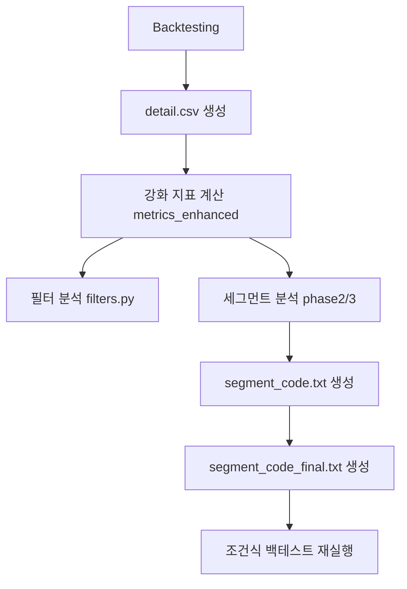

# 세그먼트 필터 프로세스 리팩토링 계획서

**문서 버전**: v1.0  
**작성일**: 2025-02-14  
**상태**: 계획 수립 / 실행 준비

---

## 1. 목적 및 범위

### 1.1 목적
- 백테스팅 결과로부터 **매수 시점 변수만** 사용하여 필터/세그먼트 필터 조건식을 안정적으로 생성
- 세그먼트 필터 예측 성과와 실제 백테스팅 결과의 불일치 해소
- 출력 산출물 네이밍/구성 정리 및 유지보수성 개선
- 속도 개선 및 파이써닉한 구조 정립

### 1.2 범위
- 강화 분석(필터/조합/임계값) + 세그먼트 분석(Phase2/3) + 최종 조건식 생성
- 출력 파일 네이밍 체계/manifest
- 매수/매도 파생 변수 정의 및 문서화(의미/단위/공식)

---

## 2. 현행 프로세스(요약)



**현재 출력 흐름**
- `*_detail.csv`, `*_filter.csv`, `*_segment_*`, `*_segment_code*.txt`, `*_enhanced.png`, `*_report.txt`

---

## 3. 핵심 문제/가설

1) **분석/런타임 변수 계산 불일치**
- 예: `모멘텀점수`는 분석에서는 z-score, 런타임 매핑에서는 고정 스케일 계산
- 동일한 필터 조건식이 실제 백테스팅에서 다른 결과를 유발

2) **시계열 파생 변수의 계산 기준 불일치**
- `당일거래대금_전틱분봉_비율` 등은 detail.csv 기반 shift/rolling 계산
- 런타임은 종목별/틱 기준으로 계산 → 값 불일치 가능

3) **세그먼트 경계(동적/고정) 선택 일관성 부족**
- 템플릿 비교 결과 vs 실제 적용 경계값 불일치 가능성 존재

4) **출력 네이밍/목록이 확장되며 관리/검증 난이도 증가**
- 파일이 많고 의미/순서 파악이 어렵고 검증 단계 추적이 어려움

---

## 4. 리팩토링 원칙

- **매수 시점 변수만 사용**: 필터/세그먼트 필터에서 룩어헤드 요소 배제
- **공식 단일화**: 동일 변수는 하나의 정의에서 계산(분석/런타임 정합)
- **출력 구조 표준화**: 단계/카테고리 기반 번호 체계 + manifest
- **호환성 유지**: 기존 텔레그램 메시지/이미지 유지, 기존 파일명은 옵션 유지

---

## 5. 목표 프로세스(안)

```mermaid
flowchart TD
    A[Backtesting] --> B[detail.csv (원본)]
    B --> C[파생지표 계산/등록]
    C --> D[필터 분석]
    D --> E[detail_filtered.csv 생성]
    E --> F[세그먼트 분석]
    F --> G[detail_segment.csv 생성]
    F --> H[segment_code_final.txt 생성]
    H --> I[검증: 예상 vs 적용 결과]
```

---

## 6. 출력 네이밍 체계(초안)

### 6.1 번호 규칙
- `0_`: 요약/매니페스트
- `1-`: 원본/중간 detail
- `2-`: 필터 분석
- `3-`: 세그먼트 분석/코드
- `4-`: 이미지/차트

### 6.2 예시(placeholder: `{save_file_name}`)
| 신규 파일명 | 기존 파일명(호환 옵션) | 설명 |
|---|---|---|
| `0_{save}_report.txt` | `{save}_report.txt` | 종합 리포트 |
| `0_{save}_manifest.json` | (신규) | 산출물 목록/버전 |
| `1-1_{save}_detail.csv` | `{save}_detail.csv` | 원본 detail |
| `1-2_{save}_detail_filtered.csv` | (신규) | 일반 필터 적용 detail |
| `1-3_{save}_detail_segment.csv` | (신규) | 세그먼트 필터 적용 detail |
| `2-1_{save}_filter.csv` | `{save}_filter.csv` | 필터 후보 |
| `2-2_{save}_filter_combinations.csv` | `{save}_filter_combinations.csv` | 조합 |
| `2-3_{save}_filter_stability.csv` | `{save}_filter_stability.csv` | 안정성 |
| `2-4_{save}_optimal_thresholds.csv` | `{save}_optimal_thresholds.csv` | 임계값 |
| `3-1_{save}_segment_summary.csv` | `{save}_segment_summary.csv` | 세그먼트 요약 |
| `3-2_{save}_segment_filters.csv` | `{save}_segment_filters.csv` | 세그먼트 필터 후보 |
| `3-3_{save}_segment_local_combos.csv` | `{save}_segment_local_combos.csv` | 로컬 조합 |
| `3-4_{save}_segment_combos.csv` | `{save}_segment_combos.csv` | 전역 조합 |
| `3-5_{save}_segment_ranges.csv` | `{save}_segment_ranges.csv` | 경계값 |
| `3-6_{save}_segment_code.txt` | `{save}_segment_code.txt` | 세그먼트 조건식 |
| `3-7_{save}_segment_code_final.txt` | `{save}_segment_code_final.txt` | 최종 조건식 |
| `3-8_{save}_segment_validation.csv` | `{save}_segment_validation.csv` | 안정성 검증 |
| `4-1_{save}_enhanced.png` | `{save}_enhanced.png` | 강화 분석 이미지 |
| `4-2_{save}_segment_heatmap.png` | `{save}_segment_heatmap.png` | 세그먼트 히트맵 |
| `4-3_{save}_filter_efficiency.png` | `{save}_filter_efficiency.png` | 필터 효율 차트 |

**호환 전략(초안)**: 신규 이름 생성 + 기존 이름 유지(옵션 플래그).

---

## 7. 단계별 리팩토링 계획

### Phase 1: 프로세스 정리/문서화 (진행중)
- 현행 파이프라인 도식화/이슈 정리
- 출력 네이밍/manifest 초안 정의
- 단계별 목표/검증 기준 확정

### Phase 2: 출력 네이밍/filtered detail 생성
- 출력 네이밍 레이어 도입
- `detail_filtered.csv`, `detail_segment.csv` 생성
- 기존 파일명 유지 옵션 추가

### Phase 3: 변수 레지스트리 도입
- 매수/매도/파생 변수 정의 통합
- 분석/런타임 계산식 정합성 확보
- 필터 후보 선정 로직 일원화

### Phase 4: 검증/성능 개선
- 세그먼트 필터 적용 검증 자동화
- 병렬 처리/캐시 개선
- 텔레그램 송출 순서 정리(메시지/이미지 내용 동일 유지)

---

## 8. 상태 관리

| 단계 | 상태 | 비고 |
|---|---|---|
| Phase 1 | 완료 | 계획서 작성 |
| Phase 2 | 완료 | 출력 네이밍/매니페스트/filtered detail 생성 |
| Phase 3 | 완료 | 변수 레지스트리/정합성 개선 |
| Phase 4 | 완료 | 검증 체크리스트/성능 개선/텔레그램 순서 조정 |

---

## 9. 확인 필요 사항(결정 포인트)

1. 신규 네이밍 도입 시 **기존 파일명 유지 여부** (기본: 유지)
2. manifest 형식(예: JSON vs CSV)
3. 필터/세그먼트 적용 detail 파일 생성 시점과 이름 규칙
4. 모멘텀/리스크 점수 계산식의 단일화 방식
