# STOM 프로젝트 문서 저장소

> STOM (System Trading Optimization Manager) 프로젝트의 모든 문서를 체계적으로 관리하는 중앙 저장소

**📍 위치**: `docs/`
**📅 최종 업데이트**: 2025-01-15
**🔖 버전**: STOM V1

---

## 📋 목차

- [개요](#개요)
- [문서 구조](#문서-구조)
- [주요 폴더 소개](#주요-폴더-소개)
- [빠른 시작 가이드](#빠른-시작-가이드)
- [문서 활용 시나리오](#문서-활용-시나리오)
- [기여 가이드](#기여-가이드)

---

## 개요

STOM 프로젝트의 모든 문서를 한 곳에서 관리하는 통합 문서 저장소입니다.

### 문서 저장소의 목적

1. **지식 공유**: 트레이딩 전략, 개발 가이드, 시스템 매뉴얼을 팀 내에서 공유
2. **표준화**: 일관된 문서 작성 표준 및 템플릿 제공
3. **지속성**: 프로젝트 지식의 영구 보존 및 진화
4. **학습 지원**: 신규 사용자 및 개발자를 위한 체계적인 학습 경로 제공
5. **참조 용이성**: 모든 문서 간 링크를 통한 빠른 참조

---

## 문서 구조

```
docs/
├── README.md                    # 📍 현재 문서 (전체 개요)
│
├── Guideline/                   # 📘 가이드라인 문서
│   ├── README.md
│   ├── Back_Testing_Guideline_Tick.md
│   ├── Back_Testing_Guideline_Min.md
│   ├── Condition_Document_Template_Guideline.md
│   ├── Stock_Database_Information.md
│   ├── Manual_Generation_Guideline.md
│   └── 사용설명서/              # STOM 사용자 매뉴얼 (1~4부)
│
├── Condition/                   # 📊 조건식 문서
│   ├── README.md
│   ├── Tick/                    # 틱 조건식 (초단위)
│   │   ├── README.md
│   │   ├── Condition_Tick_*.md
│   │   └── 20250808_study/
│   ├── Min/                     # 분봉 조건식 (1분 단위)
│   │   ├── README.md
│   │   ├── Condition_*_Min.md
│   │   └── Idea/
│   ├── Idea/                    # 전략 아이디어 및 계획
│   │   ├── Plan_from_GPT5/
│   │   └── Plan_from_claude_opus/
│   └── Reference/               # 참고 자료
│       ├── PyTrader/
│       └── YouTube/
│
├── Manual/                      # 📖 프로젝트 매뉴얼
│   ├── README.md
│   ├── 01_Overview/             # 프로젝트 개요
│   ├── 02_Architecture/         # 시스템 아키텍처
│   ├── 03_Modules/              # 모듈 분석
│   ├── 04_API/                  # API 연동 분석
│   ├── 05_UI_UX/                # UI/UX 분석
│   ├── 06_Data/                 # 데이터 관리
│   ├── 07_Trading/              # 트레이딩 엔진
│   ├── 08_Backtesting/          # 백테스팅 시스템
│   ├── 09_Manual/               # 사용자 매뉴얼
│   └── 10_Conclusion/           # 부록 및 참고자료
│
├── CodeReview/                  # 🔍 코드 리뷰 문서
│   └── Backtesting_Data_Loading_Multicore_Analysis.md
│
└── 가상환경구축연구/             # 🧪 가상환경 연구 자료
```

---

## 주요 폴더 소개

### 📘 [Guideline](./Guideline/) - 가이드라인 문서

**목적**: 전략 개발, 백테스팅, 문서화를 위한 종합 가이드라인

**주요 문서**:
- **[Back_Testing_Guideline_Tick.md](./Guideline/Back_Testing_Guideline_Tick.md)** (33KB, 826줄)
  - 초 단위 틱 데이터 백테스팅 완전 가이드
  - 주식 매수/매도 변수 826개 완전 목록
  - 구간 연산 함수, 과거 틱 데이터 조회 방법

- **[Back_Testing_Guideline_Min.md](./Guideline/Back_Testing_Guideline_Min.md)** (25KB, 752줄)
  - 1분봉 캔들 데이터 백테스팅 완전 가이드
  - 주식 매수/매도 변수 752개 완전 목록
  - TA-Lib 기술적 지표 활용 (MACD, RSI, BBand 등)

- **[Condition_Document_Template_Guideline.md](./Guideline/Condition_Document_Template_Guideline.md)** (32KB, 850줄+)
  - 조건식 문서 작성 템플릿 완전 가이드
  - 공통 계산 지표, 시간대별 분기, 최적화 섹션
  - 실전 예제 및 42개 체크포인트

- **[Stock_Database_Information.md](./Guideline/Stock_Database_Information.md)** (20KB)
  - 주식 백업 데이터베이스 구조 상세 문서
  - 분봉/틱 DB 컬럼 정보 (108개/93개)

- **[Manual_Generation_Guideline.md](./Guideline/Manual_Generation_Guideline.md)** (31KB)
  - STOM 프로젝트 분석 및 문서화 전략 가이드

**자세히 보기**: [Guideline/README.md](./Guideline/README.md)

---

### 📊 [Condition](./Condition/) - 조건식 문서

**목적**: 모든 트레이딩 전략 조건식 문서 저장소

**하위 폴더**:

#### 📂 [Condition/Tick](./Condition/Tick/) - 틱 조건식
- **문서 수**: 30개
- **주요 문서**:
  - [Condition_Tick_902_905_update_2.md](./Condition/Tick/Condition_Tick_902_905_update_2.md) ⭐⭐⭐⭐⭐
  - [Condition_Tick_900_920.md](./Condition/Tick/Condition_Tick_900_920.md) ⭐⭐⭐⭐⭐
  - [Condition_Tick_900_930_Composite_Study.md](./Condition/Tick/Condition_Tick_900_930_Composite_Study.md) ⭐⭐⭐⭐
- **특징**: 초 단위 고빈도 트레이딩, 급등주 포착

#### 📂 [Condition/Min](./Condition/Min/) - 분봉 조건식
- **문서 수**: 20개
- **주요 문서**:
  - [Condition_Find_1_Min.md](./Condition/Min/Condition_Find_1_Min.md)
  - [Condition_MACD_Precision_System.md](./Condition/Min/Idea/Condition_MACD_Precision_System.md)
  - [Condition_Triple_Confirmation.md](./Condition/Min/Idea/Condition_Triple_Confirmation.md)
- **특징**: 1분봉 캔들 데이터, TA-Lib 지표 활용

#### 📂 [Condition/Idea](./Condition/Idea/) - 전략 아이디어
- **Plan_from_GPT5**: GPT-5 기반 전략 계획 (13개 문서)
- **Plan_from_claude_opus**: Claude Opus 기반 전략 계획 (11개 문서)

#### 📂 [Condition/Reference](./Condition/Reference/) - 참고 자료
- **PyTrader**: PyTrader 참고 자료 (2개)
- **YouTube**: 호가창 분석 자료 (6개)

**자세히 보기**: [Condition/README.md](./Condition/README.md)

---

### 📖 [Manual](./Manual/) - 프로젝트 매뉴얼

**목적**: STOM 프로젝트 전체 분석 및 사용자 매뉴얼

**주요 섹션**:

| 섹션 | 폴더 | 내용 |
|------|------|------|
| 01. 프로젝트 개요 | [01_Overview](./Manual/01_Overview/) | 프로젝트 소개, 기술 스택 |
| 02. 시스템 아키텍처 | [02_Architecture](./Manual/02_Architecture/) | 전체 시스템 구조, 데이터 플로우 |
| 03. 모듈 분석 | [03_Modules](./Manual/03_Modules/) | 주식/코인/UI/유틸리티/백테스터 모듈 |
| 04. API 연동 | [04_API](./Manual/04_API/) | 키움증권/업비트/바이낸스 API |
| 05. UI/UX 분석 | [05_UI_UX](./Manual/05_UI_UX/) | 메인 윈도우, 차트 시스템 |
| 06. 데이터 관리 | [06_Data](./Manual/06_Data/) | 데이터베이스 구조, 성능 최적화 |
| 07. 트레이딩 엔진 | [07_Trading](./Manual/07_Trading/) | 전략 실행, 주문/리스크 관리 |
| 08. 백테스팅 시스템 | [08_Backtesting](./Manual/08_Backtesting/) | 백테스팅 엔진, 최적화 시스템 |
| 09. 사용자 매뉴얼 | [09_Manual](./Manual/09_Manual/) | 설치, 사용법, 트러블슈팅 |
| 10. 부록 | [10_Conclusion](./Manual/10_Conclusion/) | 다이어그램, API 레퍼런스, 용어집 |

**특징**:
- 총 코드 라인 수: 약 50,000+ 라인
- 지원 거래소: 키움증권, 업비트, 바이낸스
- GUI 프레임워크: PyQt5
- 실시간 처리: WebSocket, ZeroMQ

**자세히 보기**: [Manual/README.md](./Manual/README.md)

---

### 🔍 [CodeReview](./CodeReview/) - 코드 리뷰 문서

**목적**: 특정 기능 또는 모듈에 대한 코드 리뷰 및 분석

**주요 문서**:
- **[Backtesting_Data_Loading_Multicore_Analysis.md](./CodeReview/Backtesting_Data_Loading_Multicore_Analysis.md)**
  - 백테스팅 데이터 로딩 멀티코어 분석

**특징**: 심층 코드 분석, 성능 최적화 제안

---

### 🧪 [가상환경구축연구](./가상환경구축연구/) - 가상환경 연구

**목적**: STOM 프로젝트 가상환경 구축 및 관리 연구 자료

---

## 빠른 시작 가이드

### 사용자 유형별 추천 경로

#### 🆕 신규 사용자 (STOM 처음 사용)

```mermaid
graph LR
    A[시작] --> B[사용설명서 1~2부]
    B --> C[Manual/01_Overview]
    C --> D[Manual/09_Manual]
    D --> E[실습]
```



**추천 문서**:
1. [Guideline/사용설명서/21_스톰사용설명서 1부_요약.md](./Guideline/사용설명서/21_스톰사용설명서%201부_요약.md)
2. [Guideline/사용설명서/22_스톰사용설명서 2부_요약.md](./Guideline/사용설명서/22_스톰사용설명서%202부_요약.md)
3. [Manual/01_Overview/project_overview.md](./Manual/01_Overview/project_overview.md)
4. [Manual/09_Manual/user_manual.md](./Manual/09_Manual/user_manual.md)

---

#### 📈 전략 개발자 (조건식 작성)

```mermaid
graph LR
    A[시작] --> B{전략 유형}
    B -->|Tick| C[Tick Guideline]
    B -->|Min| D[Min Guideline]
    C --> E[Tick 예제]
    D --> F[Min 예제]
    E --> G[조건식 작성]
    F --> G
    G --> H[백테스팅]
```



**Tick 전략 개발**:
1. [Back_Testing_Guideline_Tick.md](./Guideline/Back_Testing_Guideline_Tick.md) - 변수 학습
2. [Stock_Database_Information.md](./Guideline/Stock_Database_Information.md) - DB 구조
3. [Condition_Tick_902_905_update_2.md](./Condition/Tick/Condition_Tick_902_905_update_2.md) - 골드 스탠다드 예제
4. [Condition_Document_Template_Guideline.md](./Guideline/Condition_Document_Template_Guideline.md) - 문서 작성

**Min 전략 개발**:
1. [Back_Testing_Guideline_Min.md](./Guideline/Back_Testing_Guideline_Min.md) - 변수 학습
2. [Stock_Database_Information.md](./Guideline/Stock_Database_Information.md) - DB 구조
3. [Condition_Find_1_Min.md](./Condition/Min/Condition_Find_1_Min.md) - 기본 예제
4. [Condition_Document_Template_Guideline.md](./Guideline/Condition_Document_Template_Guideline.md) - 문서 작성

---

#### 💻 개발자 (코드 분석 및 기여)

```mermaid
graph LR
    A[시작] --> B[Manual 전체]
    B --> C[아키텍처 이해]
    C --> D[모듈 분석]
    D --> E[코드 수정/기여]
```



**추천 문서**:
1. [Manual/README.md](./Manual/README.md) - 프로젝트 전체 개요
2. [Manual/02_Architecture/system_architecture.md](./Manual/02_Architecture/system_architecture.md) - 시스템 구조
3. [Manual/03_Modules/modules_analysis.md](./Manual/03_Modules/modules_analysis.md) - 모듈 상세
4. [Manual_Generation_Guideline.md](./Guideline/Manual_Generation_Guideline.md) - 문서화 가이드
5. [CodeReview/](./CodeReview/) - 코드 리뷰 자료

---

#### 📚 학습자 (시스템 트레이딩 학습)

```mermaid
graph LR
    A[시작] --> B[기본 개념]
    B --> C[데이터베이스 구조]
    C --> D[백테스팅 가이드]
    D --> E[조건식 분석]
    E --> F[실전 연습]
```



**추천 문서**:
1. [Manual/01_Overview/project_overview.md](./Manual/01_Overview/project_overview.md)
2. [Stock_Database_Information.md](./Guideline/Stock_Database_Information.md)
3. [Back_Testing_Guideline_Tick.md](./Guideline/Back_Testing_Guideline_Tick.md) 또는 [Back_Testing_Guideline_Min.md](./Guideline/Back_Testing_Guideline_Min.md)
4. [Condition/Tick/](./Condition/Tick/) 또는 [Condition/Min/](./Condition/Min/) 예제 분석
5. [Condition/Reference/YouTube/](./Condition/Reference/YouTube/) - 호가창 분석 참고

---

## 문서 활용 시나리오

### 시나리오 1: 새로운 Tick 전략 개발

1. [Back_Testing_Guideline_Tick.md](./Guideline/Back_Testing_Guideline_Tick.md) 읽고 변수 숙지
2. [Condition_Tick_902_905_update_2.md](./Condition/Tick/Condition_Tick_902_905_update_2.md) 분석
3. [Condition_Document_Template_Guideline.md](./Guideline/Condition_Document_Template_Guideline.md) 템플릿 복사
4. 새 조건식 작성 및 백테스팅
5. 결과 문서화 후 `Condition/Tick/` 폴더에 저장

### 시나리오 2: 분봉 기술적 지표 활용 전략 개발

1. [Back_Testing_Guideline_Min.md](./Guideline/Back_Testing_Guideline_Min.md) 읽고 TA-Lib 지표 학습
2. [Condition_MACD_Precision_System.md](./Condition/Min/Idea/Condition_MACD_Precision_System.md) 분석
3. [Condition_Triple_Confirmation.md](./Condition/Min/Idea/Condition_Triple_Confirmation.md) 복합 지표 연구
4. 자신만의 지표 조합 설계
5. 백테스팅 후 `Condition/Min/` 폴더에 문서화

### 시나리오 3: STOM 시스템 이해 및 커스터마이징

1. [Manual/README.md](./Manual/README.md) 전체 구조 파악
2. [Manual/02_Architecture/system_architecture.md](./Manual/02_Architecture/system_architecture.md) 아키텍처 이해
3. [Manual/03_Modules/](./Manual/03_Modules/) 관심 모듈 분석
4. [CodeReview/](./CodeReview/) 코드 리뷰 참고
5. 코드 수정 및 기여

### 시나리오 4: 호가창 분석 학습

1. [Condition/Reference/YouTube/](./Condition/Reference/YouTube/) 자료 학습
2. [Back_Testing_Guideline_Tick.md](./Guideline/Back_Testing_Guideline_Tick.md) 호가 관련 변수 확인
3. 호가창 기반 Tick 전략 개발
4. [Condition/Tick/](./Condition/Tick/) 기존 전략과 비교 분석

---

## 기여 가이드

### 문서 작성 표준

1. **Markdown 형식**: 모든 문서는 `.md` 형식으로 작성
2. **템플릿 준수**: [Condition_Document_Template_Guideline.md](./Guideline/Condition_Document_Template_Guideline.md) 따름
3. **링크 활용**: 관련 문서 간 적극적인 링크 연결
4. **README 업데이트**: 새 문서 추가 시 해당 폴더 README 업데이트

### 새 문서 추가 프로세스

1. 적절한 폴더 선택 (`Guideline/`, `Condition/Tick/`, `Condition/Min/`, 등)
2. 템플릿 복사 또는 기존 문서 참조
3. 내용 작성 (표준 준수)
4. 해당 폴더 README에 새 문서 추가
5. 필요 시 상위 폴더 README도 업데이트

### 문서 품질 체크리스트

- [ ] 명확한 제목 및 목차
- [ ] 문서 목적 및 개요 작성
- [ ] 관련 문서 링크 제공
- [ ] 예제 코드 포함 (해당 시)
- [ ] 최종 업데이트 날짜 명시
- [ ] 맞춤법 및 문법 검토

---

## 📊 문서 통계

### 전체 문서 수
- **Guideline**: 5개 핵심 문서 + 8개 사용설명서
- **Condition**: 87개 문서
  - Tick: 30개
  - Min: 20개
  - Idea: 29개
  - Reference: 8개
- **Manual**: 10개 섹션 (다수 하위 문서)
- **CodeReview**: 1개
- **총계**: 100+ 문서

### 문서 품질 분포
- ⭐⭐⭐⭐⭐ (골드 스탠다드): 3개
- ⭐⭐⭐⭐ (검증 완료): 6개
- 📊 (연구 단계): 16개
- 💡 (아이디어 단계): 15개
- 📘 (가이드라인): 13개
- 📖 (매뉴얼): 10개 섹션

---

## 🎯 빠른 참조표

| 목적 | 폴더 | 주요 문서 |
|------|------|----------|
| STOM 시작하기 | [Guideline/사용설명서](./Guideline/사용설명서/) | 21~24_스톰사용설명서 |
| Tick 전략 개발 | [Condition/Tick](./Condition/Tick/) | [Condition_Tick_902_905_update_2.md](./Condition/Tick/Condition_Tick_902_905_update_2.md) |
| Min 전략 개발 | [Condition/Min](./Condition/Min/) | [Condition_Find_1_Min.md](./Condition/Min/Condition_Find_1_Min.md) |
| 백테스팅 변수 확인 | [Guideline](./Guideline/) | [Back_Testing_Guideline_Tick.md](./Guideline/Back_Testing_Guideline_Tick.md) / [Back_Testing_Guideline_Min.md](./Guideline/Back_Testing_Guideline_Min.md) |
| DB 구조 확인 | [Guideline](./Guideline/) | [Stock_Database_Information.md](./Guideline/Stock_Database_Information.md) |
| 조건식 문서 작성 | [Guideline](./Guideline/) | [Condition_Document_Template_Guideline.md](./Guideline/Condition_Document_Template_Guideline.md) |
| 시스템 구조 이해 | [Manual](./Manual/) | [02_Architecture](./Manual/02_Architecture/) |
| 코드 분석 | [Manual](./Manual/) | [03_Modules](./Manual/03_Modules/) |
| 호가창 분석 학습 | [Condition/Reference](./Condition/Reference/) | [YouTube 폴더](./Condition/Reference/YouTube/) |
| AI 전략 아이디어 | [Condition/Idea](./Condition/Idea/) | Plan_from_GPT5 / Plan_from_claude_opus |

---

## 🔗 외부 리소스

- **프로젝트 루트**: `C:\System_Trading\STOM\STOM_V1\`
- **데이터베이스 위치**: `C:\System_Trading\STOM\STOM_V1\_database\`
- **코드베이스**: `C:\System_Trading\STOM\STOM_V1\` (stock/, coin/, ui/, backtester/, utility/)

---

## 📝 문서 작성 원칙

1. **명확성**: 모든 문서는 명확하고 이해하기 쉽게 작성
2. **일관성**: 템플릿 및 표준을 준수하여 일관성 유지
3. **연결성**: 관련 문서 간 적극적인 링크 연결
4. **실용성**: 실제 사용 가능한 예제 및 코드 포함
5. **최신성**: 정기적인 업데이트 및 검증

---

## 💡 유용한 팁

### 문서 검색 팁
- **Ctrl+F (브라우저)**: 현재 문서 내 검색
- **GitHub 검색**: 전체 저장소 검색
- **README 활용**: 각 폴더 README에서 문서 빠른 탐색

### 학습 팁
- **순차 학습**: Guideline → 예제 분석 → 실습 순서 추천
- **비교 학습**: Tick vs Min 차이점 비교하며 학습
- **실전 연습**: 작은 전략부터 시작하여 점진적 확장

### 문서화 팁
- **템플릿 활용**: 기존 고품질 문서를 템플릿으로 활용
- **예제 포함**: 추상적 설명보다 구체적 예제 우선
- **링크 연결**: 관련 문서를 적극적으로 링크

---

## 📧 문의 및 기여

- **문서 오류 발견**: Issue 등록 또는 프로젝트 관리자 연락
- **개선 제안**: Pull Request 또는 직접 제안
- **새 문서 작성**: 기여 가이드 참조 후 작성

---

**🎉 STOM 프로젝트 문서 저장소에 오신 것을 환영합니다!**

*이 문서 저장소는 STOM 프로젝트의 지식을 체계적으로 관리하고 공유하기 위해 만들어졌습니다. 모든 문서는 실제 시스템 및 백테스팅 결과를 기반으로 작성되었습니다.*

**📅 마지막 업데이트**: 2025-01-15
**📧 관리자**: STOM 프로젝트 팀
