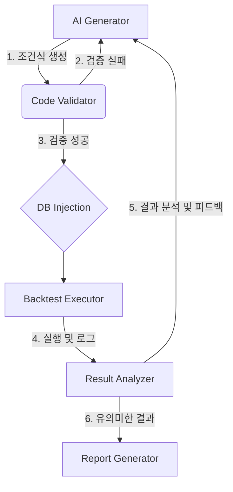

# 자동화된 조건식 최적화 시스템 연구 (Automated Condition Optimization System Research)

## 1. 개요 (Overview)

본 문서는 STOM 시스템의 조건식(Condition) 개발 및 최적화 과정을 AI를 활용하여 자동화하는 방법을 연구하고 설계한 보고서입니다.
기존의 수동적인 조건식 작성 및 테스트 과정을 **AI 기반의 무한 연구 루프(Infinite Research Loop)**로 전환하여, 24시간 중단 없이 새로운 전략을 발굴하고 개선하는 것을 목표로 합니다.

### 1.1 목표
1. **완전 자동화**: 조건식 생성 -> 검증 -> 백테스트 -> 결과 분석 -> 수정 -> 재테스트의 전 과정을 자동화.
2. **가이드라인 준수**: `Condition_Document_Template_Guideline.md`를 완벽히 준수하는 고품질 조건식 생성.
3. **데이터 기반 의사결정**: 백테스트 결과를 정량적으로 분석하여 전략의 폐기/수정/채택 여부 결정.
4. **지식 축적**: 연구 결과와 수정 이력을 자동으로 문서화(`docs/Study/`)하여 시스템의 지식베이스 확장.

---

## 2. 현행 시스템 분석 (Current System Analysis)

### 2.1 조건식 구조 및 실행 흐름
현재 STOM 시스템의 조건식 처리는 다음과 같은 흐름을 따릅니다.

1. **작성**: 사용자가 Markdown 파일(`docs/Condition/Tick/*.md`)에 Python 코드로 조건식을 작성.
2. **저장**: 작성된 조건식 코드는 `_database/strategy.db`의 `stockbuyconds`, `stocksellconds` 테이블에 저장됨.
3. **검증**: `backtester/back_code_test.py`의 `BackCodeTest` 클래스가 문법 및 변수 범위(`self.vars`)를 정적 분석.
4. **실행**: `backtester/optimiz_conditions.py`가 DB에서 조건식을 로드하여 백테스팅 및 최적화(GA/Grid Search) 수행.
5. **결과**: 결과는 `_database/backtest.db` 및 로그로 저장됨.

### 2.2 핵심 구성 요소
*   **`self.vars`**: 최적화 변수 관리의 핵심. `[[시작, 끝, 간격], 초기값]` 형식을 엄격히 준수해야 함.
*   **`self.Buy` / `self.Sell`**: 매매 실행 함수. 인자 순서와 개수가 정확해야 함.
*   **`BackCodeTest.CheckFactor`**: 사용된 팩터 함수(예: `이동평균(30)`)의 괄호 유무 등을 검사하는 엄격한 파서.

---

## 3. 자동화 시스템 아키텍처 (Proposed Architecture)

AI 에이전트가 주도하는 **ACRS (Automated Condition Research System)**의 아키텍처를 제안합니다.

### 3.1 워크플로우 (Workflow)



### 3.2 단계별 상세 설계

#### Phase 1: AI Generator (생성기)
*   **역할**: 새로운 조건식 아이디어를 제안하거나 기존 조건식을 개선.
*   **입력**:
    *   `Condition_Document_Template_Guideline.md` (필수 문법 및 구조)
    *   현재 시장 트렌드 또는 타겟 종목군 (옵션)
    *   이전 백테스트 실패 원인 (피드백 루프 시)
*   **출력**:
    *   조건식 Markdown 파일 내용
    *   추출된 Python 코드 (매수/매도 로직)
    *   `self.vars` 정의

#### Phase 2: Code Validator (검증기)
*   **역할**: 생성된 코드가 STOM 엔진에서 실행 가능한지 사전 검증.
*   **구현**: `backtester/back_code_test.py`를 래핑(Wrapping)하여 사용.
*   **로직**:
    ```python
    try:
        test = BackCodeTest(queue, code_string)
        if "전략테스트완료" in queue:
            return True
    except Exception as e:
        return False, str(e) # 에러 메시지를 AI에게 반환하여 수정 요청
    ```

#### Phase 3: DB Injection & Execution (주입 및 실행)
*   **역할**: 검증된 코드를 DB에 등록하고 백테스터를 실행.
*   **DB 작업**: `sqlite3`를 이용해 `_database/strategy.db`에 `INSERT` 또는 `UPDATE`.
*   **실행**: `subprocess`를 통해 `backtester/optimiz_conditions.py` 실행.
*   **모니터링**: 실행 중 발생하는 표준 출력(stdout)을 캡처하여 진행 상황 추적.

#### Phase 4: Result Analyzer (분석기)
*   **역할**: 백테스트 결과를 분석하여 전략의 유효성 판단.
*   **데이터 소스**: `_database/backtest.db`의 결과 테이블.
*   **평가 지표**:
    *   수익률 (Return)
    *   MDD (Maximum Drawdown)
    *   거래 횟수 (Trade Count) -> 과최적화 여부 판단
    *   승률 (Win Rate)
*   **판단 로직**:
    *   **Pass**: 목표 기준(예: 수익률 > 10%, MDD < 5%) 달성 -> `docs/Condition/Tick/3_Review_finished`로 이동 및 보고서 작성.
    *   **Retry**: 가능성은 보이나 튜닝 필요 -> `self.vars` 범위 조정 후 재실행.
    *   **Fail**: 개선 여지 없음 -> 폐기 및 실패 원인 기록.

---

## 4. 구현 가이드 (Implementation Guide)

### 4.1 자동화 스크립트 구조 (`study/auto_research.py`)

```python
import sqlite3
import subprocess
from backtester.back_code_test import BackCodeTest
# ... 기타 import

class AutoResearcher:
    def __init__(self):
        self.db_path = './_database/strategy.db'
        
    def generate_condition(self, prompt_context):
        # LLM API 호출 (Claude/GPT)
        # 가이드라인 기반 조건식 생성 요청
        pass

    def validate_code(self, code):
        # BackCodeTest 실행
        # 에러 발생 시 LLM에게 에러 메시지와 함께 재요청
        pass

    def inject_to_db(self, strategy_name, buy_code, sell_code):
        # DB에 전략 저장
        pass

    def run_backtest(self, strategy_name):
        # optimiz_conditions.py 실행
        pass

    def analyze_result(self, strategy_name):
        # 결과 DB 조회 및 평가
        pass

    def run_loop(self):
        while True:
            # 무한 연구 루프 실행
            pass
```

### 4.2 프롬프트 엔지니어링 전략
AI에게 조건식 생성을 요청할 때는 다음과 같은 시스템 프롬프트를 사용해야 합니다.

> "당신은 STOM 시스템의 수석 퀀트 개발자입니다. 
> `docs/Guideline/Condition_Document_Template_Guideline.md`를 엄격히 준수하여 
> 장초반(09:00~09:20) 급등주 포착을 위한 Tick 단위 조건식을 작성하십시오.
> `self.vars` 인덱스는 반드시 1부터 연속되어야 하며, 0번은 고정값입니다.
> 매수 로직은 `매수 = True`로 시작하여 필터링하는 구조여야 합니다."

---

## 5. 결론 및 향후 계획

이 연구를 통해 설계된 자동화 시스템은 인간의 개입을 최소화하면서도 시스템의 가이드라인을 준수하는 고품질의 전략을 대량으로 생산할 수 있습니다.
향후 `study/auto_research_v1.py` 프로토타입을 개발하여 실제 자동 생성된 조건식 1호를 `docs/Condition/Tick`에 등록하는 것을 첫 번째 마일스톤으로 삼아야 합니다.
