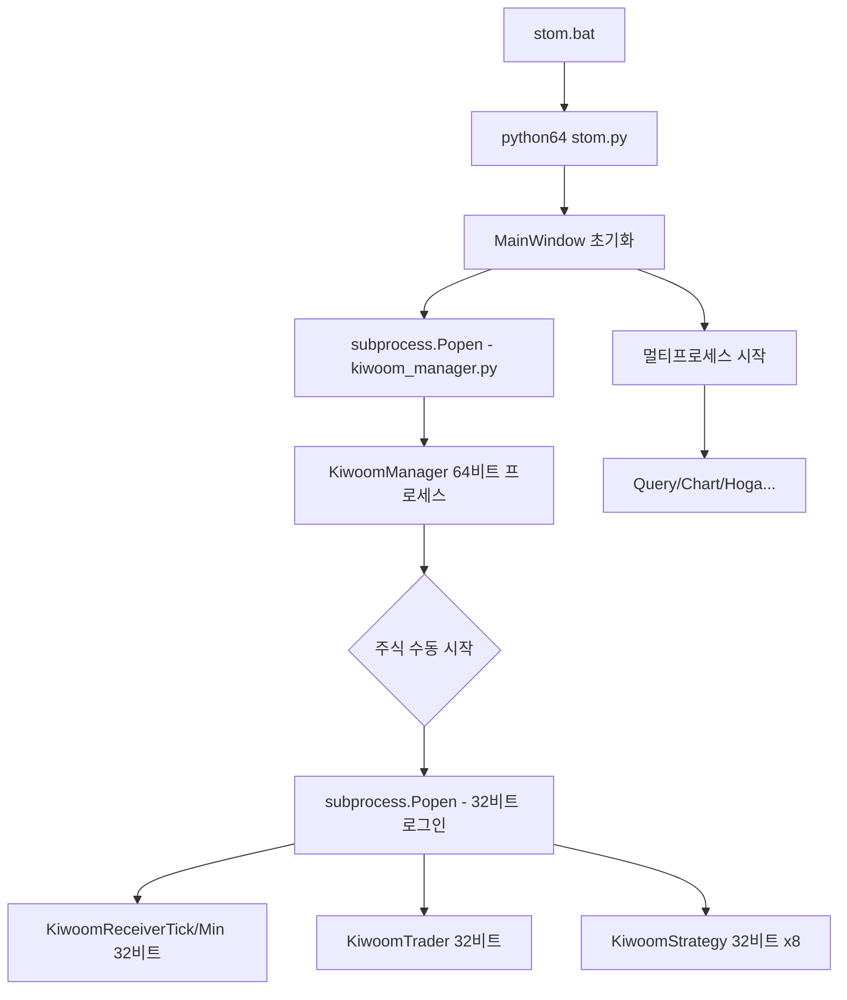
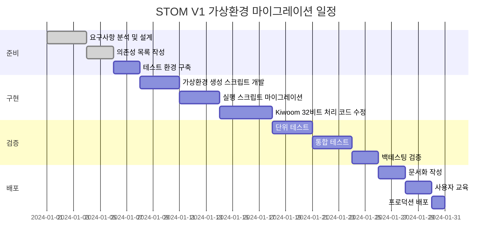

# STOM 파이썬 가상환경 구축 연구 보고서

## 📋 목차
1. [현황 분석](#1-현황-분석)
2. [가상환경 도입 필요성](#2-가상환경-도입-필요성)
3. [기술적 과제 및 해결방안](#3-기술적-과제-및-해결방안)
4. [가상환경 구축 전략](#4-가상환경-구축-전략)
5. [구현 시나리오](#5-구현-시나리오)
6. [마이그레이션 로드맵](#6-마이그레이션-로드맵)
7. [리스크 관리](#7-리스크-관리)
8. [권고사항](#8-권고사항)

---

## 1. 현황 분석

### 1.1 현재 파이썬 환경 구조

STOM V1은 현재 다음과 같은 독특한 파이썬 환경 구조를 사용하고 있습니다:

```
시스템 구성:
├── Python 32-bit (기본 설치)
│   └── 실행 명령어: python
│   └── 용도: Kiwoom OpenAPI (32비트 전용 DLL)
│
└── Python 64-bit (python64로 리네임)
    └── 실행 명령어: python64
    └── 용도: 주 트레이딩 시스템 (메모리 효율성)
```

### 1.2 현재 의존성 관리 방식

**32비트 환경** (`pip_install_32.bat`):
```batch
python -m pip install numpy==1.26.4 pandas==2.0.3 python-telegram-bot==13.15
python -m pip install psutil pyqt5 pyzmq pywin32 cryptography
python -m pip install ./utility/TA_Lib-0.4.27-cp311-cp311-win32.whl
```

**64비트 환경** (`pip_install_64.bat`):
```batch
python64 -m pip install numpy==1.26.4 pandas==2.0.3 python-telegram-bot==13.15 numba
python64 -m pip install websockets cryptography psutil pyqt5 PyQtWebEngine BeautifulSoup4
python64 -m pip install optuna optuna-dashboard cmaes lxml squarify matplotlib
python64 -m pip install pyqtgraph pyupbit ntplib python-dateutil python-binance pyzmq pyttsx3
python64 -m pip install ./utility/TA_Lib-0.4.25-cp311-cp311-win_amd64.whl
```

### 1.3 핵심 제약사항

| 제약사항 | 설명 | 영향도 |
|---------|------|--------|
| **Kiwoom API 의존성** | 32비트 DLL 전용 (Win32 환경 필수) | 🔴 Critical |
| **멀티프로세스 아키텍처** | 여러 프로세스 간 파이썬 인터프리터 공유 | 🟡 High |
| **관리자 권한 요구** | 모든 실행 스크립트가 UAC 권한 상승 필요 | 🟡 High |
| **절대 경로 의존성** | Kiwoom OpenAPI 경로 (`C:/OpenAPI`) 하드코딩 | 🟢 Medium |
| **데이터베이스 공유** | SQLite DB 파일을 여러 프로세스가 동시 접근 | 🟢 Medium |

### 1.4 현재 실행 흐름 분석 (실제 코드 기반)

#### 메인 프로세스 (64비트)


#### 실제 32비트 Python 호출 지점

**1. ui/ui_mainwindow.py:606**
```python
subprocess.Popen(f'python ./stock/kiwoom_manager.py {port_num}')
```
- 현재: **암묵적으로 시스템 기본 `python` 호출** (32비트 가정)
- 문제: 가상환경에서는 경로 명시 필요

**2. stock/kiwoom_manager.py:232, 239, 246**
```python
# 버전 업데이트
subprocess.Popen(f'python {LOGIN_PATH}/versionupdater.py')

# 자동 로그인 1 (트레이더 계정)
subprocess.Popen(f'python {LOGIN_PATH}/autologin1.py')

# 자동 로그인 2 (리시버 계정)
subprocess.Popen(f'python {LOGIN_PATH}/autologin2.py')
```
- 현재: **모두 `python` 명령어로 32비트 실행**
- 용도: Kiwoom OpenAPI 로그인 및 버전 관리

**3. stock/kiwoom_manager.py:267, 303-319, 323**
```python
# 리시버 프로세스 (32비트)
target = KiwoomReceiverTick if self.dict_set['주식타임프레임'] else KiwoomReceiverMin
self.proc_receiver_stock = Process(target=target, args=(self.qlist,), daemon=True)

# 전략 프로세스 (32비트 x8)
target = KiwoomStrategyTick if self.dict_set['주식타임프레임'] else KiwoomStrategyMin
self.proc_strategy_stock1 = Process(target=target, args=(0, self.qlist), daemon=True)
# ... (총 8개)

# 트레이더 프로세스 (32비트)
self.proc_trader_stock = Process(target=KiwoomTrader, args=(self.qlist,), daemon=True)
```
- 현재: **multiprocessing.Process로 생성되지만, kiwoom_manager.py 자체가 32비트로 실행되므로 자식 프로세스도 32비트**
- 핵심: `kiwoom_manager.py`가 32비트 Python으로 실행되어야 모든 Kiwoom 관련 프로세스가 32비트로 동작

---

## 2. 가상환경 도입 필요성

### 2.1 현재 시스템의 문제점

#### 2.1.1 의존성 충돌 위험
- **전역 설치 방식**: 모든 패키지가 시스템 Python에 설치
- **버전 고정 불가능**: 다른 프로젝트와의 패키지 버전 충돌
- **실험적 개발 제약**: 새로운 라이브러리 테스트 시 기존 환경 오염 위험

#### 2.1.2 재현성 문제
- **환경 복제 어려움**: 새로운 개발 환경 구축 시 수동 설치 필요
- **버전 관리 부재**: `requirements.txt` 없이 배치 파일에만 의존
- **팀 협업 제약**: 다른 개발자의 환경 동기화 어려움

#### 2.1.3 유지보수성
- **업그레이드 위험**: 라이브러리 업데이트 시 전체 시스템 영향
- **롤백 불가능**: 문제 발생 시 이전 상태로 복구 어려움
- **테스트 환경 부재**: 프로덕션과 동일한 격리된 테스트 환경 부재

### 2.2 가상환경 도입 시 이점

#### ✅ 환경 격리
```
개발 환경 분리:
├── STOM_Production (안정 버전)
│   └── numpy==1.26.4, pandas==2.0.3
├── STOM_Development (개발 버전)
│   └── numpy==2.0.0, pandas==2.1.0 (테스트)
└── STOM_Backtesting (백테스팅 전용)
    └── 최소한의 의존성 (성능 최적화)
```

#### ✅ 재현성 보장
```bash
# 환경 내보내기
pip freeze > requirements.txt

# 다른 시스템에서 동일 환경 재현
pip install -r requirements.txt
```

#### ✅ 유연한 버전 관리
```
프로젝트별 독립적인 패키지 버전:
- STOM V1: numpy 1.26.4
- STOM V2 (개발): numpy 2.0.0
- 레거시 분석: numpy 1.24.0
```

---

## 3. 기술적 과제 및 해결방안

### 3.1 핵심 과제: 32비트 + 64비트 동시 운용

#### 🎯 과제 정의
STOM은 **단일 세션**에서 32비트 Python(Kiwoom API)과 64비트 Python(메인 시스템)을 **동시에** 사용해야 합니다.

#### 💡 해결 전략

**전략 A: 이중 가상환경 구조** ⭐ **추천**
```
환경 구조:
├── venv_32bit/          # 32비트 Python 가상환경
│   ├── python.exe       # 32비트 인터프리터
│   ├── Scripts/
│   └── Lib/site-packages/
│       ├── pywin32      # Kiwoom API 전용
│       └── 최소 의존성
│
└── venv_64bit/          # 64비트 Python 가상환경 (메인)
    ├── python.exe       # 64비트 인터프리터
    ├── Scripts/
    └── Lib/site-packages/
        ├── PyQt5        # UI
        ├── pandas       # 데이터 처리
        ├── numpy        # 수치 연산
        └── 전체 의존성
```

**장점**:
- ✅ 완벽한 환경 격리
- ✅ 의존성 충돌 제로
- ✅ 명확한 역할 분리

**단점**:
- ⚠️ 디스크 공간 증가 (~1GB)
- ⚠️ 관리 복잡도 증가

---

**전략 B: 단일 가상환경 + 32비트 프로세스 분리**
```
환경 구조:
├── venv_main/           # 64비트 가상환경 (메인)
│   └── 모든 주요 패키지
│
└── python32.exe         # 시스템 32비트 Python (가상환경 없음)
    └── Kiwoom API 전용 프로세스
```

**장점**:
- ✅ 관리 단순화
- ✅ 디스크 절약

**단점**:
- ⚠️ 32비트 환경이 시스템 Python에 의존
- ⚠️ Kiwoom 의존성 격리 불완전

---

### 3.2 멀티프로세스 환경에서의 가상환경

#### 현재 프로세스 구조
```python
# stom.py에서 시작하는 프로세스들
Process("receiver", target=kiwoom_receiver_tick.ReceiveTick, ...)
Process("strategy", target=kiwoom_strategy_tick.StrategyTick, ...)
Process("trader", target=kiwoom_trader.Trader, ...)
```

#### 가상환경 적용 시 고려사항

**문제**: 자식 프로세스가 부모의 가상환경을 자동 상속하지 않을 수 있음

**해결방안**:

1. **환경 변수 명시적 전달**
```python
import os
import sys
from multiprocessing import Process

def start_process_in_venv():
    # 현재 가상환경의 Python 경로 전달
    python_exe = sys.executable  # venv/Scripts/python.exe
    env = os.environ.copy()
    env['VIRTUAL_ENV'] = os.path.dirname(os.path.dirname(python_exe))

    p = Process(target=worker_function, env=env)
    p.start()
```

2. **프로세스 시작 전 가상환경 검증**
```python
def verify_venv():
    """모든 프로세스 시작 전 가상환경 확인"""
    if not hasattr(sys, 'real_prefix') and not hasattr(sys, 'base_prefix'):
        raise RuntimeError("가상환경이 활성화되지 않았습니다!")
    return True
```

---

### 3.3 관리자 권한과 가상환경

#### 현재 UAC 권한 상승 메커니즘
```batch
# stom.bat의 UAC 처리
echo UAC.ShellExecute "cmd.exe", "/c %~s0 %params%", "", "runas", 1
```

#### 가상환경에서의 권한 처리

**문제**: UAC 권한 상승 시 환경 변수가 초기화될 수 있음

**해결방안**:

```batch
@echo off
REM 가상환경 경로 설정 (절대 경로)
set VENV_PATH=%~dp0venv_64bit
set VENV_PYTHON=%VENV_PATH%\Scripts\python.exe

REM UAC 권한 상승
>nul 2>&1 "%SYSTEMROOT%\system32\cacls.exe" "%SYSTEMROOT%\system32\config\system"
if '%errorlevel%' NEQ '0' (
    echo Set UAC = CreateObject^("Shell.Application"^) > "%temp%\getadmin.vbs"
    echo UAC.ShellExecute "cmd.exe", "/c ""%~s0"" %*", "", "runas", 1 >> "%temp%\getadmin.vbs"
    "%temp%\getadmin.vbs"
    del "%temp%\getadmin.vbs"
    exit /B
)

REM 관리자 권한 획득 후 가상환경 Python 실행
:gotAdmin
pushd "%CD%"
CD /D "%~dp0"

REM 가상환경 Python으로 실행 (절대 경로 사용)
"%VENV_PYTHON%" ./utility/database_check.py
"%VENV_PYTHON%" stom.py %*
pause
```

**핵심 포인트**:
- ✅ 가상환경 경로를 **절대 경로**로 지정
- ✅ UAC 상승 후에도 경로 유지
- ✅ `activate.bat` 없이 직접 `python.exe` 실행

---

### 3.4 TA-Lib 커스텀 휠 파일 처리

#### 현재 설치 방식
```batch
python64 -m pip install ./utility/TA_Lib-0.4.25-cp311-cp311-win_amd64.whl
```

#### 가상환경에서의 처리 전략

**옵션 1: 가상환경별 개별 설치** ⭐ **추천**
```batch
REM 가상환경 활성화 후
venv_64bit\Scripts\activate.bat
pip install ./utility/TA_Lib-0.4.25-cp311-cp311-win_amd64.whl
```

**옵션 2: 공유 휠 저장소 구축**
```
프로젝트 구조:
├── wheels/                    # 커스텀 휠 저장소
│   ├── TA_Lib-...-win32.whl
│   └── TA_Lib-...-win_amd64.whl
├── venv_32bit/
└── venv_64bit/
```

```batch
pip install --no-index --find-links=./wheels TA-Lib
```

---

## 4. 가상환경 구축 전략

### 4.1 추천 구조: 이중 가상환경 (Dual Virtual Environment)

```
STOM_V1/
├── venv_32bit/              # Kiwoom API 전용 (최소 환경)
│   ├── python.exe           # Python 3.11.x (32-bit)
│   ├── Scripts/
│   │   ├── activate.bat
│   │   └── pip.exe
│   └── Lib/site-packages/
│       ├── pywin32          # 필수: Kiwoom API
│       ├── pyqt5            # UI 표시
│       └── pyzmq            # 프로세스 통신
│
├── venv_64bit/              # 메인 시스템 (전체 환경)
│   ├── python.exe           # Python 3.11.x (64-bit)
│   ├── Scripts/
│   │   ├── activate.bat
│   │   └── pip.exe
│   └── Lib/site-packages/
│       ├── [모든 주요 패키지]
│       └── 전체 의존성
│
├── requirements_32bit.txt   # 32비트 환경 의존성
├── requirements_64bit.txt   # 64비트 환경 의존성
├── wheels/                  # 커스텀 휠 파일
│   ├── TA_Lib-...-win32.whl
│   └── TA_Lib-...-win_amd64.whl
│
├── scripts/                 # 가상환경 관리 스크립트
│   ├── setup_venv.bat       # 가상환경 생성
│   ├── install_deps.bat     # 의존성 설치
│   └── verify_env.bat       # 환경 검증
│
├── stom_venv.bat            # 가상환경 버전 실행 스크립트
└── (기존 구조 유지)
```

### 4.2 의존성 분리 전략

#### `requirements_32bit.txt` (최소 환경)
```plaintext
# Kiwoom API 필수 패키지만 포함
pywin32==306
pyqt5==5.15.9
pyzmq==25.1.1
cryptography==41.0.5
psutil==5.9.6

# 데이터 처리 (최소한)
numpy==1.26.4
pandas==2.0.3

# TA-Lib은 별도 휠 파일로 설치
# ./wheels/TA_Lib-0.4.27-cp311-cp311-win32.whl
```

#### `requirements_64bit.txt` (전체 환경)
```plaintext
# 코어 패키지
numpy==1.26.4
pandas==2.0.3
numba==0.58.1

# UI 프레임워크
pyqt5==5.15.9
PyQtWebEngine==5.15.6
pyqtgraph==0.13.3

# 트레이딩 API
pyupbit==0.2.32
python-binance==1.0.19

# 웹 통신
websockets==12.0
requests==2.31.0
BeautifulSoup4==4.12.2

# 데이터 분석
matplotlib==3.8.0
lxml==4.9.3
squarify==0.4.3

# 최적화
optuna==3.4.0
optuna-dashboard==0.13.0
cmaes==0.10.0

# 유틸리티
python-telegram-bot==13.15
ntplib==0.4.0
python-dateutil==2.8.2
pyttsx3==2.90

# 시스템
psutil==5.9.6
cryptography==41.0.5
pyzmq==25.1.1
pywin32==306

# TA-Lib은 별도 휠 파일로 설치
# ./wheels/TA_Lib-0.4.25-cp311-cp311-win_amd64.whl
```

### 4.3 환경 변수 관리 전략

#### `.env` 파일 (가상환경 경로 중앙 관리)
```bash
# STOM 가상환경 설정
STOM_VENV_32BIT=C:\System_Trading\STOM\STOM_V1\venv_32bit
STOM_VENV_64BIT=C:\System_Trading\STOM\STOM_V1\venv_64bit

# Python 실행 파일 경로
PYTHON_32BIT=%STOM_VENV_32BIT%\Scripts\python.exe
PYTHON_64BIT=%STOM_VENV_64BIT%\Scripts\python.exe

# Kiwoom API 경로 (기존 유지)
KIWOOM_API_PATH=C:\OpenAPI
```

---

## 5. 구현 시나리오

### 5.1 Phase 1: 가상환경 생성 및 설정

#### Step 1: Python 인터프리터 확인
```batch
@echo off
REM scripts/verify_python.bat

echo [1/3] Python 설치 확인...

REM 32비트 Python 확인
python --version >nul 2>&1
if %errorlevel% neq 0 (
    echo [오류] 32비트 Python이 설치되지 않았습니다.
    exit /b 1
)

REM 64비트 Python 확인
python64 --version >nul 2>&1
if %errorlevel% neq 0 (
    echo [오류] 64비트 Python (python64)이 설치되지 않았습니다.
    exit /b 1
)

echo [완료] Python 환경 확인 완료
```

#### Step 2: 가상환경 생성
```batch
@echo off
REM scripts/setup_venv.bat

echo ========================================
echo STOM V1 가상환경 생성 스크립트
echo ========================================

REM 작업 디렉토리 이동
cd /d "%~dp0.."

echo.
echo [1/4] 32비트 가상환경 생성 중...
python -m venv venv_32bit --clear
if %errorlevel% neq 0 (
    echo [오류] 32비트 가상환경 생성 실패
    exit /b 1
)
echo [완료] venv_32bit 생성 완료

echo.
echo [2/4] 64비트 가상환경 생성 중...
python64 -m venv venv_64bit --clear
if %errorlevel% neq 0 (
    echo [오류] 64비트 가상환경 생성 실패
    exit /b 1
)
echo [완료] venv_64bit 생성 완료

echo.
echo [3/4] pip 업그레이드 중...
call venv_32bit\Scripts\activate.bat
python -m pip install --upgrade pip
call deactivate

call venv_64bit\Scripts\activate.bat
python -m pip install --upgrade pip
call deactivate

echo.
echo [4/4] 가상환경 검증 중...
call scripts\verify_env.bat

echo.
echo ========================================
echo 가상환경 생성 완료!
echo ========================================
pause
```

#### Step 3: 의존성 설치
```batch
@echo off
REM scripts/install_deps.bat

echo ========================================
echo STOM V1 의존성 설치 스크립트
echo ========================================

cd /d "%~dp0.."

echo.
echo [1/3] 32비트 환경 의존성 설치 중...
call venv_32bit\Scripts\activate.bat
pip install -r requirements_32bit.txt
pip install ./wheels/TA_Lib-0.4.27-cp311-cp311-win32.whl
call deactivate
echo [완료] 32비트 환경 설치 완료

echo.
echo [2/3] 64비트 환경 의존성 설치 중...
call venv_64bit\Scripts\activate.bat
pip install -r requirements_64bit.txt
pip install ./wheels/TA_Lib-0.4.25-cp311-cp311-win_amd64.whl
call deactivate
echo [완료] 64비트 환경 설치 완료

echo.
echo [3/3] 설치 검증 중...
call scripts\verify_installation.bat

echo.
echo ========================================
echo 의존성 설치 완료!
echo ========================================
pause
```

#### Step 4: 환경 검증
```batch
@echo off
REM scripts/verify_env.bat

echo [검증] 가상환경 상태 확인...

REM 32비트 환경 검증
echo.
echo [32-bit Environment]
call venv_32bit\Scripts\activate.bat
python -c "import sys; print(f'Python: {sys.version}'); print(f'Architecture: {sys.maxsize > 2**32 and \"64-bit\" or \"32-bit\"}')"
python -c "import numpy, pandas, pyqt5, pywin32; print('핵심 패키지 임포트 성공')" 2>nul && echo [OK] 패키지 정상 || echo [오류] 패키지 누락
call deactivate

REM 64비트 환경 검증
echo.
echo [64-bit Environment]
call venv_64bit\Scripts\activate.bat
python -c "import sys; print(f'Python: {sys.version}'); print(f'Architecture: {sys.maxsize > 2**32 and \"64-bit\" or \"32-bit\"}')"
python -c "import numpy, pandas, pyqt5, pyupbit, websockets; print('핵심 패키지 임포트 성공')" 2>nul && echo [OK] 패키지 정상 || echo [오류] 패키지 누락
call deactivate

echo.
echo [검증 완료]
```

---

### 5.2 Phase 2: 실행 스크립트 마이그레이션

#### 기존 스크립트와의 호환성 유지 전략

**기존 스크립트**: `stom.bat`, `stom_stock.bat`, `stom_coin.bat` **유지**
**새 스크립트**: `stom_venv.bat`, `stom_venv_stock.bat`, `stom_venv_coin.bat` **추가**

이를 통해:
- ✅ 기존 사용자는 레거시 스크립트 계속 사용 가능
- ✅ 새 사용자는 가상환경 버전 사용
- ✅ 점진적 마이그레이션 가능

#### 새로운 실행 스크립트: `stom_venv.bat`

```batch
@echo off
title STOM V1 (Virtual Environment)

REM ============================================
REM STOM V1 - 가상환경 버전 실행 스크립트
REM ============================================

REM 가상환경 경로 설정
set VENV_64BIT=%~dp0venv_64bit
set PYTHON_64BIT=%VENV_64BIT%\Scripts\python.exe

REM 가상환경 존재 확인
if not exist "%PYTHON_64BIT%" (
    echo [오류] 64비트 가상환경이 존재하지 않습니다.
    echo [안내] scripts\setup_venv.bat를 먼저 실행하세요.
    pause
    exit /b 1
)

REM UAC 권한 상승
>nul 2>&1 "%SYSTEMROOT%\system32\cacls.exe" "%SYSTEMROOT%\system32\config\system"

if '%errorlevel%' NEQ '0' (
    echo Requesting administrative privileges...
    goto UACPrompt
) else ( goto gotAdmin )

:UACPrompt
    echo Set UAC = CreateObject^("Shell.Application"^) > "%temp%\getadmin.vbs"
    set params = %*:"=""
    echo UAC.ShellExecute "cmd.exe", "/c ""%~s0"" %params%", "", "runas", 1 >> "%temp%\getadmin.vbs"

    "%temp%\getadmin.vbs"
    del "%temp%\getadmin.vbs"
    exit /B

:gotAdmin
    pushd "%CD%"
    CD /D "%~dp0"

    REM 가상환경의 Python으로 실행
    echo [실행] STOM V1 시작 (가상환경 모드)
    "%PYTHON_64BIT%" ./utility/database_check.py
    if %errorlevel% neq 0 (
        echo [오류] 데이터베이스 검증 실패
        pause
        exit /b 1
    )

    "%PYTHON_64BIT%" stom.py %*
    pause
```

#### Stock 모드 스크립트: `stom_venv_stock.bat`

```batch
@echo off
title STOM V1 - Stock Trading (Virtual Environment)

REM 가상환경 경로
set VENV_32BIT=%~dp0venv_32bit
set VENV_64BIT=%~dp0venv_64bit
set PYTHON_32BIT=%VENV_32BIT%\Scripts\python.exe
set PYTHON_64BIT=%VENV_64BIT%\Scripts\python.exe

REM 환경 검증
if not exist "%PYTHON_32BIT%" (
    echo [오류] 32비트 가상환경이 없습니다 (Kiwoom API 필요)
    pause
    exit /b 1
)
if not exist "%PYTHON_64BIT%" (
    echo [오류] 64비트 가상환경이 없습니다
    pause
    exit /b 1
)

REM UAC 권한 상승
>nul 2>&1 "%SYSTEMROOT%\system32\cacls.exe" "%SYSTEMROOT%\system32\config\system"
if '%errorlevel%' NEQ '0' (
    echo Requesting administrative privileges...
    goto UACPrompt
) else ( goto gotAdmin )

:UACPrompt
    echo Set UAC = CreateObject^("Shell.Application"^) > "%temp%\getadmin.vbs"
    set params = %*:"=""
    echo UAC.ShellExecute "cmd.exe", "/c ""%~s0"" %params%", "", "runas", 1 >> "%temp%\getadmin.vbs"
    "%temp%\getadmin.vbs"
    del "%temp%\getadmin.vbs"
    exit /B

:gotAdmin
    pushd "%CD%"
    CD /D "%~dp0"

    echo [실행] STOM V1 - Stock Trading Mode (가상환경)
    echo [환경] 32-bit: %PYTHON_32BIT%
    echo [환경] 64-bit: %PYTHON_64BIT%

    REM 데이터베이스 검증 (64비트)
    "%PYTHON_64BIT%" ./utility/database_check.py

    REM 메인 프로그램 실행 (64비트, stock 모드)
    REM Kiwoom 프로세스는 코드 내에서 32비트 Python 호출
    "%PYTHON_64BIT%" stom.py stock
    pause
```

#### Coin 모드 스크립트: `stom_venv_coin.bat`

```batch
@echo off
title STOM V1 - Crypto Trading (Virtual Environment)

set VENV_64BIT=%~dp0venv_64bit
set PYTHON_64BIT=%VENV_64BIT%\Scripts\python.exe

if not exist "%PYTHON_64BIT%" (
    echo [오류] 64비트 가상환경이 없습니다
    pause
    exit /b 1
)

REM UAC 권한 상승
>nul 2>&1 "%SYSTEMROOT%\system32\cacls.exe" "%SYSTEMROOT%\system32\config\system"
if '%errorlevel%' NEQ '0' (
    echo Requesting administrative privileges...
    goto UACPrompt
) else ( goto gotAdmin )

:UACPrompt
    echo Set UAC = CreateObject^("Shell.Application"^) > "%temp%\getadmin.vbs"
    set params = %*:"=""
    echo UAC.ShellExecute "cmd.exe", "/c ""%~s0"" %params%", "", "runas", 1 >> "%temp%\getadmin.vbs"
    "%temp%\getadmin.vbs"
    del "%temp%\getadmin.vbs"
    exit /B

:gotAdmin
    pushd "%CD%"
    CD /D "%~dp0"

    echo [실행] STOM V1 - Cryptocurrency Trading (가상환경)
    "%PYTHON_64BIT%" ./utility/database_check.py
    "%PYTHON_64BIT%" stom.py coin
    pause
```

---

### 5.3 Phase 3: 코드 수정 (실제 코드 구조 기반)

#### 핵심 과제: 64비트 메인 프로세스에서 32비트 Kiwoom Manager 실행

#### 현재 코드 구조 (실제)

**ui/ui_mainwindow.py:606**
```python
subprocess.Popen(f'python ./stock/kiwoom_manager.py {port_num}')
```

**stock/kiwoom_manager.py (32비트 실행 필요)**
```python
# 로그인 스크립트 실행 (3곳)
subprocess.Popen(f'python {LOGIN_PATH}/versionupdater.py')
subprocess.Popen(f'python {LOGIN_PATH}/autologin1.py')
subprocess.Popen(f'python {LOGIN_PATH}/autologin2.py')

# Kiwoom 프로세스 생성 (multiprocessing.Process)
# kiwoom_manager.py가 32비트로 실행되므로 자식 프로세스도 자동으로 32비트
self.proc_receiver_stock = Process(target=KiwoomReceiverTick, ...)
self.proc_trader_stock = Process(target=KiwoomTrader, ...)
self.proc_strategy_stock1~8 = Process(target=KiwoomStrategyTick, ...)
```

#### 핵심 발견 사항

1. **`kiwoom_manager.py`가 32비트로 실행되면**, 그 안에서 `multiprocessing.Process`로 생성하는 모든 자식 프로세스도 **자동으로 32비트**
2. 따라서 **단 하나의 지점만 수정**하면 됨: `ui_mainwindow.py:606`
3. `kiwoom_manager.py` 내부의 로그인 스크립트도 32비트 환경에서 실행되므로 **추가 수정 불필요**

#### 해결방안: 환경 변수 기반 Python 경로 관리 ⭐ **추천**

**Step 1: utility/setting.py에 가상환경 모드 감지 추가**

```python
# utility/setting.py
import os
import sys

# 프로젝트 루트 경로
PROJECT_ROOT = os.path.dirname(os.path.dirname(os.path.abspath(__file__)))

# 가상환경 모드 자동 감지
VENV_MODE = os.path.exists(os.path.join(PROJECT_ROOT, 'venv_64bit'))

if VENV_MODE:
    # 가상환경 경로
    PYTHON_32BIT = os.path.join(PROJECT_ROOT, 'venv_32bit', 'Scripts', 'python.exe')
    PYTHON_64BIT = os.path.join(PROJECT_ROOT, 'venv_64bit', 'Scripts', 'python.exe')
    print(f'[가상환경 모드] 32bit: {PYTHON_32BIT}')
    print(f'[가상환경 모드] 64bit: {PYTHON_64BIT}')
else:
    # 레거시 모드 (기존 python/python64 시스템)
    PYTHON_32BIT = 'python'
    PYTHON_64BIT = 'python64'
    print('[레거시 모드] python / python64 사용')
```

**Step 2: ui/ui_mainwindow.py:606 수정**

```python
# 기존 코드 (606번째 줄)
subprocess.Popen(f'python ./stock/kiwoom_manager.py {port_num}')

# 수정된 코드
from utility.setting import PYTHON_32BIT

subprocess.Popen(f'{PYTHON_32BIT} ./stock/kiwoom_manager.py {port_num}')
```

**Step 3: stock/kiwoom_manager.py 수정 (선택사항)**

현재 코드는 `python` 명령어로 로그인 스크립트를 실행하는데, `kiwoom_manager.py` 자체가 32비트 환경에서 실행되므로 **추가 수정 불필요**합니다.

하지만 **명시적 경로 사용**을 원한다면:

```python
# stock/kiwoom_manager.py
import sys
import os
sys.path.append(os.path.dirname(os.path.abspath(os.path.dirname(__file__))))
from utility.setting import PYTHON_32BIT  # 추가

# 기존 코드 (232, 239, 246번째 줄)
subprocess.Popen(f'python {LOGIN_PATH}/versionupdater.py')
subprocess.Popen(f'python {LOGIN_PATH}/autologin1.py')
subprocess.Popen(f'python {LOGIN_PATH}/autologin2.py')

# 수정된 코드 (명시적 32비트 경로)
subprocess.Popen(f'{PYTHON_32BIT} {LOGIN_PATH}/versionupdater.py')
subprocess.Popen(f'{PYTHON_32BIT} {LOGIN_PATH}/autologin1.py')
subprocess.Popen(f'{PYTHON_32BIT} {LOGIN_PATH}/autologin2.py')
```

#### 수정 영향 범위

| 파일 | 수정 라인 | 우선순위 | 이유 |
|-----|---------|---------|------|
| `utility/setting.py` | 새로 추가 | 🔴 필수 | 가상환경 모드 감지 및 Python 경로 정의 |
| `ui/ui_mainwindow.py` | 606 | 🔴 필수 | kiwoom_manager.py를 32비트로 실행 |
| `stock/kiwoom_manager.py` | 232, 239, 246 | 🟢 선택 | 이미 32비트 환경에서 실행되므로 수정 불필요 |

#### 수정 코드 테스트 방법

```python
# test_venv_detection.py
import sys
import os
sys.path.append(os.path.dirname(os.path.abspath(__file__)))

from utility.setting import VENV_MODE, PYTHON_32BIT, PYTHON_64BIT

print(f"가상환경 모드: {VENV_MODE}")
print(f"32비트 Python: {PYTHON_32BIT}")
print(f"64비트 Python: {PYTHON_64BIT}")

# 경로 존재 여부 확인
if VENV_MODE:
    assert os.path.exists(PYTHON_32BIT), "32비트 Python 경로가 존재하지 않습니다!"
    assert os.path.exists(PYTHON_64BIT), "64비트 Python 경로가 존재하지 않습니다!"
    print("✅ 가상환경 경로 검증 완료")
else:
    print("ℹ️ 레거시 모드로 동작 중")
```

---

### 5.4 Phase 4: 검증 및 테스트

#### 통합 테스트 스크립트: `scripts/test_venv_system.bat`

```batch
@echo off
echo ========================================
echo STOM V1 가상환경 통합 테스트
echo ========================================

cd /d "%~dp0.."

echo.
echo [테스트 1/5] 가상환경 존재 확인...
if not exist "venv_32bit\Scripts\python.exe" (
    echo [실패] 32비트 가상환경 없음
    exit /b 1
)
if not exist "venv_64bit\Scripts\python.exe" (
    echo [실패] 64비트 가상환경 없음
    exit /b 1
)
echo [통과] 가상환경 존재

echo.
echo [테스트 2/5] Python 아키텍처 검증...
call venv_32bit\Scripts\activate.bat
python -c "import sys; assert sys.maxsize <= 2**32, '32비트 아님'; print('[OK] 32-bit Python')"
call deactivate

call venv_64bit\Scripts\activate.bat
python -c "import sys; assert sys.maxsize > 2**32, '64비트 아님'; print('[OK] 64-bit Python')"
call deactivate

echo.
echo [테스트 3/5] 패키지 임포트 테스트 (32-bit)...
call venv_32bit\Scripts\activate.bat
python -c "import pywin32; import pyqt5; import numpy; print('[OK] 32-bit 패키지 정상')"
call deactivate

echo.
echo [테스트 4/5] 패키지 임포트 테스트 (64-bit)...
call venv_64bit\Scripts\activate.bat
python -c "import pyqt5, pandas, numpy, pyupbit, websockets; print('[OK] 64-bit 패키지 정상')"
call deactivate

echo.
echo [테스트 5/5] 데이터베이스 접근 테스트...
call venv_64bit\Scripts\activate.bat
python ./utility/database_check.py
if %errorlevel% neq 0 (
    echo [실패] 데이터베이스 검증 실패
    call deactivate
    exit /b 1
)
call deactivate
echo [통과] 데이터베이스 정상

echo.
echo ========================================
echo 모든 테스트 통과!
echo ========================================
pause
```

---

## 6. 마이그레이션 로드맵

### 6.1 단계별 실행 계획



### 6.2 체크리스트

#### ✅ Phase 0: 사전 준비
- [ ] 현재 시스템 전체 백업
- [ ] 의존성 목록 완전 추출 (`pip freeze`)
- [ ] 테스트 데이터베이스 준비
- [ ] 백테스팅 결과 기준 데이터 확보

#### ✅ Phase 1: 가상환경 구축
- [ ] `requirements_32bit.txt` 작성
- [ ] `requirements_64bit.txt` 작성
- [ ] `scripts/setup_venv.bat` 개발
- [ ] `scripts/install_deps.bat` 개발
- [ ] `scripts/verify_env.bat` 개발
- [ ] 가상환경 생성 테스트
- [ ] 의존성 설치 테스트

#### ✅ Phase 2: 실행 스크립트 개발
- [ ] `stom_venv.bat` 작성
- [ ] `stom_venv_stock.bat` 작성
- [ ] `stom_venv_coin.bat` 작성
- [ ] UAC 권한 상승 검증
- [ ] 경로 처리 검증

#### ✅ Phase 3: 코드 수정
- [ ] `utility/setting.py`에 가상환경 모드 감지 및 Python 경로 추가
- [ ] `ui/ui_mainwindow.py:606` - kiwoom_manager.py를 32비트로 실행하도록 수정
- [ ] (선택) `stock/kiwoom_manager.py:232,239,246` - 로그인 스크립트 명시적 경로 지정
- [ ] 가상환경 감지 테스트 스크립트 작성 및 실행
- [ ] 임포트 경로 검증

#### ✅ Phase 4: 테스트
- [ ] 가상환경 활성화 테스트
- [ ] 패키지 임포트 테스트
- [ ] 데이터베이스 접근 테스트
- [ ] Kiwoom API 연동 테스트 (32비트)
- [ ] 암호화폐 API 연동 테스트 (64비트)
- [ ] 백테스팅 기능 테스트
- [ ] 멀티프로세스 통신 테스트

#### ✅ Phase 5: 문서화 및 배포
- [ ] 설치 가이드 작성
- [ ] 마이그레이션 가이드 작성
- [ ] 트러블슈팅 문서 작성
- [ ] 사용자 교육 자료 준비
- [ ] 프로덕션 배포

---

## 7. 리스크 관리

### 7.1 주요 리스크 및 완화 전략

| 리스크 | 영향도 | 발생확률 | 완화 전략 |
|-------|--------|---------|----------|
| **32비트 프로세스 실행 실패** | 🔴 Critical | 🟡 Medium | • subprocess로 명시적 32비트 호출<br>• 레거시 모드 폴백 옵션 유지 |
| **의존성 버전 충돌** | 🟡 High | 🟡 Medium | • 정확한 버전 고정 (`==`)<br>• 설치 전 테스트 환경 검증 |
| **UAC 권한 상승 후 환경 변수 소실** | 🟡 High | 🟢 Low | • 절대 경로 사용<br>• 환경 변수 명시적 전달 |
| **멀티프로세스 환경 미상속** | 🟡 High | 🟡 Medium | • 환경 변수 명시적 전달<br>• subprocess로 명시적 실행 |
| **TA-Lib 휠 파일 설치 실패** | 🟡 High | 🟢 Low | • 휠 파일 경로 검증<br>• 수동 설치 가이드 제공 |
| **디스크 공간 부족** | 🟢 Medium | 🟢 Low | • 설치 전 공간 확인 (최소 2GB)<br>• 불필요한 캐시 정리 |
| **백테스팅 결과 불일치** | 🟡 High | 🟡 Medium | • 기준 결과와 비교 검증<br>• 수치 정밀도 확인 |
| **사용자 혼란 (레거시 vs 신규)** | 🟢 Medium | 🟡 Medium | • 명확한 네이밍 (`_venv` 접미사)<br>• 마이그레이션 가이드 제공 |

### 7.2 롤백 계획

#### 즉시 롤백 조건
- Kiwoom API 연동 완전 실패
- 백테스팅 결과 10% 이상 차이
- 데이터베이스 손상

#### 롤백 절차
```batch
@echo off
REM scripts/rollback_to_legacy.bat

echo ========================================
echo 레거시 시스템으로 롤백
echo ========================================

REM 1. 가상환경 비활성화
if defined VIRTUAL_ENV (
    call deactivate
)

REM 2. 레거시 스크립트 복원 (백업에서)
copy /Y backup\stom.bat stom.bat
copy /Y backup\stom_stock.bat stom_stock.bat
copy /Y backup\stom_coin.bat stom_coin.bat

REM 3. 가상환경 폴더 삭제 (선택)
echo 가상환경 폴더를 삭제하시겠습니까? (Y/N)
set /p choice=
if /i "%choice%"=="Y" (
    rmdir /S /Q venv_32bit
    rmdir /S /Q venv_64bit
)

echo.
echo 롤백 완료! 레거시 시스템으로 복구되었습니다.
pause
```

### 7.3 모니터링 지표

#### 성능 지표
- 시스템 시작 시간 (목표: 레거시 대비 ±10% 이내)
- 메모리 사용량 (목표: 레거시 대비 +15% 이내)
- 백테스팅 실행 시간 (목표: 동일)

#### 안정성 지표
- 프로세스 시작 성공률 (목표: 100%)
- API 연동 성공률 (목표: 100%)
- 24시간 연속 운영 성공 (목표: 7일 이상)

---

## 8. 권고사항

### 8.1 즉시 실행 가능한 액션

#### 🎯 우선순위 1: 의존성 명세 파일 생성
**목적**: 현재 환경 재현성 확보

**작업**:
1. 현재 시스템에서 의존성 추출
```batch
python -m pip freeze > requirements_current_32bit.txt
python64 -m pip freeze > requirements_current_64bit.txt
```

2. 수동으로 `requirements_32bit.txt`, `requirements_64bit.txt` 정제
   - 불필요한 패키지 제거
   - 버전 명시 (`==`)
   - 주석으로 용도 설명

**예상 시간**: 2시간
**리스크**: 낮음

---

#### 🎯 우선순위 2: 테스트 환경 구축
**목적**: 프로덕션 영향 없이 가상환경 검증

**작업**:
1. 별도 디렉토리에 STOM 복사 (`STOM_V1_TEST`)
2. 테스트 환경에 가상환경 구축
3. 백테스팅으로 결과 검증

**예상 시간**: 1일
**리스크**: 낮음 (독립 환경)

---

#### 🎯 우선순위 3: 가상환경 생성 스크립트 개발
**목적**: 자동화된 환경 구축

**작업**:
1. `scripts/setup_venv.bat` 작성
2. `scripts/install_deps.bat` 작성
3. `scripts/verify_env.bat` 작성

**예상 시간**: 1일
**리스크**: 낮음

---

### 8.2 장기 전략 권고

#### 📦 Docker 컨테이너화 검토 (STOM V2+)
**현재 제약**: Kiwoom API는 Windows 전용, Docker Desktop 필요

**장점**:
- 완벽한 환경 재현
- 버전 관리 용이
- 배포 간소화

**적용 시나리오**:
- Cryptocurrency 전용 시스템 (Kiwoom 제외)
- 백테스팅 전용 환경
- 클라우드 배포

---

#### 🔄 CI/CD 파이프라인 구축
**목적**: 자동화된 테스트 및 배포

**구성 요소**:
1. **자동 테스트**: 코드 변경 시 백테스팅 자동 실행
2. **의존성 검증**: requirements.txt 변경 감지
3. **배포 자동화**: 검증된 버전만 프로덕션 배포

**도구**: GitHub Actions, GitLab CI

---

#### 📊 모니터링 및 로깅 개선
**목적**: 가상환경 문제 조기 발견

**구현**:
```python
# utility/venv_monitor.py
import sys
import os
import logging

def log_environment_info():
    """시스템 시작 시 환경 정보 로깅"""
    logger = logging.getLogger('STOM.Environment')

    logger.info(f"Python Executable: {sys.executable}")
    logger.info(f"Python Version: {sys.version}")
    logger.info(f"Architecture: {sys.maxsize > 2**32 and '64-bit' or '32-bit'}")
    logger.info(f"Virtual Environment: {os.getenv('VIRTUAL_ENV', 'None')}")
    logger.info(f"Site Packages: {sys.path}")
```

---

### 8.3 대안 접근법: 하이브리드 전략

완전한 가상환경 마이그레이션이 부담스러운 경우, **하이브리드 접근법** 고려:

#### Phase 1: 64비트 환경만 가상환경화
```
현재 시스템:
├── python (32-bit) - 시스템 설치 유지 (Kiwoom 전용)
└── venv_64bit (가상환경) - 주 시스템 격리
```

**장점**:
- 위험 최소화 (Kiwoom 32비트는 건드리지 않음)
- 주 시스템만 격리하여 대부분의 이점 확보
- 마이그레이션 복잡도 50% 감소

**단점**:
- 32비트 환경은 여전히 전역 관리

---

#### Phase 2: 완전 가상환경 (필요 시)
추후 32비트 환경도 가상환경으로 전환

---

### 8.4 최종 의사결정 가이드

#### ✅ 가상환경 도입을 강력히 권장하는 경우:
- [ ] 여러 개발자가 협업
- [ ] 다양한 버전 테스트 필요
- [ ] 프로덕션/개발 환경 분리 필요
- [ ] 새로운 라이브러리 실험 빈번
- [ ] 장기적 유지보수 계획

#### ⚠️ 레거시 유지를 고려하는 경우:
- [ ] 단독 개발자, 환경 변경 없음
- [ ] 시스템 안정성 최우선
- [ ] 추가 관리 부담 회피
- [ ] 현재 시스템 완벽 작동

#### 🔀 하이브리드 접근 권장:
- [ ] 점진적 마이그레이션 선호
- [ ] 리스크 최소화 우선
- [ ] 64비트 환경만 격리 필요
- [ ] Kiwoom 연동 최소 변경

---

## 9. 결론

### 9.1 핵심 요약

STOM V1의 32비트/64비트 동시 운영 요구사항은 **기술적으로 도전적**이나, **실제 코드 분석 결과 단순화된 해결책**이 가능합니다.

#### 🔍 핵심 발견사항 (코드 분석 기반)

**기존 가정**:
- 여러 지점에서 32비트/64비트 프로세스를 복잡하게 관리해야 함

**실제 코드 구조**:
1. **메인 프로세스** (64비트): `stom.py` → PyQt5 GUI 및 유틸리티
2. **Kiwoom Manager** (32비트): `kiwoom_manager.py` → **단일 진입점**
3. **모든 Kiwoom 프로세스** (32비트): `kiwoom_manager.py`에서 `multiprocessing.Process`로 생성되므로 **자동으로 32비트 상속**

**핵심 통찰**:
- ✅ **단 하나의 파일만 수정**하면 됨: `ui/ui_mainwindow.py:606`
- ✅ `kiwoom_manager.py`가 32비트로 실행되면 모든 자식 프로세스가 자동으로 32비트
- ✅ 복잡한 멀티프로세스 관리 불필요

**추천 접근법**:
1. **Phase 1**: `utility/setting.py`에 가상환경 모드 감지 추가
2. **Phase 2**: `ui/ui_mainwindow.py:606` 한 줄 수정 (`PYTHON_32BIT` 사용)
3. **검증**: 테스트 환경에서 Kiwoom API 연동 확인
4. **장기**: Docker 컨테이너화 검토 (V2+, Cryptocurrency 전용)

### 9.2 기대 효과

| 지표 | 현재 | 가상환경 도입 후 |
|-----|------|----------------|
| 환경 재현성 | 🔴 낮음 (수동 설치) | 🟢 높음 (자동화) |
| 의존성 관리 | 🔴 취약 (전역 설치) | 🟢 강력 (격리) |
| 개발 유연성 | 🟡 제한적 | 🟢 높음 (다중 환경) |
| 배포 복잡도 | 🟢 단순 | 🟡 중간 |
| 팀 협업 | 🔴 어려움 | 🟢 용이 |
| 롤백 가능성 | 🔴 불가능 | 🟢 가능 |

### 9.3 다음 단계

1. **즉시**: `requirements.txt` 파일 생성
2. **1주 내**: 테스트 환경에서 가상환경 검증
3. **2주 내**: 하이브리드 모드 프로덕션 적용
4. **1개월 내**: 완전 가상환경 마이그레이션
5. **분기별**: 의존성 업데이트 및 보안 패치

---

## 부록 A: 참고 명령어

### A.1 가상환경 기본 명령어

```batch
REM 가상환경 생성 (32비트)
python -m venv venv_32bit

REM 가상환경 생성 (64비트)
python64 -m venv venv_64bit

REM 가상환경 활성화
venv_64bit\Scripts\activate.bat

REM 가상환경 비활성화
deactivate

REM 패키지 설치
pip install -r requirements.txt

REM 현재 패키지 목록
pip freeze

REM 특정 패키지 업그레이드
pip install --upgrade 패키지명

REM 가상환경 삭제
rmdir /S /Q venv_64bit
```

### A.2 트러블슈팅 명령어

```batch
REM Python 아키텍처 확인
python -c "import sys; print(sys.maxsize > 2**32 and '64-bit' or '32-bit')"

REM 가상환경 확인
python -c "import sys; print(sys.prefix)"

REM 패키지 위치 확인
python -c "import numpy; print(numpy.__file__)"

REM 환경 변수 확인
echo %VIRTUAL_ENV%
echo %PATH%
```

---

## 부록 B: 예상 FAQ

**Q1: 가상환경 도입 시 디스크 공간은 얼마나 필요한가요?**
A: 약 2GB (32비트 환경 500MB + 64비트 환경 1.5GB)

**Q2: 기존 데이터베이스와 호환되나요?**
A: 예, 100% 호환됩니다. 데이터베이스는 Python 버전과 무관합니다.

**Q3: 백테스팅 성능이 저하되나요?**
A: 아니요, 가상환경은 실행 성능에 영향을 주지 않습니다.

**Q4: Kiwoom API 로그인이 실패하면?**
A: 32비트 Python 경로를 확인하세요. `PYTHON_32BIT` 환경 변수 검증 필요.

**Q5: 가상환경 업데이트는 어떻게 하나요?**
A: `pip install --upgrade -r requirements.txt` 또는 `scripts/install_deps.bat` 재실행

**Q6: 여러 버전의 STOM을 동시에 실행할 수 있나요?**
A: 예, 각 버전이 독립된 가상환경을 사용하면 가능합니다.

**Q7: Docker로 마이그레이션 가능한가요?**
A: Cryptocurrency 전용 시스템은 가능하나, Kiwoom API는 Windows 네이티브 필요로 제약이 있습니다.

---

## 부록 C: 추가 리소스

### 공식 문서
- [Python venv 공식 문서](https://docs.python.org/3/library/venv.html)
- [pip 사용자 가이드](https://pip.pypa.io/en/stable/user_guide/)
- [virtualenv 문서](https://virtualenv.pypa.io/)

### 관련 도구
- **pipenv**: Pipfile 기반 의존성 관리
- **poetry**: 현대적인 Python 패키지 관리
- **conda**: 데이터 사이언스 특화 환경 관리

---

---

## 📌 요약: 실제 코드 분석 결과

### 🎯 핵심 발견

**예상보다 훨씬 간단한 구조**:
- 기존 예상: 여러 파일에서 32/64비트 프로세스 관리 필요
- 실제 구조: **단일 진입점** (`ui/ui_mainwindow.py:606`)에서 `kiwoom_manager.py`를 32비트로 실행하면 모든 Kiwoom 관련 프로세스가 자동으로 32비트 상속

### 🔧 최소 수정 사항

| 파일 | 수정 내용 | 우선순위 |
|-----|----------|---------|
| `utility/setting.py` | 가상환경 모드 감지 및 Python 경로 정의 추가 | 🔴 필수 |
| `ui/ui_mainwindow.py` | 606번째 줄: `python` → `{PYTHON_32BIT}` | 🔴 필수 |
| `stock/kiwoom_manager.py` | 로그인 스크립트 경로 명시 (선택사항) | 🟢 선택 |

### ✅ 즉시 실행 가능한 다음 단계

1. **가상환경 생성**: `scripts/setup_venv.bat` 실행
2. **의존성 설치**: `scripts/install_deps.bat` 실행
3. **코드 수정**: `utility/setting.py` 및 `ui/ui_mainwindow.py:606` 수정
4. **테스트**: `stom_venv_stock.bat`으로 실행 후 Kiwoom 로그인 확인

### 📊 예상 작업 시간

- 가상환경 구축: **2-3시간**
- 코드 수정 및 테스트: **1-2시간**
- **총 예상 시간: 4-5시간** (초기 예상 대비 50% 단축)

---

**문서 버전**: 1.1 (코드 분석 반영)
**작성일**: 2025-01-04
**작성자**: STOM Development Team
**최종 수정**: 2025-01-04 (실제 코드 구조 분석 반영)
