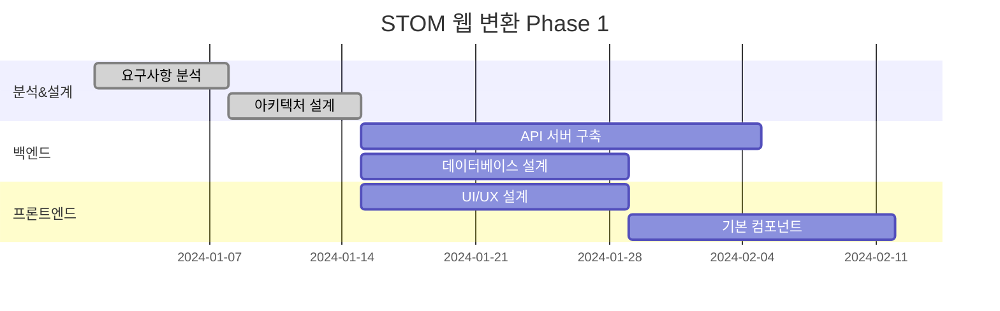
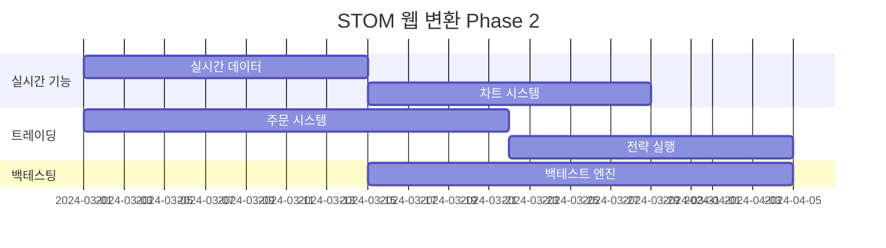
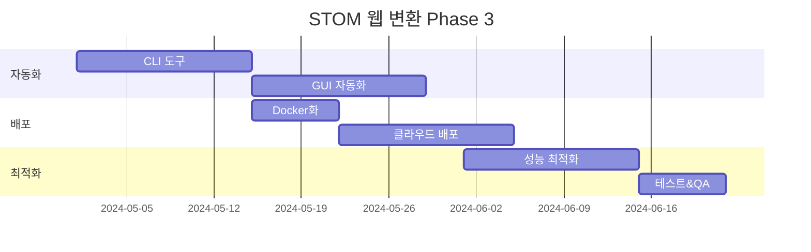

# STOM 웹 기반 변환 작업 계획 및 로드맵

## 🎯 프로젝트 목표

### 주요 목표
1. **웹 기반 인터페이스 구축**: 기존 PyQt5 GUI → 웹 애플리케이션
2. **CLI 자동화 도구 개발**: 배치 처리 및 스케줄링 기능
3. **GUI 자동화 도구 개발**: 데스크톱 환경에서의 무인 실행

### 성공 지표
- [ ] 웹 브라우저에서 모든 핵심 기능 접근 가능
- [ ] CLI를 통한 백테스트 및 전략 실행
- [ ] 스케줄러를 통한 자동 실행
- [ ] 기존 기능 100% 호환성 유지

## 📅 전체 로드맵 (24주 계획)

### Phase 1: 기반 구축 (1-8주)


### Phase 2: 핵심 기능 구현 (9-16주)


### Phase 3: 자동화 및 배포 (17-24주)


## 🏗️ 상세 작업 계획

### Phase 1: 기반 구축 (1-8주)

#### Week 1-2: 분석 및 설계
**목표**: 전체 시스템 아키텍처 설계

**작업 내용**:
- [ ] 기존 코드 의존성 분석
- [ ] API 엔드포인트 설계
- [ ] 데이터베이스 스키마 설계
- [ ] UI/UX 와이어프레임 작성
- [ ] 기술 스택 확정

**산출물**:
- 시스템 아키텍처 문서
- API 명세서 초안
- UI/UX 디자인 가이드

#### Week 3-5: 백엔드 API 서버 구축
**목표**: FastAPI 기반 REST API 서버 구축

**작업 내용**:
```python
# 주요 구현 모듈
stom-web/
├── backend/
│   ├── app/
│   │   ├── api/              # API 라우터
│   │   ├── core/             # 핵심 설정
│   │   ├── models/           # 데이터 모델
│   │   ├── services/         # 비즈니스 로직
│   │   └── utils/            # 유틸리티
│   ├── requirements.txt
│   └── main.py
```

**구현 기능**:
- [ ] 사용자 인증/권한 관리
- [ ] 계좌 정보 API
- [ ] 주문 관리 API
- [ ] 실시간 데이터 WebSocket
- [ ] 백테스트 API

#### Week 6-8: 프론트엔드 기본 구조
**목표**: React 기반 웹 애플리케이션 기본 구조

**작업 내용**:
```
frontend/
├── src/
│   ├── components/          # 재사용 컴포넌트
│   ├── pages/              # 페이지 컴포넌트
│   ├── hooks/              # 커스텀 훅
│   ├── services/           # API 서비스
│   ├── store/              # 상태 관리
│   └── utils/              # 유틸리티
├── public/
└── package.json
```

**구현 기능**:
- [ ] 라우팅 시스템
- [ ] 상태 관리 (Redux/Zustand)
- [ ] 인증 시스템
- [ ] 기본 레이아웃
- [ ] 반응형 디자인

### Phase 2: 핵심 기능 구현 (9-16주)

#### Week 9-10: 실시간 데이터 시스템
**목표**: 실시간 시세/호가 데이터 스트리밍

**작업 내용**:
- [ ] WebSocket 서버 구현
- [ ] 실시간 데이터 압축/전송
- [ ] 클라이언트 실시간 연결 관리
- [ ] 데이터 캐싱 시스템

**기술 구현**:
```python
# WebSocket 실시간 데이터
@app.websocket("/ws/realtime")
async def websocket_endpoint(websocket: WebSocket):
    await websocket.accept()
    # 실시간 데이터 스트리밍 로직
```

#### Week 11-12: 차트 시스템
**목표**: 웹 기반 실시간 차트 구현

**작업 내용**:
- [ ] TradingView Charting Library 통합
- [ ] 커스텀 차트 컴포넌트 개발
- [ ] 기술적 지표 구현
- [ ] 차트 상호작용 기능

**차트 라이브러리 선택**:
1. **TradingView Charting Library** (권장)
   - 전문적인 트레이딩 차트
   - 풍부한 기술적 지표
   - 실시간 업데이트 지원

2. **Chart.js + 커스텀 플러그인**
   - 라이선스 자유
   - 커스터마이징 용이

#### Week 13-15: 주문 및 전략 시스템
**목표**: 자동매매 주문 시스템 구현

**작업 내용**:
- [ ] 주문 API 통합
- [ ] 전략 편집기 (Monaco Editor)
- [ ] 전략 백테스트 실행
- [ ] 포트폴리오 관리

#### Week 16: 백테스팅 엔진 웹 연동
**목표**: 기존 백테스팅 엔진을 웹에서 실행

**작업 내용**:
- [ ] 백테스트 작업 큐 시스템
- [ ] 진행상황 실시간 모니터링
- [ ] 결과 시각화
- [ ] 최적화 결과 분석

### Phase 3: 자동화 및 배포 (17-24주)

#### Week 17-18: CLI 자동화 도구
**목표**: 명령줄 인터페이스 도구 개발

**작업 내용**:
```bash
# CLI 도구 구조
stom-cli/
├── stom_cli/
│   ├── commands/           # 명령어 모듈
│   ├── config/            # 설정 관리
│   ├── utils/             # 유틸리티
│   └── main.py
├── setup.py
└── requirements.txt
```

**주요 명령어**:
```bash
# 백테스트 실행
stom backtest --strategy="my_strategy" --period="2024-01-01:2024-12-31"

# 실시간 트레이딩 시작
stom trade --mode=live --strategy="scalping_v1"

# 데이터 업데이트
stom data update --market=stock --date=today

# 최적화 실행
stom optimize --strategy="base_strategy" --method=genetic
```

#### Week 19-20: GUI 자동화 도구
**목표**: 무인 실행을 위한 GUI 자동화

**작업 내용**:
- [ ] 시스템 트레이 애플리케이션
- [ ] 스케줄러 통합
- [ ] 모니터링 대시보드
- [ ] 알림 시스템

**GUI 자동화 기능**:
```python
# 자동화 스케줄러
class TradingScheduler:
    def __init__(self):
        self.scheduler = BackgroundScheduler()
    
    def add_daily_job(self, strategy, time):
        # 매일 정해진 시간에 전략 실행
        
    def add_market_open_job(self, strategy):
        # 장 시작 시 자동 실행
```

#### Week 21: Docker 컨테이너화
**목표**: 배포를 위한 컨테이너화

**작업 내용**:
```dockerfile
# Dockerfile 예시
FROM python:3.11-slim

WORKDIR /app
COPY requirements.txt .
RUN pip install -r requirements.txt

COPY . .
EXPOSE 8000

CMD ["uvicorn", "main:app", "--host", "0.0.0.0", "--port", "8000"]
```

**Docker Compose 구성**:
```yaml
version: '3.8'
services:
  web:
    build: .
    ports:
      - "8000:8000"
  redis:
    image: redis:alpine
  postgres:
    image: postgres:13
```

#### Week 22-23: 클라우드 배포
**목표**: AWS/GCP 클라우드 배포

**배포 아키텍처**:
```
Internet → Load Balancer → Web Servers → Database
                        → Redis Cache
                        → Background Workers
```

#### Week 24: 성능 최적화 및 테스트
**목표**: 성능 최적화 및 통합 테스트

**최적화 항목**:
- [ ] 데이터베이스 쿼리 최적화
- [ ] 캐싱 전략 구현
- [ ] CDN 설정
- [ ] 실시간 데이터 압축
- [ ] 메모리 사용량 최적화

## 🛠️ 기술 스택 상세

### 백엔드
- **Framework**: FastAPI
- **Database**: PostgreSQL + Redis
- **ORM**: SQLAlchemy
- **Authentication**: JWT
- **Task Queue**: Celery
- **WebSocket**: FastAPI WebSocket

### 프론트엔드
- **Framework**: React 18
- **State Management**: Zustand
- **UI Library**: Material-UI / Ant Design
- **Charts**: TradingView Charting Library
- **Build Tool**: Vite
- **Styling**: Tailwind CSS

### 자동화 도구
- **CLI**: Typer
- **GUI**: PyQt6 (시스템 트레이)
- **Scheduler**: APScheduler
- **Monitoring**: Prometheus + Grafana

### 배포 및 인프라
- **Containerization**: Docker
- **Orchestration**: Docker Compose / Kubernetes
- **Cloud**: AWS / GCP
- **CI/CD**: GitHub Actions
- **Monitoring**: ELK Stack

## 📊 리스크 관리

### 주요 리스크 요소
1. **성능 저하**: 웹 환경에서의 실시간 처리 성능
2. **호환성**: 기존 기능과의 완벽한 호환성 유지
3. **보안**: 웹 환경에서의 보안 강화 필요
4. **데이터 마이그레이션**: 기존 데이터의 안전한 이전

### 리스크 완화 방안
- **성능**: 캐싱, 압축, 최적화된 알고리즘 사용
- **호환성**: 단계적 마이그레이션, 병렬 운영
- **보안**: HTTPS, JWT, 입력 검증, 권한 관리
- **데이터**: 백업, 검증, 단계적 마이그레이션

## 🎯 다음 단계

1. **팀 구성**: 풀스택 개발자 2-3명, DevOps 엔지니어 1명
2. **개발 환경 구축**: Git 저장소, CI/CD 파이프라인 설정
3. **프로토타입 개발**: 핵심 기능의 MVP 버전 구현
4. **사용자 테스트**: 베타 버전으로 사용자 피드백 수집

---

*다음 문서에서는 구체적인 기술 구현 방안을 제시합니다.*